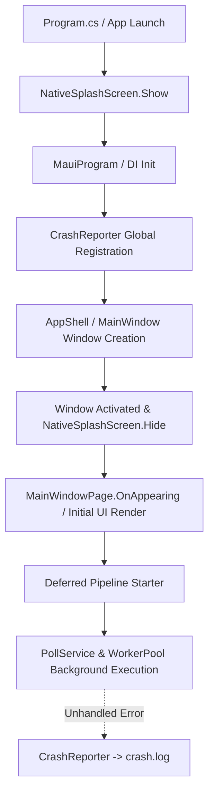

# Requirements

### Overview & Goals
The app currently suffers from two critical stability and user experience issues:
1. **Startup / Splash Screen Delays**: The application can take excessive time (or appear stuck on the splash screen for up to minutes) when opening. This occurs because heavy background tasks, database queries, and pipeline polling/parsing are triggered prematurely before the native window and main UI have finished loading and breathing.
2. **Long-Running Crashes & Lack of Thread-Aware Diagnostics**: The app occasionally crashes after hours of background operation with unknown root causes. We need a dedicated, thread-aware crash logger that reliably writes full diagnostic context to `crash.log` across all threads and exception boundaries, as well as hardening of long-running worker loops.

### Scope
- **In Scope**:
  - Implement a dedicated, robust crash reporting service that outputs thread-aware stack traces and environment telemetry to `crash.log`.
  - Wire global exception hooks across `AppDomain`, `TaskScheduler`, MAUI lifecycle, and WinUI / Windows entry points.
  - Defer and decouple background polling / enrichment loops (`PollService`, `WorkerPool`) so they only spin up after the main window is fully rendered and presented.
  - Optimize initial database connection/schema initialization and feed loading to avoid UI thread contention at startup.
  - Audit background worker error handling to prevent silent process termination during long runs.
- **Out of Scope**:
  - Changes to V2 features or redesigning core UI cards/layouts.
  - Modifying the underlying scraping HTML parsing selectors unless an unhandled parsing exception is identified.

### User Stories
- **As a user**, I want the app to open instantly without hanging on the splash screen so that I can immediately access my dashboard and projects.
- **As a user/developer**, I want any background or runtime crash to generate a comprehensive `crash.log` with thread details so that issues can be diagnosed and fixed quickly without silent application disappearance.

# Technical Design

### Current Implementation Analysis
1. **Startup Flow**: In `App.xaml.cs`, `StartPipeline` is kicked off directly in the `App` constructor or when onboarding is completed. Even though `Task.Run` is used, starting immediate HTTP polling and background worker tasks concurrently while WinUI / MAUI is inflating pages, binding contexts, and executing SQLite initial queries can saturate threads and delay the splash screen dismissal in `PlatformServiceRegistration.OnWindowCreated` / `window.Activated`.
2. **Exception Handling & Crash Logging**:
   - `Program.cs` has basic `AppDomain.UnhandledException` and `TaskScheduler.UnobservedTaskException` hooks writing to `crash.log`, but `MauiProgram.cs` only routes to `InteractionLogger.Fault` which writes to `interaction.log`.
   - `InteractionLogger` truncates or omits critical thread metadata (e.g., ManagedThreadId, IsThreadPoolThread, IsBackground, full stack traces for inner exceptions, memory usage at crash time).

### Key Decisions
1. **Dedicated CrashLogger (`CrashReporter`)**:
   - Create a centralized, fail-safe `CrashReporter` class in `Services/Diagnostics/CrashReporter.cs` (or `Core/Platform/`).
   - Captures managed thread ID, thread name, thread pool status, exception type, message, inner exceptions, stack traces, memory working set, and uptime.
   - Synchronously flushes to `AppPaths.LogsDirectory/crash.log` without throwing any exceptions.
2. **Deferred Startup Pipeline**:
   - In `App.xaml.cs` and `MainWindowPage.xaml.cs`, startup polling is delayed until the window has completed its initial appearance and layout.
   - A short breathing delay (e.g., 200-500ms after window activation) gives the UI thread and native WinUI compositor full priority to render and dismiss the native splash screen.
3. **Background Worker Hardening**:
   - Ensure all `Task.Run` loops in `EnrichmentWorker`, `PollService`, and `NotificationDispatcher` have outer `try/catch` guards that log any critical failure to `CrashReporter` without taking down the process.

### Architecture Diagram

### Components & File Structure
- `Services/Diagnostics/CrashReporter.cs`: Thread-safe static crash reporter capturing full thread diagnostic info to `crash.log`.
- `MauiProgram.cs`: Register `CrashReporter` in `RegisterGlobalExceptionLogging()`.
- `Platforms/Windows/Program.cs`: Unify crash logging through `CrashReporter`.
- `App.xaml.cs` & `Features/Projects/Views/MainWindowPage.xaml.cs`: Defer `StartPipeline` execution until after UI appearance.
- `Services/Pipeline/WorkerPool/EnrichmentWorker.cs` & `Services/Pipeline/PollService.cs`: Ensure worker task loops handle long-running resource management cleanly.

# Testing

### Validation Approach
1. **Startup Latency Verification**:
   - Launch application on Windows and verify that `NativeSplashScreen` closes and the main window opens in under 1-2 seconds.
   - Confirm that the pipeline does not execute heavy network requests until after the main view is interactable.
2. **Crash Logging Verification**:
   - Verify that simulated unhandled exceptions (e.g., on a background worker thread, `TaskScheduler`, and UI thread) generate detailed `crash.log` entries with timestamps, thread IDs, thread pool indicators, and complete stack traces.
   - Ensure log file location matches `AppPaths.LogsDirectory` (`%LocalAppData%/MostaqlK/log/crash.log`).
3. **Long-Running Pipeline Stability**:
   - Run polling cycles with multiple background workers to confirm no task unhandled exceptions or resource leaks occur.

# Delivery Steps

### ✓ Step 1: Implement Dedicated Thread-Aware Crash Logger
A dedicated, thread-safe crash diagnostics logger `CrashReporter` is created and registered across all process exception hooks.

- Create `CrashReporter` in `Core/Platform/` or `Services/Diagnostics/` with thread tracing, environment details, unhandled exception capturing, and persistent writing to `crash.log` in `AppPaths.LogsDirectory`.
- Hook `AppDomain.CurrentDomain.UnhandledException`, `TaskScheduler.UnobservedTaskException`, `AppDomain.CurrentDomain.FirstChanceException` (filtered for fatal/unhandled paths), and Windows-specific `Program.cs` handlers.
- Add thread state / managed thread ID, background/foreground status, and stack traces to `crash.log`.

### ✓ Step 2: Decouple & Defer Pipeline Polling from Startup Window Initialization
Startup pipeline initialization is deferred until after the UI window has fully loaded and appeared.

- Refactor `App.xaml.cs` and `MainWindowPage.xaml.cs` so that `StartPipeline` does not immediately start scraping and worker processing during splash screen / window construction.
- Introduce an asynchronous startup phase or post-render trigger (e.g. `MainWindowPage.OnAppearing` / dispatch after layout) with a non-blocking initial delay/breath before starting poll loops.
- Ensure database migration/check in `SqliteConnectionFactory` and initial feed query are streamlined and do not block the UI thread during window launch.

### ✓ Step 3: Harden Long-Running Background Workers & Resource Management
Audit background worker loops and SQLite operations for stability during prolonged execution.

- Inspect `EnrichmentWorker`, `PollService`, `TokenBucketRateLimiter`, and `SqliteConnectionFactory` for memory leaks, unobserved task exceptions, semaphore deadlocks, or unhandled HTTP/HTML parsing crashes.
- Ensure all background worker loops catch unhandled domain/runtime exceptions gracefully, log them to `crash.log` and `InteractionLogger`, and prevent process termination.
- Validate that timer/debounce loops and CancellationTokenSources are properly disposed and cannot crash long-running sessions.

### ✓ Step 4: End-to-End Validation & Verification
Verify the splash screen, window launch timing, and crash logger in both debug and release scenarios.

- Test that `NativeSplashScreen` closes smoothly without hanging and the main window opens promptly (< 1-2 seconds).
- Trigger deliberate test exceptions on background threads to verify that `crash.log` captures thread IDs, full stack traces, and exception details without failing.
- Verify that continuous polling over long runtimes does not leak memory or crash silently.