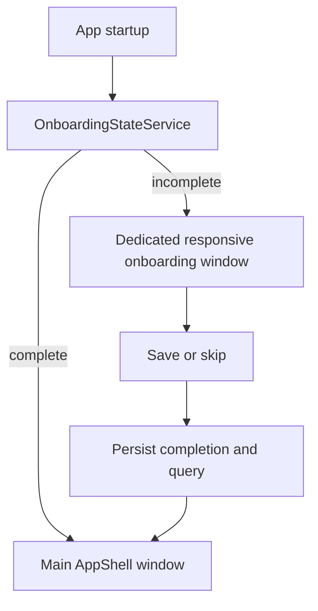
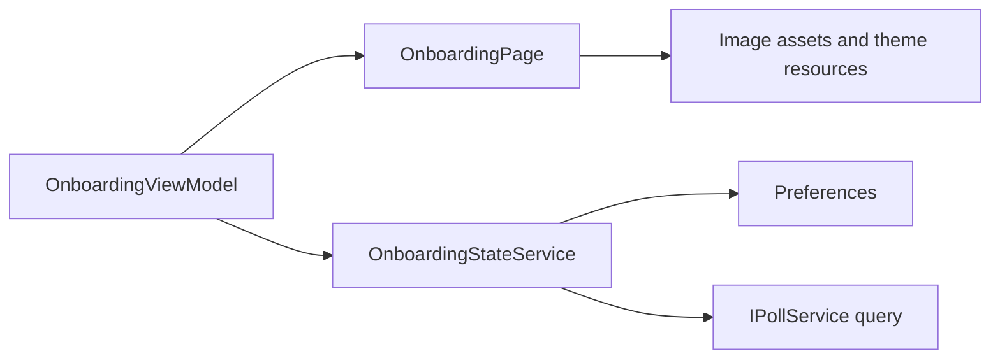

# Requirements

### Overview & Goals
Implement the approved onboarding design as a real, separate MAUI window shown on first launch, preserving the `.repertoire/design/mvp/onboarding.html` 920:720 composition ratio while scaling responsively to the available monitor/work area.

### Functional Requirements
- Show onboarding only when its completion preference is not set; subsequent launches open the existing main `AppShell` flow directly.
- Host onboarding in a dedicated MAUI `Window`, independent from the main Shell window.
- Present the onboarding as a bounded, non-resizable/non-maximizable separated window whose initial client size is calculated from the available monitor/work area rather than hardcoded pixels.
- Follow the operating system light/dark theme by default; do not introduce a separate onboarding theme preference or theme toggle.
- Reproduce all six design steps, Arabic RTL content, illustrations from `Resources/Images/Onboarding/`, progress dots, skip navigation, query presets, validation, save/skip completion, and final CTA.
- Preserve the design’s transitions, save-button rectangle-to-pill animation, spinner/check animation, input focus/error feedback, and reduced-motion behavior where supported by MAUI.
- Store onboarding completion exactly once after the user finishes or skips the onboarding flow.
- Persist the personalization query using the existing `settings_query_params` contract so Settings and the polling service continue to use the same value.
- Add a manual reset utility under `tools/` that clears the onboarding completion preference while leaving unrelated settings intact.

### Scope
**In scope:** onboarding page/window, first-run startup gate, system-theme handling, query preference integration, responsive bounded Windows window behavior, generated image assets, reset script, and UI/design-parity validation.

**Out of scope:** changes to the main feed layout, new authentication, new query-builder behavior beyond the existing query string preference, and post-MVP/v2 functionality.

# Technical Design

### Current Implementation
- `App.CreateWindow` in `App.xaml.cs` currently creates one `Window(new AppShell(...))` and sizes the main client area for the existing desktop mockups.
- `App.xaml.cs` currently forces `UserAppTheme` from `settings_is_dark_mode` through `StartupNavigation.ResolveTheme`; onboarding must not duplicate or override this logic when following the OS theme.
- `MauiProgram.cs` registers feature pages/view-models and configures Windows lifecycle events, including native title-bar handling and window activation/close behavior.
- `SettingsViewModel` persists `settings_query_params` via `Preferences` and applies it to `IPollService`, so onboarding should reuse that key/service contract instead of creating a second setting.
- Existing UI follows `Features/<Feature>/Views` and `ViewModels`, uses CommunityToolkit MVVM, shared `Resources/Styles`, Tajawal fonts, RTL Arabic-first markup, and reusable units catalogued in `UNITS.md`.
- Existing tooling includes `tools/reset-close-behavior-preference.ps1`, which provides the preference-file parsing and explicit-confirmation pattern for a reset script.

### Key Decisions
- **Dedicated window:** add an onboarding-specific window/page rather than a Shell route or main-window gate, preserving the requested separated window and keeping `AppShell` navigation unchanged.
- **System theme:** extract/reuse the theme-resolution boundary so onboarding reads the effective OS `RequestedTheme` and responds to `RequestedThemeChanged`; it will not add a new persisted theme choice.
- **Persistence:** use a named onboarding completion preference and the existing `settings_query_params` key. Mark completion only after final CTA or skip, and make startup gating idempotent.
- **Responsive viewport contract:** use 920:720 only as the reference aspect ratio for the HTML design. Calculate a responsive client width/height from the current monitor work area using proportional sizing plus sensible minimum and maximum bounds, preserve the ratio, account for Windows frame/title-bar offsets, and then disable user resizing/maximizing through the native Windows `AppWindow` presenter.
- **Animation model:** implement the HTML state machine as MAUI visual-state/animation methods in the onboarding page or view-model-backed page state, with navigation lockout during transitions and equivalent reduced-motion behavior.

### Proposed Components
- `Features/Onboarding/Views/OnboardingPage.xaml(.cs)`: six-step visual layout, RTL typography, illustration placement, progress/footer controls, query input/presets, and animation orchestration.
- `Features/Onboarding/ViewModels/OnboardingViewModel.cs`: current step, query value, preset selection, validation/save state, next/back/skip/finalize commands, and completion/query persistence coordination.
- `Services/Onboarding/OnboardingStateService.cs` or equivalent service: centralize the completion preference key, query save/skip behavior, and resettable state contract; register as a singleton in `MauiProgram`.
- `App.xaml.cs`: gate startup and create/manage the dedicated onboarding window before exposing the normal main flow; preserve existing pipeline and main-window startup behavior.
- `MauiProgram.cs`: register onboarding services/page/view-model and add Windows lifecycle handling for the onboarding window’s native presenter, title bar, and theme synchronization.
- `tools/reset-onboarding-preference.ps1`: follow the existing reset script’s `-ConfirmReset` and preference JSON handling, removing only the onboarding completion key (and optionally documenting a query reset switch if needed).
- `MostaqlK.csproj`: ensure onboarding images/fonts are included using the existing `Resources/Images/*` and `Resources/Fonts/*` MAUI asset conventions.
- `UNITS.md`: update only if implementation introduces a reusable UI primitive not covered by existing units; otherwise reuse existing `AppButton`, `AppCard`, `AppEntry`, and animation/style conventions without adding a duplicate unit.

### Window Lifecycle

### UI/Data Flow

### Risks & Mitigations
- Native frame dimensions may differ from client dimensions; calculate client dimensions from the monitor work area, compensate for Windows frame offsets using the approach documented in `App.xaml.cs`, and validate at multiple monitor sizes.
- Existing global `UserAppTheme` can override OS theme; keep onboarding theme resolution explicit and ensure its page resources react to effective theme changes without mutating the main preference.
- Closing the onboarding window before completion could leave startup ambiguous; handle close as a non-completion path and ensure the main window is not incorrectly marked complete.
- Animation timers can race with navigation or window closure; cancel/ignore stale transitions and disable navigation while a transition is active.

# Testing

### Validation Approach
- Build the Windows target and run the existing UI test project after adding onboarding coverage.
- Exercise the onboarding flow through Appium/UI automation using stable automation names for each step, query input, presets, save, skip, and final CTA.
- Use the repository’s design capture/parity tools to compare light and dark onboarding renders against `.repertoire/design/mvp/onboarding.html` at the reference 920:720 ratio and at representative small, standard, and large monitor work areas.

### Key Scenarios
- Fresh preferences show the dedicated onboarding window and the main window is not incorrectly used as the onboarding surface.
- Reload after final CTA does not show onboarding again.
- Reload after skip does not show onboarding again.
- Save accepts valid custom query text and presets, writes `settings_query_params`, and reaches the final step after the save animation.
- Empty custom input shows the designed validation state and does not complete onboarding.
- Light and dark OS themes render the same layout with correct theme tokens and react to a runtime theme change.
- Onboarding window cannot be resized or maximized, opens with a monitor-relative client size, preserves the 920:720 ratio, and remains usable on small and large work areas.
- Navigation remains locked during transitions; reduced-motion mode avoids long animation movement while preserving state changes.
- Running `tools/reset-onboarding-preference.ps1 -ConfirmReset` allows onboarding to appear again without clearing unrelated settings.

### Edge Cases
- Existing completion preference with missing/empty query opens the main app without forcing personalization.
- Repeated save/skip/final clicks do not duplicate completion or corrupt the query preference.
- Window close/crash during onboarding leaves completion unset so the next launch can retry.
- Reset script handles a missing preferences file, missing container, or already-cleared key safely.

# Delivery Steps

### ✓ Step 1: Add onboarding state and startup orchestration
The app has a reusable onboarding state service and first-run gate that decides whether to show onboarding or the main Shell.

- Add the onboarding feature service/view-model using the existing CommunityToolkit MVVM and `Preferences` patterns.
- Define the completion preference and reuse `settings_query_params` for personalization.
- Register the service, page, and view-model in `MauiProgram.cs`.
- Update `App.xaml.cs` startup/window creation to open a dedicated onboarding window only when incomplete and transition to the main `AppShell` after completion.
- Keep incomplete onboarding retryable after an early window close.

### ✓ Step 2: Implement the pixel-matched onboarding page
The dedicated onboarding page reproduces the six-step HTML design in native MAUI controls using a responsive layout that preserves the approved 920:720 reference ratio without requiring a fixed pixel viewport.

- Build `Features/Onboarding/Views/OnboardingPage.xaml` and code-behind with RTL layout, Tajawal typography, theme resources, illustrations, badges, dots, footer controls, and query form.
- Reuse existing design-system units and asset/font conventions instead of introducing duplicate controls.
- Implement query presets, input validation, save/skip behavior, final CTA, and accessible automation identifiers.
- Match spacing, proportions, colors, corner radii, shadows, and responsive behavior to `.repertoire/design/mvp/onboarding.html`, using device-independent units and proportional layout rather than fixed pixel coordinates.

### ✓ Step 3: Add transitions and responsive native window behavior
Onboarding navigation has the designed transitions and the Windows window behaves as a bounded responsive separated surface.

- Port slide enter/exit animations, navigation lockout, save spinner/check morph, input error feedback, and reduced-motion handling.
- Add Windows lifecycle configuration that derives the onboarding client area from the current monitor work area, preserves the 920:720 aspect ratio, applies minimum/maximum bounds, and compensates for native frame dimensions.
- Disable resize and maximize affordances through the native `AppWindow` presenter and handle title-bar/theme synchronization using existing `MauiProgram.cs` patterns.
- Ensure onboarding follows the effective system theme without changing the persisted main-app theme setting.

### ✓ Step 4: Add reset tooling and verify design parity
A manual reset command and automated validation prove the onboarding can be replayed and matches the design.

- Add `tools/reset-onboarding-preference.ps1` following the existing close-behavior reset script’s confirmation and JSON-container handling.
- Add/update UI automation scenarios for fresh launch, save, skip, completion persistence, reset, theme, responsive sizing across work areas, and transition-safe navigation.
- Run Windows build/tests and design screenshot/parity checks at the 920:720 reference ratio in light and dark themes across representative monitor work-area sizes.
- Correct measurable visual or lifecycle differences discovered by those checks without changing the approved design contract.