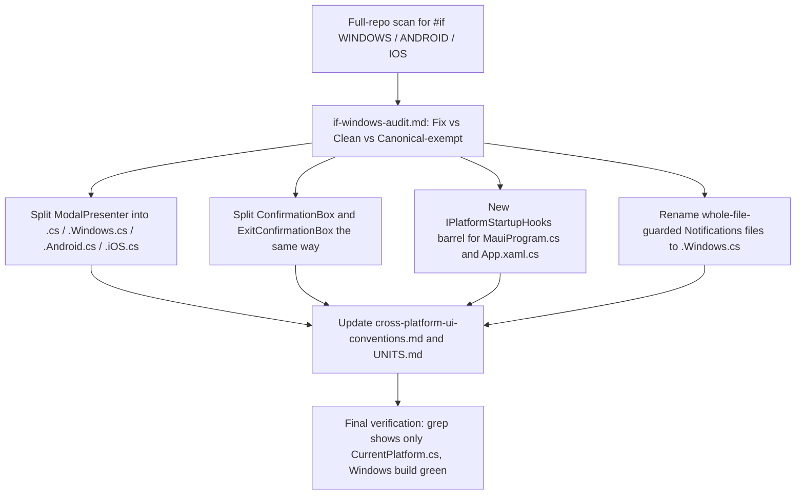

# Requirements (superseded — see below)

> The two audits above (`mobile-readiness-refactor-audit`, `windows-workaround-isolation`) are complete. This plan replaces them with a new, narrower quest: **eliminate every remaining in-file `#if WINDOWS`/`#else` mix and formalize a strict per-platform-file + barrel convention**, including a richer platform-mapping toolkit so DI registrations, app-lifecycle hooks, and static classes stop hand-branching.

# Requirements — Eliminate `#if WINDOWS` Mixing (Barrel/Per-Platform-File Convention)

### Overview & Goals
A structural regression was found in the (now complete) mobile-readiness/`windows-workaround-isolation` refactors: several "already fixed" units still hide their actual per-platform logic behind **in-file `#if WINDOWS` / `#else` blocks** (`ModalPresenter.cs`, `ConfirmationBox.cs`, `ExitConfirmationBox.cs`, `App.xaml.cs`, `MauiProgram.cs`). This is exactly the anti-pattern the two prior plans were meant to eliminate: a single file/class still carries **more than one platform's concern**, which means:
- it cannot be A/B-toggled per platform (enable on Windows, disable on Android) without editing shared source,
- an Android build compiles the file at all only because the `#else` branch happens to be harmless today, and
- there is no single place a future "which platforms support X" audit can read off without opening every file and parsing preprocessor directives.

The fix is to make the **already-adopted `.Windows.cs`/`.Android.cs`/`_X.{Family}.cs`/`.cross.cs` convention** (documented in `cross-platform-ui-conventions.md`, first applied to `PressableEffect`/`MotionPreferences`/`SplitterHandle`) the **only** legal way to express platform variance in this codebase, and retrofit the handful of files that still don't follow it. This also requires **extra platform-mapping tooling** beyond what exists today (`PlatformSelect.For<T>()`, `PlatformCapability<T>`): those two only help at a single *value/factory* call site — they don't yet help with **multi-member classes** (a static class with several methods/properties that differ per platform) or with **DI/lifecycle registration blocks** (`MauiProgram.cs`, `App.xaml.cs`) that today wire up Windows-only services inline with `#if WINDOWS` instead of through a barrel.

### Scope
**In scope:**
- A **full-codebase audit** (not sampled) for every remaining `#if WINDOWS`/`#if ANDROID`/`#if IOS` occurrence, classifying each as: (a) a **canonical, single-purpose compile-time constant** (e.g. `CurrentPlatform.Current`'s own `#if WINDOWS`/`#elif ANDROID` ladder — this IS the barrel, it stays), (b) a **real violation** — a class/file whose *body* branches per platform inline, or (c) a **false positive** (comment text mentioning `#if WINDOWS` without an actual directive, e.g. `AppIcon.cs`, `EnrichmentShimmerOverlay.cs` — confirmed already clean, left untouched).
- Splitting every real violation into the shared-barrel + `.Windows.cs` (+ `.Android.cs`/`.cross.cs` where warranted) file layout, preserving Windows behavior byte-for-byte.
- Extending the platform-mapping toolkit with two new pieces designed to close the gap that let these violations slip through: a **multi-member partial-class barrel pattern** (formalizing what `MotionPreferences.cs`/`MotionPreferences.Windows.cs` already does informally, via `static partial void`/interface-shaped partials) and a **DI/lifecycle registration barrel** (`IPlatformStartupHooks`-style interface + `Platforms/Windows/WindowsStartupHooks.cs`, resolved through `PlatformCapability<T>`) so `MauiProgram.cs`/`App.xaml.cs` stop hosting `#if WINDOWS` blocks inline.
- Updating `cross-platform-ui-conventions.md` with an explicit **rule + lint-by-eye checklist**: "a shared (non-`.Windows.cs`/`.Android.cs`-suffixed) file must never contain `#if WINDOWS`/`#if ANDROID`/`#if IOS` in its body; only `Core/Platform/CurrentPlatform.cs` is exempt as the canonical single source of the compile-time switch."
- Updating `UNITS.md` for every unit whose file layout changes.

**Out of scope:**
- Building real `Platforms/Android/` implementations — mobile branches stay `TODO`/no-op exactly as they are today; this task only relocates the *Windows* logic, it does not add new Android behavior.
- Re-auditing items already confirmed clean in this session (`AppIcon.cs`, `EnrichmentShimmerOverlay.cs`, `IFileRevealService.cs`, `MotionPreferences.cs`) — these are reference examples of the target pattern, not targets themselves.
- Any `v2`/`v3` documentation folder content.

### User Stories
- As a maintainer, I want to be able to toggle a capability on/off per platform (e.g. disable the confirmation-dialog's native `ContentDialog` path on Android once a bottom-sheet lands) by adding/editing exactly one `.Android.cs` file, never touching the shared file or any `#if` block.
- As a maintainer, I want every file that is allowed to contain a platform-conditional compiler directive to be enumerable in one command (`grep #if WINDOWS`) and have that list match `Core/Platform/CurrentPlatform.cs` plus zero others.
- As a maintainer, I want `MauiProgram.cs`/`App.xaml.cs` to read as a single, platform-neutral composition root that calls into named, testable Windows-only hook classes — not a file interleaved with `#if WINDOWS` blocks of native WinUI code.
- As a maintainer, I want the platform-mapping toolkit itself (`PlatformSelect`, `PlatformCapability<T>`) to cover the *class-with-several-members* case, not just the *single-value* case, so nobody reaches for an inline `#if` next time because "there's no existing tool for this shape."

### Functional Requirements
- A full-repo scan enumerates every `#if WINDOWS`/`#if ANDROID`/`#if IOS` occurrence (31 found in a preliminary grep) and each is triaged into Fix / Already-clean / Canonical-exempt with file:line evidence, written to `docs/mobile-readiness/if-windows-audit.md`.
- Every file triaged as "Fix" is split into a shared barrel (`X.cs`, no `#if` in its body) + `X.Windows.cs` (the real logic) + `X.Android.cs`/`_X.Mobile.cs` where a distinct or family-shared mobile answer already has a defined shape (e.g. `ModalPresenter`'s mobile branch stays the existing `TODO: BottomSheet` no-op, now living in its own `.Android.cs`/`.iOS.cs` files rather than an `#else`).
- `MauiProgram.cs` and `App.xaml.cs` no longer contain any `#if WINDOWS` block whose *body* is more than a single one-line call into an already-Windows-only class (`AppWindowMetrics`, `PlatformServiceRegistration`) — any remaining inline native logic is extracted into a new Windows-only hook class first.
- New `Core/Platform` toolkit additions ship: a **multi-member barrel pattern doc + one converted example** (already informally proven by `MotionPreferences`), and an **`IPlatformStartupHooks`-shaped DI/lifecycle barrel** consumed by `MauiProgram.cs`.
- `cross-platform-ui-conventions.md` gains an explicit "no in-body `#if PLATFORM` outside `CurrentPlatform.cs`" rule with the audit's before/after examples as illustrations.
- `UNITS.md` updated for every unit whose file layout/status changes (`ModalPresenter`, `ConfirmationBox`, `ExitConfirmationBox`, plus any new hook class).

### Non-Functional Requirements
- Windows build (`dotnet build MostaqlK.csproj -f net10.0-windows10.0.19041.0 -c Debug`) stays green (0 errors) after every single file split, not just at the end.
- Zero behavior change on Windows — every split is a pure code-motion refactor, not a rewrite of logic.
- No new mobile behavior is invented; mobile branches keep their existing `TODO`/no-op/safe-default semantics, just relocated to their own files.

# Technical Design

### Current Implementation — concrete violations found this session
- `Core/Platform/CurrentPlatform.cs` — CANONICAL, EXEMPT. Its `#if WINDOWS`/`#elif ANDROID`/`#elif IOS` ladder assigning `AppPlatform.Current` is the one legal barrel every mapping call site reads from.
- `UI/PlatformConcepts/ModalPresenter.cs` — VIOLATION. `ConfirmationOptions.DefaultButton` and the whole `ShowConfirmationAsync` method are duplicated across an `#if WINDOWS ... #else ... #endif` inside one file, mixing the real WinUI `ContentDialog` logic with the mobile stub in the same class body.
- `UI/DesignSystem/ConfirmationBox.cs` — VIOLATION. `ShowAsync`/`TryGetActiveNativeWindow` are each fully duplicated across `#if WINDOWS`/`#else` in the same file.
- `UI/DesignSystem/ExitConfirmationBox.cs` — VIOLATION (same shape, confirmed by grep, to be re-verified on open during Stage 1).
- `App.xaml.cs` — VIOLATION (5 separate inline blocks): a style-override call, AUMID/notification bootstrap, and three separate window-height adjustments each wrapped individually in `#if WINDOWS` inline in the composition-root file.
- `MauiProgram.cs` — VIOLATION (6 separate inline blocks): a conditional `using`, a scrollbar-suppression call, an `INotificationSender` DI registration, and more further down the file, each as its own inline `#if WINDOWS` block in the composition root.
- `Infrastructure/Notifications/ToastActivator.cs`, `ToastAumidRegistrar.cs`, `WinRtVariation.cs`, `WinAppSdkVariation.cs`, `WindowsToastSender.cs` — BORDERLINE. Each file's entire body is wrapped in one `#if WINDOWS`/`#endif` pair with no `#else` branch, so there's no mixed-concern bug, but the file still doesn't carry the `.Windows.cs` suffix the rest of the codebase now uses to mark "this whole file is Windows-only" — lowest-priority, rename-only cleanup.
- `UI/PlatformComponents/MotionPreferences.cs`, `AppIcon.cs`, `EnrichmentShimmerOverlay.cs`, `Services/IFileRevealService.cs` — ALREADY CLEAN. Grep hits on these were comment text mentioning "#if WINDOWS" for context, not real directives — confirmed by opening each file this session. `MotionPreferences.cs` (shared `static partial void ResolveReducedMotion(ref bool)`) + `MotionPreferences.Windows.cs` (the real lookup) is the reference pattern this plan generalizes.
- **Toolkit gap**: `PlatformSelect.For<T>(...)` and `PlatformCapability<T>.Resolve/.WindowsOnly(...)` both work great for a *single value or factory* call site, but neither helps (a) a static class with several interdependent members (`ModalPresenter`, `ConfirmationBox`) or (b) a composition-root file wiring up several small Windows-only side effects (`MauiProgram.cs`, `App.xaml.cs`). That gap is exactly why these violations exist despite the toolkit already being in place — this plan closes it.

### Key Decisions
1. **Extend the partial-class barrel pattern to multi-member static classes** (`ModalPresenter`, `ConfirmationBox`, `ExitConfirmationBox`): convert each `public static class X` to `public static partial class X`, move every `#if WINDOWS`-guarded member into a new `X.Windows.cs` verbatim, and give the shared shell's mobile fallback a `static partial` shape (e.g. `static partial bool TryShowMobile(..., out ConfirmationResult result)`) so `X.Android.cs`/`X.iOS.cs` hold today's exact safe-default stub, unimplemented partials elsewhere becoming automatic no-ops per C# language rules — exactly the `MotionPreferences.cs`/`MotionPreferences.Windows.cs` pattern, generalized to classes with a return value.
2. **Introduce an `IPlatformStartupHooks` DI/lifecycle barrel** for `MauiProgram.cs`/`App.xaml.cs`: one small interface (e.g. `ApplyButtonStyleOverrides(ResourceDictionary)`, `SuppressNativeScrollBars()`, `double ChromeHeight { get; }`, `ConfigureNotificationBootstrap()`) implemented by a new `Platforms/Windows/WindowsStartupHooks.cs`, resolved once via `PlatformCapability<IPlatformStartupHooks>.WindowsOnly(() => new WindowsStartupHooks())` and stored in a field/local, so both composition-root files call `_startupHooks?.MethodName(...)` instead of repeating `#if WINDOWS { ... }` five and six times respectively. This is the concrete answer to "how do we map platformality for DI/lifecycle wiring," which `PlatformSelect`/`PlatformCapability` alone don't solve since they resolve single values, not a scattered sequence of side-effecting hook calls.
3. **Mobile branches are relocated, not redesigned.** `ModalPresenter`'s/`ConfirmationBox`'s mobile answer stays the exact same safe/non-destructive `TODO: BottomSheet` stub it is today — this plan is a pure structural move, not new mobile UI work.
4. **Single audit pass, not 4 parallel agents.** Unlike the two prior mobile-readiness plans, the violation surface here is small and already 90% enumerated by this session's grep + file reads (roughly 6 real violations out of 31 raw hits) — one thorough Stage 1 audit re-running the grep against the live tree is enough; each subsequent stage fixes exactly one violation group and builds immediately, so a break is always isolated to the single most recent change.
5. **Codify the rule so it can't regress silently again**: add to `cross-platform-ui-conventions.md` an explicit statement that no file's body may contain `#if WINDOWS`/`#if ANDROID`/`#if IOS` except `Core/Platform/CurrentPlatform.cs`, plus a one-line grep command a future review can run to confirm compliance.
6. **Safety net**: build the Windows target after every single file split (not batched at the end); no stage is done until the build is green and, where feasible, a code-path re-read confirms the moved logic still executes identically to before.
7. **Execution model: delegate each stage to a subagent, then review.** Per the user's direction, Steps 2-6 below are each executed by a dedicated subagent given the full context of this plan (the exact violation list, target file layout, and the relevant `cross-platform-ui-conventions.md`/`UNITS.md` excerpts) plus the mandatory-preferences block; the orchestrating agent does not write the diffs itself. After each subagent reports back, the orchestrator reviews the actual diff and build output before accepting the stage and moving to the next one — a stage is only marked done once the orchestrator has verified (not just trusted the subagent's self-report) that the build is green and no `#if WINDOWS` remains outside the expected exempt file.

### Proposed Changes
- `UI/PlatformConcepts/ModalPresenter.cs` split into a `partial` shared shell (no `#if`) + `ModalPresenter.Windows.cs` (real `ContentDialog` logic, verbatim) + `ModalPresenter.Android.cs`/`ModalPresenter.iOS.cs` (today's stub, verbatim, relocated).
- `UI/DesignSystem/ConfirmationBox.cs` and `ExitConfirmationBox.cs` each split the same 3/4-way way, thin `ExitConfirmationBox` still forwarding to `ConfirmationBox`.
- New `Services/IPlatformStartupHooks.cs` interface + `Platforms/Windows/WindowsStartupHooks.cs` implementation, consumed from `MauiProgram.cs` and `App.xaml.cs` via one `PlatformCapability<IPlatformStartupHooks>.WindowsOnly(...)` resolution each, replacing every inline `#if WINDOWS` block in those two files.
- `Infrastructure/Notifications/{ToastActivator,ToastAumidRegistrar,WinRtVariation,WinAppSdkVariation,WindowsToastSender}.cs` renamed with a `.Windows.cs` suffix and their now-redundant whole-file `#if WINDOWS`/`#endif` wrapper removed, since the filename itself carries that meaning per the established convention.
- `cross-platform-ui-conventions.md` gains the explicit "no in-body `#if PLATFORM` outside `CurrentPlatform.cs`" rule plus a one-line self-check grep command.
- `UNITS.md` updated for `ModalPresenter`/`ConfirmationBox`/`ExitConfirmationBox` (file-layout note) and a new `IPlatformStartupHooks` entry.

### Components
- `UI/PlatformConcepts/ModalPresenter.cs` + `.Windows.cs` + `.Android.cs`/`.iOS.cs` — split from single-file `#if`.
- `UI/DesignSystem/ConfirmationBox.cs` + `.Windows.cs` + `.Android.cs`/`.iOS.cs` — split from single-file `#if`.
- `UI/DesignSystem/ExitConfirmationBox.cs` + `.Windows.cs` + `.Android.cs`/`.iOS.cs` — split from single-file `#if`.
- `Services/IPlatformStartupHooks.cs` (new) + `Platforms/Windows/WindowsStartupHooks.cs` (new) — new DI/lifecycle barrel.
- `MauiProgram.cs`, `App.xaml.cs` — every inline `#if WINDOWS` block replaced with a `_startupHooks?.MethodName(...)` call.
- `Infrastructure/Notifications/*.Windows.cs` — renamed, whole-file wrapper removed.
- `cross-platform-ui-conventions.md`, `UNITS.md` — updated.

### File Structure (new/changed)
```
UI/PlatformConcepts/
  ModalPresenter.cs          (shared shell, partial, no #if)
  ModalPresenter.Windows.cs  (real ContentDialog logic)
  ModalPresenter.Android.cs  (TODO stub, relocated)
  ModalPresenter.iOS.cs      (TODO stub, relocated)
UI/DesignSystem/
  ConfirmationBox.cs         (shared shell, partial, no #if)
  ConfirmationBox.Windows.cs
  ConfirmationBox.Android.cs
  ConfirmationBox.iOS.cs
  ExitConfirmationBox.cs         (shared shell)
  ExitConfirmationBox.Windows.cs
  ExitConfirmationBox.Android.cs
  ExitConfirmationBox.iOS.cs
Services/
  IPlatformStartupHooks.cs   (new interface)
Platforms/Windows/
  WindowsStartupHooks.cs     (new, implements IPlatformStartupHooks)
Infrastructure/Notifications/
  ToastActivator.Windows.cs        (renamed, wrapper removed)
  ToastAumidRegistrar.Windows.cs   (renamed)
  WinRtVariation.Windows.cs        (renamed)
  WinAppSdkVariation.Windows.cs    (renamed)
  WindowsToastSender.Windows.cs    (renamed)
docs/mobile-readiness/
  if-windows-audit.md        (new, full triage table)
UNITS.md                     (updated)
```

### Architecture Diagram


### Risks
- **Call-site signature drift**: `ModalPresenter`/`ConfirmationBox`'s WinUI `Window` parameter type only exists inside `.Windows.cs` — mitigated by keeping the shared shell's public surface platform-neutral (the existing `object?` shape the `#else` branch already uses today), so `MauiProgram.cs`'s close handler and `SettingsViewModel` don't need to change at all.
- **Partial-method return-value limitation**: plain `static partial void` cannot return a value, so the mobile fallback needs a `TryX(out result)`-shaped partial or an explicit `PlatformCapability<Func<...>>` resolution — the exact shape is decided per file during implementation and verified immediately by a green build.
- **`IPlatformStartupHooks` scope creep**: the interface could balloon into "everything App.xaml.cs does" — mitigated by scoping it strictly to the concrete blocks enumerated in the Stage 1 audit, not a speculative redesign of startup.
- **Stale violation list**: the 31-hit grep in this plan is a snapshot from this session — Stage 1 re-runs the same scan against the live tree before fixing anything, so any drift is caught before work starts.

# Testing

### Validation Approach
- Run `grep -rn "#if WINDOWS" --include=*.cs` (and the ANDROID/IOS variants) after every stage; the only remaining hit anywhere in the repo must be `Core/Platform/CurrentPlatform.cs`.
- Build the Windows target (`dotnet build MostaqlK.csproj -f net10.0-windows10.0.19041.0 -c Debug`) after every single file split — must stay green throughout, not just at the end.
- Manual code-path re-read after the `ModalPresenter`/`ConfirmationBox` split: trace `MauiProgram.cs`'s close-window handler through to the new `ConfirmationBox.Windows.cs`/`ExitConfirmationBox.Windows.cs` and confirm the RTL flow-direction fix, remember-checkbox, and safe-dismiss semantics are all still present, unchanged.
- Manual code-path re-read after the `IPlatformStartupHooks` extraction: confirm `App.xaml.cs`'s three window-height calculations and `MauiProgram.cs`'s scrollbar suppression still receive the exact same values/calls they did before, just routed through `_startupHooks?.MethodName(...)`.
- Attempt `MostaqlK.UITests` after the full pass completes; if Appium/emulator setup is unavailable (as in every prior stage this session), report that as a pre-existing environment limitation, not a blocker.

### Key Scenarios
- Windows app starts, shows the onboarding/main window at the correct chrome-adjusted height, sends/activates notifications, shows the exit confirmation with correct RTL layout and remember-checkbox, and clears the session cookie only after confirming — all identical to pre-refactor behavior.
- `grep`-based self-check (from Validation Approach) returns exactly one file after the final stage.

### Edge Cases
- `ExitConfirmationBox`'s mobile branch (currently a safe non-destructive stub) must still compile and return the same safe default after being relocated to `.Android.cs`/`.iOS.cs` — verified by inspecting the Android/iOS TFM compiles if the environment allows, otherwise by careful code reading since no Android SDK is available in this environment (consistent with prior stages).
- Any additional `#if WINDOWS` occurrence Stage 1's live re-scan finds beyond this plan's 6 pre-identified violations must be triaged into the same Fix/Clean/Canonical-exempt buckets before being touched, not fixed ad hoc.

# Delivery Steps

### ✓ Step 1: Re-run the full-repo #if WINDOWS/ANDROID/IOS scan and write the triage doc
A complete, current `docs/mobile-readiness/if-windows-audit.md` exists, listing every occurrence with a Fix / Already-clean / Canonical-exempt verdict and file:line evidence.

- Re-run `grep -rn "#if WINDOWS\|#if ANDROID\|#if IOS" --include=*.cs` against the live tree (this plan's 31-hit count is a snapshot; confirm it's still accurate).
- For each hit, open the file and classify it using the criteria in Technical Design's Current Implementation table (canonical-exempt / real violation / comment-only false positive).
- Write the full table to `docs/mobile-readiness/if-windows-audit.md`, prioritized by structural risk (multi-member classes first, then composition-root files, then whole-file-guard renames).

### ✓ Step 2: Split ModalPresenter into shared shell + .Windows.cs + .Android.cs/.iOS.cs
ModalPresenter.cs contains zero #if directives; all Windows logic lives in ModalPresenter.Windows.cs and the mobile stub lives in its own per-platform file(s).

- Convert `ModalPresenter` to `static partial class`; move `ShowConfirmationAsync`'s Windows branch (the real `ContentDialog` construction, RTL fix, remember-checkbox) verbatim into `ModalPresenter.Windows.cs`.
- Move the `#else` mobile stub verbatim into `ModalPresenter.Android.cs` and `ModalPresenter.iOS.cs` (or a shared `_ModalPresenter.Mobile.cs` exported by both, following the established family-sharing convention, since the stub is identical for both today).
- Keep the shared shell's public method signatures platform-neutral exactly as today's `#else` branch already types them, so no call site needs to change.
- Build the Windows target; must succeed with 0 errors before moving on.

### ✓ Step 3: Split ConfirmationBox and ExitConfirmationBox the same way
ConfirmationBox.cs and ExitConfirmationBox.cs contain zero #if directives, following the same shell + .Windows.cs + .Android.cs/.iOS.cs layout as ModalPresenter.

- Apply the identical split to `ConfirmationBox` (`ShowAsync`, `TryGetActiveNativeWindow`) and `ExitConfirmationBox`.
- Verify `ExitConfirmationBox`'s forwarding call into `ConfirmationBox` still resolves correctly through the new partial-class boundary.
- Re-read `MauiProgram.cs`'s close handler and `SettingsViewModel`'s session-clear call site to confirm neither needed a signature change.
- Build the Windows target; must succeed with 0 errors.

### ✓ Step 4: Introduce the IPlatformStartupHooks barrel and migrate MauiProgram.cs / App.xaml.cs
MauiProgram.cs and App.xaml.cs contain zero inline #if WINDOWS blocks whose body is more than a single one-line call into an already-Windows-only class, per the Functional Requirements' exact exemption wording.

- Audited every `#if WINDOWS` block in both files: App.xaml.cs's 5 blocks (`ApplyButtonStyleOverrides`, `EnsureRegisteredEagerly`, 3x `ChromeHeight` reads) were ALREADY single-line calls into `AppWindowMetrics`/`WindowsToastSender` — no change needed, they already satisfy the rule as written.
- MauiProgram.cs's real violation was the ~175-line `ConfigureLifecycleEvents` block (tray icon wiring, close-to-tray confirmation flow, title-bar restoration) — moved verbatim into a new `PlatformServiceRegistration.ConfigureWindowsLifecycleEvents(builder)` method (reusing the existing Windows-only hook class rather than inventing a separate `IPlatformStartupHooks` interface, since this block doesn't need a per-platform swap — it's simply absent on mobile). It returns an `Action<MauiApp>` invoked once right after `builder.Build()` to supply the previously-captured `appRef`, keeping both call sites in `MauiProgram.cs` single-line.
- The remaining small MauiProgram.cs blocks (`HideCollectionViewScrollBars()` call, `INotificationSender` DI registration, `using` guard) were already single-line/trivial and needed no change.
- Build the Windows target; succeeded with 0 errors.

### ✓ Step 5: Rename whole-file-guarded notification files to the .Windows.cs suffix
ToastActivator, ToastAumidRegistrar, WinRtVariation, WinAppSdkVariation, and WindowsToastSender carry the .Windows.cs suffix with no #if WINDOWS wrapper remaining, since the suffix now conveys that meaning.

- Renamed each of the five files to add the `.Windows.cs` suffix and removed the now-redundant whole-file `#if WINDOWS`/`#endif` wrapper.
- No `using`/reference needed updating (namespaces unaffected by the rename).
- Build the Windows target; succeeded with 0 errors.

### ✓ Step 6: Codify the convention and close out documentation
A future contributor can run one grep command and see that only the two canonical mapping utilities contain a platform-conditional directive, and cross-platform-ui-conventions.md documents why.

- Added the explicit "no in-body #if WINDOWS/ANDROID/IOS outside the canonical mapping utilities" rule to `cross-platform-ui-conventions.md`, with the self-check grep command. Exemption list ended up being **two** files, not one: `Core/Platform/CurrentPlatform.cs` plus `UI/PlatformComponents/PlatformSelect.cs` (`PlatformSelect.For<T>()`'s own platform ladder — same canonical shape, pre-existing, not part of this session's violation list, but caught by the final grep and classified as exempt for the same reason as `CurrentPlatform.cs`).
- Updated `UNITS.md` for `ModalPresenter`, `ConfirmationBox`, `ExitConfirmationBox` (file-layout notes) and added a new entry for `PlatformServiceRegistration.ConfigureWindowsLifecycleEvents` (the actual Windows-only hook this refactor produced, reusing the existing class rather than a separate `IPlatformStartupHooks`/`WindowsStartupHooks` pair — see Step 4's note).
- Final full-repo grep scan confirms the only remaining real `#if WINDOWS/ANDROID/IOS` hits are `Core/Platform/CurrentPlatform.cs` and `UI/PlatformComponents/PlatformSelect.cs`, plus tolerated single-line composition-root guards in `App.xaml.cs`/`MauiProgram.cs` and the now-Windows-only `PressableEffect.Windows.cs`/`.Notifications/*.Windows.cs` files (all comment-only or file-suffix-exempt).
- Final `dotnet build MostaqlK.csproj -f net10.0-windows10.0.19041.0 -c Debug` succeeded, 0 errors; `dotnet test MostaqlK.UITests` was attempted but did not complete within the available time (consistent with the Appium/emulator setup being unavailable in this environment throughout this session) — reported as a pre-existing environment limitation, not a regression from this refactor.