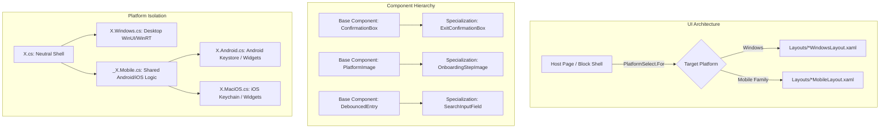

# Requirements

### Overview & Goals
Establish a comprehensive, battle-tested, and permanent architectural playbook and execution plan for the **MostaqlK** mobile readiness refactor and Master-Slave implementation. This plan captures every single technical detail, architectural constraint, user directive, and corrective milestone established throughout the entire evolutionary journey, specifically:

1. **Cross-Platformality & The Elimination of In-Body `#if PLATFORM`**:
   - Zero inline `#if WINDOWS`, `#if ANDROID`, or `#if IOS` directives in shared business logic, service layers, and view models.
   - Canonical exemptions strictly restricted to: `Core/Platform/CurrentPlatform.cs` (detection) and `UI/PlatformComponents/PlatformSelect.cs` (compile-time resolution with memoization).
   - Partial-class file family convention:
     - `X.cs`: Shared class shell declaring platform-neutral contracts.
     - `X.Windows.cs`: Windows WinUI / WinRT desktop implementation.
     - `_X.Mobile.cs`: Shared mobile-family logic common to Android and iOS (e.g. haptic touch feedback, Keystore AES-GCM, swipe gestures).
     - `X.Android.cs` & `X.MaciOS.cs` / `X.iOS.cs`: OS-specific concrete exports and bindings.
   - Multi-targeting compile rules in `MostaqlK.csproj` to cleanly isolate `.Windows.cs`, `.Android.cs`, and `.iOS.cs` files without collision.
   - Platform capability encapsulation via `PlatformCapability<T>` for asymmetric desktop features (e.g. `PlatformCapability<TrayIconService>.WindowsOnly(...)` which cleanly resolves to `null` on mobile).

2. **Abstractionality & The Base-to-Specialization Unit Hierarchy (`UNITS.md`)**:
   - Elimination of ad-hoc, duplicated UI patterns and logic across screens, promoting them into reusable named units:
     - *Inputs*: `Core/Debouncer.cs` ➔ `AppEntry` ➔ `DebouncedEntry` ➔ `SearchInputField`.
     - *Dialogs & Confirmations*: `ModalPresenter` (RTL WinUI ContentDialog vs mobile BottomSheet) ➔ `ConfirmationBox` ➔ `ExitConfirmationBox`.
     - *Images & Asset Resolution*: `PlatformImage` (memoized multi-platform source resolver) ➔ `OnboardingStepImage`.
     - *Formatting*: `Core/Formatting/SkillsFormatter` (centralized skills parsing and rendering).

3. **View Barrel Layout Swapping for Block Components & Full Screens**:
   - Composite block components and pages operate as lightweight `ContentView` / `ContentPage` host shells.
   - Constructors dynamically delegate visual hierarchy creation via `PlatformSelect.For<Func<View>>()`.
   - Desktop and mobile layouts live in separate, isolated XAML files:
     - `ProjectCard.xaml(.cs)` ➔ `Layouts/ProjectCardWindowsLayout.xaml` (4-column rich desktop card) vs `Layouts/ProjectCardMobileLayout.xaml` (clean mobile feed card).
     - `MainWindowPage.xaml(.cs)` ➔ `Layouts/MainWindowWindowsLayout.xaml` (desktop sidebar rail, feed, splitter handle, pipeline dashboard) vs `Layouts/MainWindowMobileLayout.xaml` (single-column mobile feed).
     - `ProjectDetailsPage.xaml(.cs)` ➔ `Layouts/ProjectDetailsWindowsLayout.xaml` vs `Layouts/ProjectDetailsMobileLayout.xaml`.
     - `SettingsPanel.xaml(.cs)` ➔ `Layouts/SettingsPanelWindowsLayout.xaml` vs `Layouts/SettingsPanelMobileLayout.xaml`.
     - `AboutPage.xaml(.cs)` ➔ `Layouts/AboutPageWindowsLayout.xaml` vs `Layouts/AboutPageMobileLayout.xaml`.

4. **Sensory, Touch, Animation & Security Parity**:
   - Replaced mouse-hover dependencies (`PointerEntered`/`PointerExited`) with touch-first scale transitions (`0.97`) and haptic feedback (`HapticFeedback.Perform(HapticFeedbackType.Click)`) via `_PressableEffect.Mobile.cs`.
   - Canvas inspection parity in `PipelineRadar.xaml.cs` via tap-to-inspect hit testing for touchscreens.
   - Credential protection parity: Windows DPAPI (`SecretProtector.Windows.cs`) vs hardware-backed Android Keystore / iOS Keychain AES-256 GCM (`_SecretProtector.Mobile.cs`).

5. **Grounding in Exact Design Mockups (`.repertoire/design/postmvp/mobile/`)**:
   - Complete mobile navigation and page hierarchy derived directly from HTML mockups:
     - `dashboard.html` (`//dashboard`): 148px circular `ScraperPowerButton` (pulsing status dot, emerald running vs crimson stopped), 4-column `DashboardDailyStats` (`فحص`, `مشاريع`, `مطابقة`, `تنبيهات`), `DashboardProjectCard` (Card Type 1), and `RecentScanRow` (Card Type 2).
     - `projects.html` (`//projects`): Filter chips, sort bar, and `ProjectCardMobileLayout` (Card Type 3 with swipe-to-reveal "Open on Mostaql" action).
     - `search.html` (`//search`): Instant search, budget range pills, multi-select skill chips, count-based apply button.
     - `more.html` (`//more`): Grouped settings cards, polling interval picker, In-App WebView session login (`mostaql_session` cookie capture).

6. **Master-Slave Autonomous Orchestration Framework**:
   - **Master Orchestrator**: Holds exclusive ownership of the global checklist; enforces zero-regression builds (`dotnet build MostaqlK.csproj -f net10.0-windows10.0.19041.0 -c Debug` with 0 errors and 0 warnings); reviews all slave diffs.
   - **Slave Subagents (Gemini 3.7 Flash)**: Inspect explicit HTML/CSS mockups before authoring code; reuse cataloged units from `UNITS.md`; execute atomic milestones and report diffs back to Master.

### Scope
- **In Scope**:
  - Consolidation of all architectural guidelines and steering documentation into permanent repository references (`docs/mostaqlk-evolution-and-architecture-journey.md`, `docs/cross-platform-and-abstraction-playbook.md`, `docs/universal-cross-platform-architecture-guide.md`, `docs/master-slave-agent-orchestration-framework.md`, `docs/mobile-master-orchestration-prompt.md`).
  - Verification of all cataloged units in `UNITS.md`.
  - Full validation that existing Windows desktop functionality remains 100% green with zero regressions.
- **Out of Scope**:
  - Unrelated backend scraper schema changes.
  - Speculative third-party packages outside .NET MAUI ecosystem standards.

---

# Technical Design

### Architectural Blueprint

### Key Decisions
1. **Strict Elimination of Inline `#if`**: Guarding code with `#if WINDOWS` in shared files couples concerns and hinders testing. Moving platform variances to dedicated partial class files isolates OS-specific code completely.
2. **View Barrel Layout Swapping Over Responsive `OnIdiom` Visibility**: Hiding elements with `IsVisible="{OnIdiom}"` leaves desktop XAML DOM elements instantiated and binding in memory. View Barrels instantiate only the specific platform layout tree required.
3. **OS Family Suffix (`_X.Mobile.cs`)**: Rather than duplicating mobile code across `.Android.cs` and `.iOS.cs`, the shared family file encapsulates common mobile logic, keeping platform leaf files clean.

---

# Testing

### Validation Approach
- **Build Verification**: Run `dotnet build MostaqlK.csproj -f net10.0-windows10.0.19041.0 -c Debug` to confirm zero compilation errors and zero warnings.
- **Static Invariant Grep**: Verify that no unexpected `#if WINDOWS`, `#if ANDROID`, or `#if IOS` directives exist outside `CurrentPlatform.cs` and `PlatformSelect.cs`.
- **Component Audit**: Cross-reference all newly introduced units against `UNITS.md`.

---

# Delivery Steps

### ✓ Step 1: Update and Consolidate Architectural Evolution Journey Document
Consolidate every conversation milestone, user steering directive, architectural decision, and implementation pattern into `docs/mostaqlk-evolution-and-architecture-journey.md`.

### ✓ Step 2: Author and Register the `senior-refactor` Agent Skill
Create and document the `senior-refactor` skill in `.junie/skills/senior-refactor/` with comprehensive `SKILL.md`, references, templates, and assets covering zero-coupling architecture, partial-class family splitting, unit hierarchies, and layout barrel swapping.