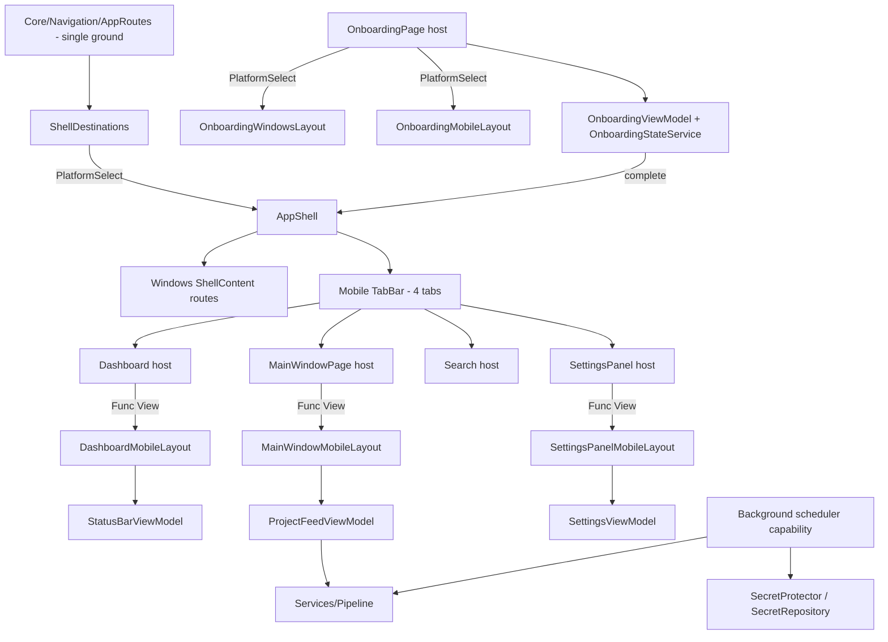

# Requirements

### Overview & Goals

Deliver the complete **MostaqlK Mobile Edition** (Android + iOS) on the existing .NET MAUI codebase, driven by a Master-Orchestrator model: the Master owns architecture, contracts, integration and acceptance; Slaves provide implementation capacity.

The outcome is **one coherent architecture** — mobile screens must look like they were designed together with the existing Windows desktop app, reusing the same ViewModels, services and unit catalog.

### Scope

**In Scope (Phases 1–9)**
- Mobile navigation shell: 4-tab RTL bottom navigation (`الرئيسية`, `المشاريع`, `البحث`, `المزيد`).
- **Mobile first-run onboarding** mirroring the six-step desktop onboarding flow (no mockup exists — derived from `.repertoire/design/mvp/onboarding.html` reflowed for phone form factors).
- Dashboard screen (`ScraperPowerButton`, `DashboardDailyStats`, `DashboardProjectCard`, `RecentScanRow`).
- Projects feed (filter/sort chips, `ProjectCardMobileLayout`, swipe actions).
- Search & filter screen (instant search, budget/skill/status filters, count-based Apply).
- More/Settings screen (polling, notifications, data purge, diagnostics, session login).
- WebView authentication + cookie extraction + secure session persistence.
- Background execution: Android `WorkManager`, iOS `BackgroundTasks`; mobile notifications.
- **Secondary surfaces that already have inert mobile barrels**: `ProjectDetailsMobileLayout.xaml`, `AboutPageMobileLayout.xaml`, plus a mobile presentation for `RecentNotificationsFlyout.xaml` and for `ModalPresenter`→`ConfirmationBox`→`ExitConfirmationBox`.
- Adaptive/tablet behaviour (≥600px master-detail).
- **Accessibility pass** (Android TalkBack / iOS VoiceOver semantics, 48dp touch targets, contrast, dynamic type) and **performance pass** (virtualized feeds, image sizing, startup cost) per current platform guidance.
- **Platform configuration**: Android manifest (permissions, notification channels, WorkManager), iOS `Info.plist` capabilities/background modes, mobile app icon and splash resources.
- **Typed mobile navigation ground**: extend the newly introduced `Core/Navigation/AppRoutes.cs` typed-route system (commit `ca01d56`) with a mobile destination set resolved through `PlatformSelect`, so both platforms consume one authoritative route vocabulary.
- **Single Ground compliance for every mobile surface** per `bugfree.txt` and `docs/single-ground-architecture-blueprint.md`, including closing the still-open mobile parity/perf violations `V-12` (skills row in `ProjectCardMobileLayout`), `V-13` (owner stats in `ProjectDetailsMobileLayout`) and `V-14` (`GetAllDetailsAsync` N+1).
- **Mobile startup-screen debug flags** — the mobile counterpart of the existing Windows `--default-page=` / `--project-id=` / `--theme=` / `--design-data` startup arguments, so any screen can be launched directly for visual testing.
- **Automated visual parity harness** — design-mockup screenshots compared against live `Pixel_6_API_29` emulator screenshots with `tools/snip_tool.py` + `tools/image_similarity.py`, iterated until every mobile screen reaches **≥80% similarity**.
- Integration pass, `UNITS.md` catalog updates, final architectural review.

**Out of Scope**
- Any change to the SQLite schema or diff-engine semantics to make UI easier.
- Any regression or visual change to the Windows desktop experience.
- `v2/` features and `design/mvp/` desktop mockup changes.

### User Stories
- As a mobile freelancer, I want a 4-tab Arabic RTL app so I can reach dashboard, feed, search and settings with one thumb.
- As a user, I want a large power button on the dashboard so I can start/stop scraping and see live daily counts.
- As a user, I want to swipe a project card to open it on Mostaql, bookmark or hide it.
- As a user, I want instant search with budget/skill/status filters and a count-based Apply button.
- As a user, I want to log in through an in-app WebView once and have my session stored in hardware-backed secure storage.
- As a user, I want new matching projects to be discovered and notified even when the app is backgrounded.
- As a first-time mobile user, I want the same six-step Arabic onboarding as on desktop, reflowed for a phone, so I can set my personalization query before reaching the tabs.
- As a developer, I want to launch the Android build directly on any screen (Settings, Search, onboarding, project details) via a debug flag — exactly like the Windows `--default-page=` flag — so I can screenshot it without manually navigating.
- As a developer, I want a repeatable command that captures the emulator screen, compares it to the corresponding design mockup and prints a similarity score with a regional breakdown, so I can iterate on layout until the screen matches the design.

### Functional Requirements
- All four destinations reachable and state-preserving; back behaviour correct on Android hardware back and iOS gestures.
- Every screen is a faithful implementation of its mockup in `.repertoire/design/postmvp/mobile/` (inspected, not recalled).
- All mobile UI is `FlowDirection="RightToLeft"` with the `Tajawal` family and design tokens from `UI/DesignSystem/DesignTokens.cs`.
- No hover-dependent interaction; press feedback via `PressableEffect` and haptics.
- Mobile screens bind to the existing `ProjectFeedViewModel`, `ProjectCardViewModel`, `ProjectDetailsViewModel`, `StatusBarViewModel`, `SettingsViewModel`, `NotificationCenterViewModel`.
- **Onboarding parity**: all six steps, Arabic RTL copy, `Resources/Images/Onboarding/` illustrations, progress dots, skip, query presets, validation, save/skip completion and final CTA behave identically to desktop; completion is stored once through the existing `OnboardingStateService` and the query through the existing `settings_query_params` contract. No mobile-only onboarding state, second preference key or duplicate view model.
- **No orphan surfaces**: every desktop screen has a reachable mobile counterpart — project details (from a feed card tap), about/diagnostics and the notifications list (from the More tab), and exit/confirmation modals rendered as mobile-appropriate sheets rather than desktop dialogs.
- Accessibility: every interactive element has a semantic description and a ≥48dp touch target; no information is conveyed by colour alone.
- On mobile, onboarding is a full-screen page presented before the tab shell (mobile has no multi-window concept); on Windows the existing dedicated onboarding `Window` created in `App.xaml.cs` is untouched.
- Mobile debug flags accept the **same argument vocabulary** as Windows (`--default-page=`, `--project-id=`, `--theme=`, `--design-data`), delivered through Android intent extras rather than a process command line, and resolve to the **same typed `AppRoute`** — no second startup-argument grammar.
- Debug-only startup flags are compiled out of Release builds and must never alter shipping startup behaviour.
- Design mockup screenshots are captured once into `tools/temp/mobile/<screen-name>/` and reused as the parity baseline for every subsequent comparison run.
- Every mobile screen (`onboarding`, `dashboard`, `projects`, `project-details`, `search`, `more`, `about`) reaches **≥80% overall similarity** against its design baseline before the final review phase closes.

### Non-Functional Requirements
- **Zero desktop regression**: `dotnet build MostaqlK.csproj -f net10.0-windows10.0.19041.0 -c Debug` → 0 errors, 0 warnings after every stage.
- **Zero `#if PLATFORM`** in shared logic outside `Core/Platform/CurrentPlatform.cs` and `UI/PlatformComponents/PlatformSelect.cs`.
- Session cookie `mostaql_session` never in plaintext or `Preferences`.
- Every new reusable unit registered in `UNITS.md`.
- Every new file justified against the New File Governance checklist before acceptance.
- **Single Ground**: no mobile surface may invent its own rounding, fallback text, pluralization, truncation limit, relative-time rule, status colour, route string or budget format — each must come from its authoritative ground in `Core/Formatting/`, `Core/Utilities/StringNormalization.cs`, `Core/Navigation/AppRoutes.cs` or `UI/DesignSystem/`.
- No presentation strings are ever written to SQLite (the `publish_time_text` class of violation must not reappear via mobile code paths).

# Technical Design

### Current Implementation

Investigation confirms the mobile scaffolding partially exists but is inert:

 Area | File | State |
---|---|---|
 Platform resolution | `UI/PlatformComponents/PlatformSelect.cs`, `Core/Platform/CurrentPlatform.cs`, `Core/Platform/PlatformCapability.cs` | Complete — canonical, the only permitted `#if` sites |
 Navigation concept | `UI/PlatformConcepts/NavigationControl.cs` | Already `PlatformSelect`s `CreateBottomTabs`/`BuildBottomNav` vs `CreateSidePanel`/`BuildSidePanel` — but returns **empty scaffold Grids** |
 App shell | `AppShell.xaml` / `.cs` | Flat desktop list of `ShellContent` (MainWindowPage, MainPage, SettingsPanel, AboutPage). **No mobile TabBar.** |
 Layout barrels | `Features/Projects/Views/Layouts/{MainWindow,ProjectCard,ProjectDetails,AboutPage}{Windows,Mobile}Layout.xaml`, `Features/Settings/Views/Layouts/SettingsPanel{Windows,Mobile}Layout.xaml` | Barrel pattern established; mobile variants are thin placeholders |
 Design system | `UI/DesignSystem/` — `DesignTokens`, `PressableEffect(.Windows/.Android/.iOS/_Mobile)`, `PressableBorder/Button/CheckBox/Picker/Switch`, `ShimmerBox`, `TruncatingLabel`, `NewRibbonBadge`, `ConfirmationBox`→`ExitConfirmationBox` | Reusable, mobile-ready |
 Platform components | `AppButton`, `AppCard`, `AppEntry`→`DebouncedEntry`→`SearchInputField`, `AppToggle`, `AppIcon`, `AppSidebar`, `PlatformImage`→`OnboardingStepImage`, `LastScanStatus`, `SplitterHandle` | Reuse targets |
 ViewModels | `Features/Projects/ViewModels/{ProjectFeed,ProjectCard,ProjectDetails,StatusBar}ViewModel.cs`, `Features/Settings/ViewModels/SettingsViewModel.cs`, `Features/Notifications/ViewModels/NotificationCenterViewModel.cs` | Production — to be **consumed, not duplicated** |
 Pipeline | `Services/Pipeline/{PollService,EnrichmentService,DiscoveryQueue,WorkerPool,TokenBucketRateLimiter}`, `Services/WorkerState.cs` | Shared engine that mobile background workers must drive |
 Security | `Infrastructure/Security/SecretProtector.{Windows,Android,MaciOS}.cs`, `Infrastructure/Database/SecretRepository.cs` | Existing secure-secret abstraction |
 Data | `Infrastructure/Database/SqliteConnectionFactory.cs`, `SearchIndex/FtsQueryService.cs`, `ProjectRepository.cs` | FTS5 Arabic search already implemented |

**Two recent commits change the baseline and are now folded into this plan:**

- **`ca01d56` — Single Ground refactor + typed navigation.** Introduced `Core/Navigation/AppRoutes.cs`: a branded `AppRoute` record struct, route-name constants (`MainWindowPageName`, `SettingsPanelName`, `AboutPageName`, `ProjectDetailsPageName`), the `projectId` query-param key, typed absolute routes (`MainWindow`/`Projects`, `Settings`, `About`, `Main`), parameterized `ProjectDetails(long|string)` builders, a main-thread-safe `NavigateAsync`, and a `Shell.GoToAsync(AppRoute)` extension. `AppShell.xaml.cs` now registers `AppRoutes.ProjectDetailsPageName` and maps `StartupNavigation.DefaultPage` to typed routes. **The destination set is desktop-shaped** — there are no `Dashboard`/`Search` destinations and no notion of a tab bar. The same commit landed the Single Ground engines (`ArabicNameFormatter`, `TextTruncator`, `PipelineTelemetryFormatter`, `StringNormalization`, `EnrichmentBadgeStyle`, `NotificationItemViewModel`) and deleted `Services/PublishedTimeUpdateService.cs`, plus `bugfree.txt` and `docs/single-ground-architecture-blueprint.md`.
- **`c13a1c0` — Android platform foundation.** Android manifest/`MainActivity`/`MainApplication` updates, mobile TFM wiring in `MostaqlK.csproj`, `.dotnetignore`, `PressableEffect.Android.cs` / `_PressableEffect.Mobile.cs` touch feedback, `DebouncedEntry`/`SearchInputField` debounced inputs, `PollService` polling adjustments, and `scripts/build.ps1` / `run.ps1` / `watch.ps1` with mobile targets. Mobile now compiles and runs — so every stage below can add a mobile build/run check, not only the Windows gate.

### Key Decisions

1. **Mobile navigation = Shell `TabBar`, barrel-swapped** *(confirmed with user)*. `AppShell` remains the single host; its content is resolved once via `PlatformSelect.For<Func<ShellItem>>()` → a mobile `TabBar` with 4 `ShellContent` tabs, or the existing Windows route list. `NavigationControl` remains the concept for in-page navigation chrome and is **not** duplicated by a new navigation service.
2. **No new navigation state manager.** Tab state is Shell routing state; `Routing.RegisterRoute` in `AppShell.xaml.cs` stays the single registration point.
3. **Screens are View Barrels.** Each mobile page is a lightweight `ContentPage` host delegating its visual tree via `PlatformSelect.For<Func<View>>()` to `Layouts/*MobileLayout.xaml`.
4. **ViewModel reuse over new presentation models.** New VMs only where the Master rules that an existing VM cannot be safely extended; a presentation-only adapter is preferred over a parallel state store.
5. **Background work is platform-divergent by design.** Android → `WorkManager` periodic + expedited unique work with constraints/backoff. iOS → `BGAppRefreshTask` (light poll) and `BGProcessingTask` (enrichment), scheduled opportunistically. Exposed to shared code through one abstraction resolved by `PlatformCapability`/`PlatformSelect` — never by branching in shared logic.
6. **Secure session via existing `SecretProtector` family.** WebView cookie extraction feeds `SecretRepository`; no new secret store.
7. **Design tokens only.** No hard-coded hex outside `DesignTokens.cs` / resource dictionaries.
8. **Typed navigation stays one ground; only the destination *set* is platform-resolved.** `Core/Navigation/AppRoutes.cs` remains the single authority for the `AppRoute` type, route-name constants, query-param keys and the navigation dispatcher — mobile must **not** get a second route vocabulary or its own `GoToAsync` helper. What genuinely differs is *which* destinations exist and in what order. Therefore:
   - `AppRoutes.cs` gains the missing shared names/routes needed by mobile (`DashboardPageName`/`Dashboard`, `SearchPageName`/`Search`, `MorePageName` aliasing the settings destination) — additive, so Windows behaviour is untouched.
   - A new platform concept `Core/Navigation/ShellDestinations.cs` (+ `ShellDestinations.Windows.cs` and `_ShellDestinations.Mobile.cs`) exposes the ordered top-level destination list and the startup-route mapping, resolved via `PlatformSelect.For<…>()`. Windows returns today's flat route list; mobile returns the 4 tab destinations. `AppShell` consumes this instead of hard-coding either shape.
   - `StartupNavigation.DefaultPage` → route mapping moves behind the same seam so `--default-page=` args and notification deep links resolve correctly per platform.
9. **Single Ground Principle is a first-class acceptance criterion** (`bugfree.txt`, `docs/single-ground-architecture-blueprint.md`). Every micro-decision a mobile screen appears to need — a fallback string, a truncation length, a plural form, a date phrasing, a status colour, a currency format, a route literal — must be traced to an existing authority before it is written. "Where was this decision made, and how many times?" is asked before any mobile screen is accepted. Mobile is the highest-risk drift surface precisely because it re-implements screens that already exist on Windows.

10. **Mobile startup arguments are a platform concept, not a new grammar.** `StartupNavigation.FromArguments` (`AppShell.xaml.cs:43`) already parses `--default-page=` / `--project-id=`, `ResolveTheme`/`ResolveExplicitTheme` (`AppShell.xaml.cs:71,92`) parse `--theme=`, and `DesignDataSeeder.ParseArguments` parses the seeding flag. Android has no process command line, so a `StartupArguments` platform concept (`StartupArguments.cs` + `.Windows.cs` + `_StartupArguments.Mobile.cs`) supplies the `string[]` those existing parsers consume: Windows returns `Environment.GetCommandLineArgs()`; mobile projects `MainActivity`'s launch-intent extras into the same `--key=value` shape. The direct `Environment.GetCommandLineArgs()` call sites in `App.xaml.cs` (lines 54, 56, 75, 82, 109, 147, 272, 305) route through the concept instead, so parsing, route mapping and theme resolution stay single-ground. Gated by `#if DEBUG` — a build-configuration switch, not a platform directive.
11. **Visual parity is measured, not asserted.** Design fidelity is verified by scoring emulator captures against mockup baselines with the existing `tools/image_similarity.py` (SSIM + palette + 4×4 regional grid + heatmap), not by eyeballing. Frame normalisation (Chrome chrome, emulator bezel/status bar) and mock-data normalisation (via the existing `--design-data` seeding) are part of the harness so the metric measures layout, not framing artefacts.

### Proposed Changes

- **Debug launch flags & visual parity**: add the `StartupArguments` platform concept so mobile can be launched on any screen by flag, and stand up the design-baseline / emulator-capture / similarity-scoring loop under `tools/temp/mobile/`.

- **AppShell**: introduce mobile shell content (`AppShell.Mobile.cs` partial or a mobile `TabBar` XAML fragment) selected at construction; register the 4 tab routes plus existing detail routes.
- **NavigationControl**: fill in the real mobile bottom-nav composition and safe-area handling; keep the desktop path byte-for-byte behaviourally identical.
- **Dashboard feature**: new `Features/Dashboard/` slice with a host page + `Layouts/DashboardMobileLayout.xaml`, plus the four dashboard units.
- **Projects**: flesh out `ProjectCardMobileLayout.xaml` and `MainWindowMobileLayout.xaml` (header counter, sort selector, filter chips, swipe actions) bound to `ProjectFeedViewModel`.
- **Search**: new mobile search page/layout composed from `SearchInputField` + `Core/Debouncer` + `SkillsFormatter`.
- **More/Settings**: flesh out `SettingsPanelMobileLayout.xaml` against `SettingsViewModel`; no second settings store.
- **Onboarding**: convert `Features/Onboarding/Views/OnboardingPage.xaml(.cs)` into a View Barrel host — its current desktop-sized visual tree moves to `Layouts/OnboardingWindowsLayout.xaml`, and a new `Layouts/OnboardingMobileLayout.xaml` gives the phone reflow (single vertical column, illustration capped by `OnboardingStepImage`, sticky bottom action row, thumb-reachable progress dots). The animation choreography hooks (`BeginExitAnimation`/`BeginEnterAnimation`, dot transitions, save spinner→check) move with each layout so `OnboardingViewModel` is unchanged. Startup presentation is resolved through `PlatformSelect` (desktop window vs mobile full-screen page).
- **Auth**: WebView login flow + cookie extraction into `Infrastructure/Http/CookieJar.cs` + `SecretRepository`.
- **Background**: platform partials driving `PollService`/`EnrichmentService`; mobile notification sender alongside the Windows toast variations in `Infrastructure/Notifications/`.
- **Navigation ground**: extend `Core/Navigation/AppRoutes.cs` with the shared mobile destination names and add the `ShellDestinations` platform-resolved destination set; all mobile navigation (tab switches, feed→details, notification taps, onboarding→shell) goes through typed `AppRoute` values, never raw strings.
- **Single Ground remediation carried into mobile**: `ProjectCardMobileLayout` gets the missing skills flex-wrap row (`V-12`), `ProjectDetailsMobileLayout` gets the mobile owner-stats card and loses the broken `StringFormat='{0} أيام'` in favour of `ArabicRelativeTime.Days` via the ViewModel (`V-13`), and `ProjectRepository.GetAllDetailsAsync` is batched before the mobile feed/search relies on it (`V-14`).

### Components

 Unit | Category | Base / reuse |
---|---|---|
 `ScraperPowerButton` | Design System | `PressableBorder` + `PressableEffect` + haptics |
 `DashboardDailyStats` | Block Component | `AppCard`, `LabelWithSubText` |
 `DashboardProjectCard` (Type 1) | Block Component | `AppCard`, `SkillsFormatter`, `ArabicRelativeTime`, `BudgetFormatter`, `NewRibbonBadge` |
 `RecentScanRow` (Type 2) | Block Component | `AppCard`, `TruncatingLabel` |
 `ProjectCardMobileLayout` (Type 3) | Layout Barrel | existing barrel host `ProjectCard` |
 `FilterChip` / chip group | Design System | `PressableBorder` |
 Mobile bottom navigation | Platform Concept | `NavigationControl` + Shell `TabBar` |
 Mobile background scheduler | Platform Capability | `PlatformCapability<T>` |
 `ShellDestinations` (Windows/Mobile) | Platform Concept | `Core/Navigation/AppRoutes.cs`, `PlatformSelect` |
 `OnboardingMobileLayout` | Layout Barrel | existing host `OnboardingPage`, `OnboardingStepImage`, `AppButton`, `AppEntry` |
 Onboarding presentation selector | Platform Concept | `PlatformSelect`, existing `OnboardingStateService` |
 `ProjectDetailsMobileLayout` | Layout Barrel | existing host `ProjectDetailsPage`, `ProjectDetailsViewModel` |
 `AboutPageMobileLayout` | Layout Barrel | existing host `AboutPage` |
 Notifications list mobile presentation | Platform Concept | `RecentNotificationsFlyout`, `NotificationCenterViewModel` |
 Mobile confirmation sheet | Design System | `ModalPresenter`→`ConfirmationBox`→`ExitConfirmationBox` |

### File Structure

```
AppShell.xaml(.cs)                      # modified: PlatformSelect-resolved shell content
AppShell.Mobile.cs                      # new: mobile TabBar composition + tab routes
Core/Navigation/AppRoutes.cs            # modified: additive Dashboard/Search/More route names
Core/Navigation/ShellDestinations.cs    # new: shared destination-set contract
Core/Navigation/ShellDestinations.Windows.cs   # new: desktop route list
Core/Navigation/_ShellDestinations.Mobile.cs   # new: 4-tab destination list
Core/Platform/StartupArguments.cs         # new: shared startup-argument contract
Core/Platform/StartupArguments.Windows.cs # new: Environment.GetCommandLineArgs()
Core/Platform/_StartupArguments.Mobile.cs # new: intent extras -> --key=value (DEBUG only)
tools/temp/mobile/<screen>/design.png     # new: design baselines (captured once)
tools/temp/mobile/<screen>/current.png    # new: emulator captures per iteration
UI/PlatformConcepts/NavigationControl.cs# modified: real mobile bottom nav
UI/DesignSystem/ScraperPowerButton.cs   # new
Features/Dashboard/Views/…/Layouts/DashboardMobileLayout.xaml(.cs)   # new
Features/Projects/Views/Layouts/ProjectCardMobileLayout.xaml(.cs)    # modified
Features/Projects/Views/Layouts/MainWindowMobileLayout.xaml(.cs)     # modified
Features/Search/Views/Layouts/SearchMobileLayout.xaml(.cs)           # new
Features/Settings/Views/Layouts/SettingsPanelMobileLayout.xaml(.cs)  # modified
Features/Projects/Views/Layouts/ProjectDetailsMobileLayout.xaml(.cs) # modified: real details tree
Features/Projects/Views/Layouts/AboutPageMobileLayout.xaml(.cs)      # modified: real about tree
Features/Notifications/Views/RecentNotificationsFlyout.xaml(.cs)     # modified: mobile presentation
Platforms/Android/AndroidManifest.xml, Platforms/iOS/Info.plist      # modified: permissions/capabilities
Features/Onboarding/Views/OnboardingPage.xaml(.cs)                   # modified: becomes barrel host
Features/Onboarding/Views/Layouts/OnboardingWindowsLayout.xaml(.cs)  # new: extracted desktop tree
Features/Onboarding/Views/Layouts/OnboardingMobileLayout.xaml(.cs)   # new: phone reflow
App.xaml.cs                              # modified: PlatformSelect-resolved onboarding presentation
Infrastructure/Security/…                # extended for WebView session
Infrastructure/Notifications/…Mobile.cs  # new mobile notification variation
Services/Background/…Android/…iOS        # new platform background schedulers
UNITS.md                                 # updated with every new unit
```

### Architecture Diagram



### Inter-Agent Contracts

Every delegated task is issued with: Task ID, owner, objective, allowed files, expected files, dependencies, units to reuse, units it must **not** create, ViewModels to consume, bindings, navigation contract, platform boundary, design source file, acceptance criteria, build requirement, integration requirements.

**Shared / locked files** (Master-coordinated, never concurrently edited): `AppShell.*`, `MauiProgram.cs`, `NavigationControl.cs`, `PlatformSelect.cs`, `UNITS.md`, shared `ResourceDictionary`, `MostaqlK.csproj`, shared ViewModels.

### Risks
- **Duplicate abstractions** from parallel Slaves → mitigated by the Integration Slave's duplicate-detection pass and New File Governance reports.
- **Windows regression** from touching barrels/NavigationControl → mitigated by the build gate after every stage.
- **iOS background scheduling is opportunistic**, not guaranteed → design must degrade gracefully to foreground polling.
- **WebView cookie APIs differ per platform** → isolated in platform partials, researched against current Android/Apple docs before implementation.
- **Navigation drift**: a Slave adding a mobile-only route string or a second `GoToAsync` helper would recreate exactly the duplicated-decision failure described in `bugfree.txt` → all routes must resolve through `AppRoutes`/`ShellDestinations`, enforced by a grep for raw `GoToAsync("` string literals.
- **Re-drift of Single Ground engines**: a mobile layout quietly re-implementing pluralization/relative time/status colour would reintroduce `V-03`–`V-09` on the mobile side → mitigated by the static greps in the Testing tab.
- **Extracting the desktop onboarding tree into a layout barrel is a high-risk refactor** of a working, animation-heavy page → move the markup verbatim, keep all `x:Name` references and animation hooks intact, and verify the desktop flow end to end before adding the mobile layout.

# Governance

### Master Operating Model
The Master is the sole owner of architectural integrity, cross-platform separation, abstraction strategy, delegation, inter-agent contracts, integration, regression prevention, build verification, design fidelity, new-file governance, `UNITS.md` integrity, and final acceptance. Slaves provide implementation capacity only: **no Slave may redefine architecture, introduce an architectural pattern without Master approval, or mark its own work complete.**

Every implementation task runs the full cycle — no stage is skipped because the task looks simple:

```text
UNDERSTAND → INSPECT EXISTING ARCHITECTURE → WEB RESEARCH → FORM ARCHITECTURAL DECISION
→ DESIGN INTER-AGENT CONTRACTS → DECOMPOSE INTO PARALLEL TASKS → DELEGATE TO SLAVES
→ SLAVES IMPLEMENT → INTEGRATION SLAVE MERGES/GLUES → MASTER REVIEWS
→ BUILD/TEST/VERIFY → FIX REGRESSIONS → UPDATE UNITS/ARCHITECTURE DOCS → MARK COMPLETE
```

**Ownership map** (exactly one primary owner per item): Navigation Slave · Dashboard Slave · Projects Slave · Search Slave · Settings Slave · Onboarding Slave · Security Slave · Android Background Slave · iOS Background Slave · Integration Slave. Other Slaves may consume an owner's public contract but must never silently modify its architecture. The Integration Slave is a glue-and-consistency agent — if integration requires an architectural decision it stops and reports to the Master.

### Research Gate (mandatory before every non-trivial task)
Fresh web research is performed per stage, scoped to that stage's subject:

 Subject | Research target |
---|---|
 Navigation | Current .NET MAUI navigation patterns and platform back-navigation behaviour |
 Android background work | Current Android `WorkManager` guidance (periodic/expedited/long-running, constraints, backoff, unique work, chaining, battery restrictions) |
 iOS background work | Current Apple `BackgroundTasks` guidance (`BGAppRefreshTask`, `BGProcessingTask`, scheduling constraints, expiration, capabilities) |
 Secure storage | Current Android Keystore and Apple Keychain guidance, key lifecycle, credential deletion |
 Haptics | Current Android/iOS haptic APIs and .NET MAUI support |
 WebView authentication | Current WebView/WKWebView cookie and session behaviour |
 Gesture handling | Current .NET MAUI gesture APIs and mobile interaction best practices |
 Adaptive layouts | Current MAUI responsive/adaptive layout recommendations |
 Accessibility | Current Android and iOS accessibility requirements |
 Notifications | Current Android notification requirements (channels, runtime permission) and Apple notification behaviour |
 Performance | Current .NET MAUI performance guidance |
 SQLite / FTS5 | Current SQLite and FTS5 recommendations where relevant |

**Source priority:** 1) Official Microsoft docs → 2) Official Android docs → 3) Official Apple docs → 4) Official .NET docs → 5) Official library docs → 6) High-quality technical references only when official docs are insufficient. Never copy code blindly from blogs, Stack Overflow or old tutorials; the Master must judge whether the information is still current (deprecations, API behaviour, platform limits, security and performance implications).

Research never overrides MostaqlK architecture — the repository and steering docs remain authoritative. The Master reconciles external best practice with the existing architecture.

### Conflict Resolution
When Slaves propose different solutions the Master never simply picks the first one that compiles. Evaluation criteria: existing architecture fit · reusability · cross-platform consistency · platform separation · duplication · lifecycle behaviour · maintainability · current platform best practice · performance · security · testability · future extensibility. **The solution that best fits the existing architectural system wins.**

### Architectural Consistency Test
Before accepting any new abstraction: *"If another feature needs this capability tomorrow, would we want them to use this same abstraction?"* If yes — make it reusable, place it in the correct layer, catalog it. If no — keep it local to the existing component and do not create a global abstraction.

### Architectural Source of Truth
Mandatory additions from the last two commits, to be read before any mobile work: `bugfree.txt`, `docs/single-ground-architecture-blueprint.md`, `Core/Navigation/AppRoutes.cs`, `.repertoire/agents/script-violation-scanner.md`, `.repertoire/agents/codebase-deep-swipe-auditor.md`.
Before any implementation every agent must have read: `docs/mobile-architecture-specification.md` · `.repertoire/design/postmvp/mobile/` · `UNITS.md` · `.repertoire/.steering/base/structure.md` · `.repertoire/.steering/v1/tech/cross-platform-ui-conventions.md` · `data-model-schema.md` · the ViewModels/services relevant to its task · the platform abstraction infrastructure · the existing layout barrels · the existing reusable components. **The repository itself is also a source of truth** — inspect existing implementations before creating any new abstraction.

### New File Governance — never create a file just because it is convenient
Every new file is reported with: Path, Architectural category, Reason, Existing abstraction considered, Why insufficient, Reusable, Platform, Unit registration required, Consumers. The Master approves before acceptance.

Before any file is created these questions must be answered: does an existing class already own this responsibility? should an existing abstraction be extended instead? is it platform-specific / mobile-family / desktop+mobile shared? is it a UI component, a design-system unit, a platform capability, a navigation concern, or a View Barrel? does it fit an existing architectural category? will it be reusable? does it create duplication? does it violate the partial-class conventions? does it need a `UNITS.md` entry?

**Worked example — bottom tabs.** A file named `BottomTabs.cs` is not automatically acceptable. The correct home is the existing navigation abstraction: `NavigationControl` → `PlatformSelect.For(...)` → Windows implementation / Mobile implementation — **not** a parallel set of `BottomTabs.cs`, `MainBottomTabs.cs`, `MobileBottomTabs.cs`, `NavigationTabs.cs` with duplicated responsibilities. New behaviour extends the architecture; it never creates a second architecture.

### Single Ground Principle (from `bugfree.txt` + `docs/single-ground-architecture-blueprint.md`)
The Golden Rule: *every business decision, linguistic rule, validation constraint, display policy and navigation identifier has exactly one authoritative ground.* Bugs in this codebase come from **duplicated decisions**, not merely duplicated code — a system can be locally correct and globally inconsistent. Moving a duplicated rule into two nicely-named per-platform helpers is **not** a fix; it only hides the duplication until the two copies drift.

Before writing any mobile line that encodes a rule, the owning agent answers: *Is this a business/linguistic/display decision? Must every platform behave identically? Where is the single ground? Can this consumer use that same ground?* If there is no ground yet, the Master establishes one before implementation — never a mobile-local copy. Share **decisions that must be identical**, not implementations that merely look similar (two buttons may legitimately differ; two budget formats may not).

**Authority matrix (mobile work must respect it):**

 Decision type | Authoritative ground |
---|---|
 Domain rules, Arabic grammar, initials, truncation, telemetry text | `Core/Domain/`, `Core/Formatting/` (`ArabicRelativeTime`, `ArabicProposalParser`, `ArabicNameFormatter`, `BudgetFormatter`, `TextTruncator`, `PipelineTelemetryFormatter`) |
 String normalization, diacritics, ASCII digits | `Core/Utilities/StringNormalization.cs` |
 Navigation routes, query params, dispatch | `Core/Navigation/AppRoutes.cs` (+ platform-resolved `ShellDestinations`) |
 Raw facts, UTC timestamps, numeric counts | `Infrastructure/` (never presentation strings) |
 State & presentation transformation | `Features/*/ViewModels` calling `Core/Formatting` |
 Colours, spacing, typography, status badges | `UI/DesignSystem/DesignTokens.cs`, `UI/DesignSystem/Badges/EnrichmentBadgeStyle.cs` |
 Platform divergence | `Core/Platform/` (`CurrentPlatform`, `PlatformSelect`, `PlatformCapability`) + `Platforms/` |

**Layer prohibitions:** `Infrastructure/` must not generate/store UI strings, mask missing fields with UI fallbacks (`?? "غير محدد"`), or run background services that rewrite display text into SQLite. `Core/` must not reference `Infrastructure/`. ViewModels must not slice strings, invent pluralization, or hardcode hex/status switches. XAML and code-behind must contain zero business or formatting logic — no inline `StringFormat` with hand-made Arabic grammar.

**Debugging stance:** when a mobile/desktop behaviour differs, the first question is not "where is the bug" but "where was this decision made, and how many times?" — then the architecture is changed so the class of bug becomes hard to reintroduce.

### Cross-Platform & Abstraction Rules
- **Forbidden in shared files:** `#if WINDOWS` / `#if ANDROID` / `#if IOS` / `#if MACCATALYST`, except in the canonical compile-time resolution infrastructure (`Core/Platform/CurrentPlatform.cs`, `UI/PlatformComponents/PlatformSelect.cs`).
- **Required file split:** `X.cs`, `X.Windows.cs`, `_X.Mobile.cs`, `X.Android.cs`, `X.iOS.cs`, `X.MaciOS.cs` by responsibility; `PlatformSelect<T>` / `PlatformCapability<T>` for compile-time resolution and optional capabilities.
- **Responsibility hierarchy:** shared abstraction → `PlatformSelect`/`PlatformCapability` → platform-family implementation → platform-specific implementation. Platform behaviour must never leak into shared ViewModels or business logic; expose it through a service/abstraction instead.
- **Abstraction hierarchy:** Base Component → Specialization → screen-specific composition (`AppEntry`→`DebouncedEntry`→`SearchInputField`, `ModalPresenter`→`ConfirmationBox`→`ExitConfirmationBox`, `PlatformImage`→`OnboardingStepImage`, plus `Core/Debouncer` and `Core/Formatting/SkillsFormatter`). No sibling components with duplicated behaviour.
- **View Barrel rule:** hosts stay lightweight and delegate via `PlatformSelect.For<Func<View>>()` to `Layouts/*WindowsLayout` / `Layouts/*MobileLayout`. The host never becomes a dumping ground for platform UI logic.
- **Design source of truth:** inspect the corresponding mockup (DOM hierarchy, dimensions, spacing, typography, colors, borders, radius, shadows, states, interaction, responsive and RTL behaviour) — never approximate from memory.
- **Touch-first:** no `PointerEntered`/`PointerExited`/hover/cursor dependencies on mobile; use `PressableEffect`, scale/opacity feedback and haptics, with gesture behaviour validated against current platform docs.
- **ViewModel rule:** consume existing production ViewModels (`ProjectFeedViewModel`, `ProjectCardViewModel`, `SettingsViewModel`, …). Never duplicate backend state in mobile-only ViewModels, never change the database schema to simplify UI, never break Windows to simplify mobile. If an existing VM cannot serve the requirement, the Master decides between safe extension, a missing shared abstraction, a presentation-only adapter, or a platform capability.
- **Dependency injection:** use the existing DI architecture and constructor injection; no manual service instantiation in Views/ViewModels. New services need a clear interface where useful, a defined lifetime, explicit registration with an architectural reason, a platform implementation strategy and testability considerations.
- **Security rule:** `mostaql_session` never in preferences or plaintext — only through the established `SecretProtector`/`_SecretProtector.Mobile.cs` architecture, with researched Keystore/Keychain behaviour, key lifecycle, logout deletion and safe WebView cookie extraction.
- **Background work rule:** never assume an API is right because the spec names it. Android: evaluate WorkManager one-time/periodic/expedited/long-running, constraints, retry/backoff, unique work, chaining, battery restrictions. iOS: evaluate `BGAppRefreshTask`, `BGProcessingTask`, `BGContinuedProcessingTask`, scheduling constraints, expiration/cancellation, capabilities. Android and iOS are not equivalent.
- **`UNITS.md` governance:** before creating a reusable component — search `UNITS.md`, search the repo, check for an equivalent, extend if appropriate, create only when necessary, register under the correct category (Platform Components / Platform Concepts / Design System / Block Components & Layout Barrels). The implementation is incomplete if `UNITS.md` does not reflect new units.

### Parallel Execution, Shared-File Locking & Contracts
Independent work is parallelised (e.g. Dashboard / Navigation / Search Slaves running concurrently, then the Integration Slave, then Master review) **only** where boundaries are clearly defined; tasks touching the same architectural core are never parallelised without explicit Master coordination.

High-risk shared files under controlled ownership: `NavigationControl`, `AppShell.*`, `MauiProgram.cs`, `UNITS.md`, `PlatformSelect.cs`, shared `ResourceDictionary`, shared ViewModels, `MostaqlK.csproj`.

Example contract:

```text
TASK: MOBILE-NAV-001   Owner: Navigation Slave
Responsibilities: mobile bottom navigation; NavigationControl integration
Must reuse: NavigationControl, PlatformSelect
Must NOT create: independent navigation service; second navigation state manager
Depends on: AppShell, existing navigation state
Integration contract: expose the navigation surface expected by AppShell;
                      no direct modification of project feed state
```

### Slave Implementation Protocol
Read task contract → inspect relevant architecture → inspect existing reusable units → inspect the HTML/CSS mockup → search the repo for existing implementations → research current external best practice → avoid unnecessary abstractions → implement only within the assigned responsibility → build → report changes, new files, architectural decisions and unresolved issues → return control to the Master. **The Slave cannot mark the task complete.**

### Regression Gate
Before accepting any task the Master asks: did it modify shared code? affect Windows? affect existing ViewModels? introduce a new service? introduce a new UI component? introduce a duplicate abstraction? modify navigation? modify resources? alter platform resolution? alter database behaviour? **Any "yes" triggers targeted review.** A successful build never by itself means the implementation is architecturally correct — the Master independently verifies the reported build result.

### Slave Report Format
Task, Status, Files modified, New files (with category/reason/alternatives), Reused components, ViewModel bindings, Services used, Platform-specific code, Architectural decisions, Design implementation, Web research performed, Build result, Warnings, Errors, Integration requirements, Unresolved questions. **No Slave marks its own work complete.**

### Master Acceptance Checklist
Design inspected · Architecture inspected · Best practices researched · `UNITS.md` checked · Existing abstractions reused · No unnecessary abstraction · New files justified · Platform separation preserved · ViewModel integration verified · Integration completed · Windows build 0 errors / 0 warnings · `UNITS.md` updated · No unresolved architectural conflict.

### Anti-Patterns (rejected on sight)
"Just create a helper / new service / another ViewModel / another card component", inline `#if ANDROID`, duplicating the Windows component, making it screen-specific, hard-coded navigation, manual service instantiation, a second state manager or formatter.

### Definition of Done
Android and iOS implementations complete · Windows still functional · all four mobile destinations working · Dashboard, Projects, Search, More/Settings and Onboarding implemented · authentication and secure session storage implemented · background execution and notifications implemented · adaptive/tablet behaviour implemented · RTL verified · touch interactions verified · mockups faithfully implemented · existing ViewModels integrated · existing abstractions reused · no forbidden platform directives · no duplicated architecture · all new files justified · all reusable units cataloged · integration complete · Windows build 0 errors / 0 warnings · final architectural review passed.

### Final Master Stance
SYSTEM not SCREEN · ARCHITECTURE not CONVENIENCE · INTEGRATION not ISOLATED IMPLEMENTATION · REUSE not DUPLICATION · PLATFORM ABSTRACTION not PLATFORM LEAKAGE · CURRENT BEST PRACTICE not ASSUMPTION. The goal is one coherent MostaqlK architecture in which independently implemented pieces behave as if they were designed together from the beginning.

# Testing

### Validation Approach
The primary automated gate is the **Windows build gate**, run after every stage:

```
dotnet build MostaqlK.csproj -f net10.0-windows10.0.19041.0 -c Debug
```
Required: **0 errors, 0 warnings**. Mobile targets are additionally built (`net10.0-android`) to prove the mobile compilation path.

Static architectural verification is performed by repository search rather than assumption:
- grep for `#if WINDOWS|#if ANDROID|#if IOS|#if MACCATALYST` — expected hits **only** in `Core/Platform/CurrentPlatform.cs` and `UI/PlatformComponents/PlatformSelect.cs`.
- grep for `PointerEntered|PointerExited` in mobile layouts — expected zero.
- grep for hard-coded hex literals in new mobile XAML — expected zero outside token definitions.
- grep for raw `GoToAsync("` / `"//` route string literals — expected zero outside `Core/Navigation/`.
- grep for `StringFormat=` with Arabic literals in mobile XAML, and for ad-hoc `?? "غير محدد"` / `.Substring(` / `$"{...} عرض"` patterns in new mobile code — expected zero (must route through `Core/Formatting`).
- Confirm no new column or write path persists presentation text into SQLite.
- Confirm every new reusable type has a corresponding row in `UNITS.md`.

### Key Scenarios
- All four tabs resolve their routes and render their mobile layout barrel.
- Windows shell still opens `MainWindowPage` with the unchanged desktop route list.
- Dashboard power toggle drives the existing pipeline state, not a private copy.
- Projects feed binds `ProjectFeedViewModel`; search binds the existing FTS query path.
- Session cookie round-trips through `SecretProtector`/`SecretRepository`, and logout deletes it.
- Every mobile navigation (tab switch, feed→details, notification tap, onboarding completion) resolves through a typed `AppRoute`; Windows startup args (`--default-page=`, `--project-id=`) still map to the same typed routes.
- The same project renders identical Arabic relative time, proposal pluralization, budget text, owner initials and status badge colour on mobile and Windows — proving one ground, not two.
- First launch on mobile shows onboarding; completing or skipping stores completion once and lands on the Dashboard tab; second launch goes straight to the tab shell.
- Windows first launch still opens the dedicated onboarding window with unchanged visuals and animations.

### Edge Cases
- Android hardware back from a non-first tab; iOS edge-swipe.
- Layout at ≥600px (tablet/landscape) switching to master-detail.
- RTL mirroring of chips, swipe directions and card affordances.
- Background work denied/deferred by the OS — app must fall back cleanly to foreground polling.

### Visual Parity Testing (Phase 8)

A repeatable design-vs-implementation loop, run after integration and before final review.

**One-time baseline capture**
- Serve the mockups locally (`python -m http.server` from `.repertoire/design/postmvp/mobile/`).
- Open each page in a Chrome window at the Pixel 6 logical viewport and capture the **full page**.
- Save baselines to `tools/temp/mobile/<screen-name>/design.png` for `onboarding`, `dashboard`, `projects`, `project-details`, `search`, `more`, `about`.

**Per-screen comparison loop**
1. Verify the build is deployed and focused on `Pixel_6_API_29` (`adb devices`, `adb shell dumpsys window | findstr mCurrentFocus`).
2. Relaunch the app on the target screen via the mobile debug flags (`adb shell am start -n <pkg>/…MainActivity -e default-page dashboard -e theme light -e design-data 1`).
3. Capture the emulator window with `tools/snip_tool.py --title "Pixel_6_API_29" --output tools/temp/mobile/<screen>/current.png`.
4. Score with `python tools/image_similarity.py tools/temp/mobile/<screen>/design.png tools/temp/mobile/<screen>/current.png --resize-mode pad --regional-score 4 --palette --heatmap-out tools/temp/mobile/<screen>/heat.png`.
5. Drive fixes from the worst-cell pixel boxes, the palette mismatch report and the heatmap; repeat until `overall_similarity ≥ 0.80`.

**Frame normalisation** — captures include browser chrome and emulator bezel/status bar, which SSIM and the palette metric would otherwise score as real divergence. Both baseline and current captures are cropped to the app content rectangle before comparison — the same concern `crop_titlebar` in `tools/compare_images.py` handles for the desktop title bar, generalised into a reusable crop with per-screen offsets recorded so runs are reproducible.

**Mock-data normalisation** — the mockups contain invented projects and counters. For the comparison window only, the app is launched with the existing `--design-data` seeding path so it renders the same fixture content. Any temporary hard-coded parity values are removed before the phase closes, and the static greps are re-run to prove nothing hard-coded survived.

### Test Changes
Extend `MostaqlK.UITests` where the existing harness supports the new surfaces; otherwise verification is by build gate, the static architectural greps above, and the recorded per-screen visual parity scores.

# Delivery Steps

###   Step 1: Phase 0-1: Typed navigation ground and mobile navigation shell
The app launches on Android/iOS into a 4-tab RTL bottom navigation driven by typed routes, while Windows keeps its existing shell unchanged.

- Complete Phase 0 discovery: re-read `docs/mobile-architecture-specification.md`, `.repertoire/.steering/v1/tech/cross-platform-ui-conventions.md`, `UNITS.md`, `bugfree.txt`, `docs/single-ground-architecture-blueprint.md`, `Core/Navigation/AppRoutes.cs`, and inspect all four mockups in `.repertoire/design/postmvp/mobile/`.
- Extend `Core/Navigation/AppRoutes.cs` additively with the shared mobile destination names/routes (`Dashboard`, `Search`, `More` aliasing the settings destination) — no second route vocabulary, no mobile-only `GoToAsync` helper.
- Add the `ShellDestinations` platform concept (`ShellDestinations.cs` + `ShellDestinations.Windows.cs` + `_ShellDestinations.Mobile.cs`) exposing the ordered top-level destination list and the `StartupNavigation.DefaultPage` → typed-route mapping, resolved via `PlatformSelect`; make `AppShell` consume it instead of hard-coding either shape.
- Research current .NET MAUI Shell/TabBar navigation and platform back-navigation behaviour before implementing.
- Add mobile shell composition (`AppShell.Mobile.cs` + mobile `TabBar` content) with tabs `الرئيسية`, `المشاريع`, `البحث`, `المزيد`; resolve shell content via `PlatformSelect` so `AppShell.xaml`'s Windows route list is untouched.
- Register the four tab routes alongside existing detail routes in `AppShell.xaml.cs`; do **not** introduce a second navigation service or state manager.
- Implement the real mobile composition in `UI/PlatformConcepts/NavigationControl.cs` (`CreateBottomTabs`/`BuildBottomNav`) including safe areas, Android navigation bar and iOS status bar insets; leave the desktop side-rail path behaviourally identical.
- Add adaptive switch to master-detail at ≥600px width.
- Define and freeze the inter-agent contracts, file-ownership map and shared-file lock list for all later stages.
- Register the mobile navigation and `ShellDestinations` units in `UNITS.md`; run the Windows build gate plus an Android build via `scripts/build.ps1`.

###   Step 2: Phase 2: Dashboard screen and its four units
The Dashboard tab renders a faithful implementation of `dashboard.html` driven by existing pipeline state.

- Inspect `.repertoire/design/postmvp/mobile/dashboard.html` for exact DOM, dimensions, spacing, typography, colors, radii, shadows and states.
- Add the `Features/Dashboard` slice as a View Barrel host delegating to `Layouts/DashboardMobileLayout.xaml` via `PlatformSelect.For<Func<View>>()`.
- Implement `ScraperPowerButton` (148px circular toggle, pulsing status indicator, emerald-running vs crimson-stopped gradients) on top of `PressableBorder`/`PressableEffect` with haptic feedback — no hover dependencies.
- Implement `DashboardDailyStats` as the 4-column metric grid (`فحص`, `مشاريع`, `مطابقة`, `تنبيهات`) using `AppCard` and `LabelWithSubText`.
- Implement `DashboardProjectCard` (Card Type 1) and `RecentScanRow` (Card Type 2) reusing `SkillsFormatter`, `ArabicRelativeTime`, `BudgetFormatter`, `NewRibbonBadge`, `TruncatingLabel`.
- Bind power state and counters to the existing `StatusBarViewModel` / pipeline services — no duplicated state.
- Source all colors from `UI/DesignSystem/DesignTokens.cs`; register every new unit in `UNITS.md`; run the Windows build gate.

###   Step 3: Phase 3: Projects feed with filters and swipe actions
The Projects tab shows the mobile feed from `projects.html` bound to the existing `ProjectFeedViewModel`.

- Inspect `.repertoire/design/postmvp/mobile/projects.html` before writing XAML.
- Flesh out `Features/Projects/Views/Layouts/MainWindowMobileLayout.xaml` with the header bar (project counter, sort selector) and horizontal filter chips (`الكل`, `جديدة`, `مفتوحة`, `ميزانية عالية`).
- Implement the reusable filter-chip unit on `PressableBorder` rather than a screen-local control.
- Flesh out `ProjectCardMobileLayout.xaml` (Card Type 3): keyword highlight, dynamic status pill from `EnrichmentBadgeStyle`, the missing flex-wrap skill-tag row (**closes `V-12`**), and a proposals/budget footer using `ArabicProposalParser` + `BudgetFormatter` — no local pluralization or hex.
- Batch `ProjectRepository.GetAllDetailsAsync` to remove the per-row skills/assets N+1 (**closes `V-14`**) before the mobile feed and search depend on it.
- Add swipe actions (Open on Mostaql, Bookmark, Hide) after researching current MAUI gesture/SwipeView behaviour; route them through existing `ProjectCardViewModel` commands.
- Consume `ProjectFeedViewModel` filtering/sorting — do not duplicate project-state logic or alter the Windows layout.
- Flesh out the currently inert `ProjectDetailsMobileLayout.xaml` so tapping a feed card opens a full-screen, scrollable details view bound to the existing `ProjectDetailsViewModel` (title, status, budget, skills, description, owner, open-on-Mostaql action) with correct Android back / iOS edge-swipe return; navigate via `AppRoutes.ProjectDetails(id)`, never a raw string.
- Add the mobile-adapted owner statistics card and remove any broken `StringFormat='{0} أيام'` in favour of the ViewModel's `ArabicRelativeTime.Days` output (**closes `V-13`**).
- Update `UNITS.md`; run the Windows build gate.

###   Step 4: Phase 4-5: Search screen and More/Settings screen
The Search and More tabs render `search.html` and `more.html` against existing services and settings state.

- Inspect both mockups before implementation.
- Add `Features/Search` host + `Layouts/SearchMobileLayout.xaml`: instant keyword search built on `SearchInputField` → `DebouncedEntry` → `AppEntry` with `Core/Debouncer`.
- Implement status toggle chips, budget-range selector pills and multi-select skill chips reusing the filter-chip unit from Phase 3 and `SkillsFormatter`.
- Wire results to the existing `Infrastructure/Database/SearchIndex/FtsQueryService.cs` Arabic FTS5 path; implement the count-based Apply button.
- Flesh out `Features/Settings/Views/Layouts/SettingsPanelMobileLayout.xaml`: grouped settings cards, polling interval picker, notification toggles, data export/purge, diagnostics — all bound to the existing `SettingsViewModel`, with no second settings store.
- Flesh out the inert `AboutPageMobileLayout.xaml` (version, credits, diagnostics links) and make it reachable from the More tab.
- Give `RecentNotificationsFlyout` a mobile presentation (full-screen / bottom-sheet list) bound to the existing `NotificationCenterViewModel`, reusing `NotificationUrlLauncher` for tap routing — no second notification store.
- Route exit/confirmation dialogs through the existing `ModalPresenter`→`ConfirmationBox`→`ExitConfirmationBox` hierarchy with a mobile sheet presentation instead of a desktop dialog.
- Update `UNITS.md`; run the Windows build gate.

###   Step 5: Phase 6: Mobile onboarding, WebView authentication and secure session storage
First launch on a phone runs the six-step onboarding, and a user can log in through an in-app WebView with their `mostaql_session` cookie persisted in hardware-backed secure storage.

**Onboarding (mirrors desktop; no mockup exists):**
- Extract the current desktop visual tree of `Features/Onboarding/Views/OnboardingPage.xaml` verbatim into `Layouts/OnboardingWindowsLayout.xaml(.cs)`, leaving `OnboardingPage` as a lightweight barrel host that resolves its tree via `PlatformSelect.For<Func<View>>()`; verify the desktop flow and animations are unchanged before continuing.
- Add `Layouts/OnboardingMobileLayout.xaml(.cs)`: single vertical column, illustration scaled through `OnboardingStepImage`, heading/badge/description stack, personalization panel using `AppEntry`, sticky bottom action row (`AppButton` next/save + skip), and thumb-reachable progress dots — all RTL `Tajawal` with `DesignTokens` colors and `PressableEffect` instead of hover.
- Re-host the step exit/enter animations, dot transitions and save spinner→check choreography per layout so `OnboardingViewModel` needs no change; respect `MotionPreferences.IsReducedMotionRequested`.
- Resolve startup presentation via `PlatformSelect` in `App.xaml.cs`: Windows keeps its dedicated onboarding `Window`; mobile presents onboarding full-screen before the tab shell and navigates to the Dashboard tab on completion.
- Reuse the existing `OnboardingStateService` completion flag and `settings_query_params` contract — no mobile-only onboarding state or second preference key.

**Authentication:**

- Research current Android WebView / iOS WKWebView cookie and session behaviour, plus Android Keystore and iOS Keychain guidance, before implementing.
- Add the in-app WebView login surface reachable from the More tab.
- Implement platform-partial cookie extraction and feed it into `Infrastructure/Http/CookieJar.cs` so scraping requests are authenticated.
- Persist the session through the existing `Infrastructure/Security/SecretProtector.{Android,MaciOS}.cs` and `SecretRepository` — never `Preferences` or plaintext files.
- Implement logout: secure deletion of the stored secret, cookie store clearing, and pipeline state reset.
- Keep all platform divergence in dedicated partial files; no `#if` in shared logic. Run the Windows build gate.

###   Step 6: Phase 7: Platform background execution and mobile notifications
Scraping continues under OS rules when the app is backgrounded, and new matches raise native notifications.

- Research current Android WorkManager guidance (periodic vs expedited vs long-running work, constraints, backoff, unique work, chaining, battery restrictions) and current Apple BackgroundTasks guidance (`BGAppRefreshTask` vs `BGProcessingTask`, scheduling constraints, expiration) — justify the chosen APIs.
- Define one shared background-scheduling abstraction exposed through `PlatformCapability`/`PlatformSelect`, with Android and iOS implementations in separate platform files.
- Android: WorkManager worker driving `Services/Pipeline/PollService` and `EnrichmentService`, plus manifest configuration and `NotificationCompat` notifications with runtime permission handling.
- iOS: BackgroundTasks registration, scheduling and expiration handling, plus required capabilities/Info.plist entries and notification authorization.
- Add a mobile notification variation alongside the existing Windows toast variations in `Infrastructure/Notifications/`, reusing `NotificationUrlLauncher` for tap routing.
- Ensure graceful degradation to foreground polling when the OS defers or denies background work. Update `UNITS.md`; run the Windows build gate.

###   Step 7: Phase 8: Mobile debug launch flags and the visual parity harness
Every mobile screen can be launched directly by flag, captured on `Pixel_6_API_29`, and scored ≥80% similar to its design mockup.

**Debug launch flags (mobile counterpart of the Windows startup arguments)**
- Add the `StartupArguments` platform concept (`Core/Platform/StartupArguments.cs`, `.Windows.cs`, `_StartupArguments.Mobile.cs`) resolved via `PlatformSelect`: Windows returns `Environment.GetCommandLineArgs()`; mobile maps `MainActivity`'s launch-intent extras into the same `--key=value` array.
- Replace the direct `Environment.GetCommandLineArgs()` calls in `App.xaml.cs` with the concept so `StartupNavigation.FromArguments`, `ResolveTheme`/`ResolveExplicitTheme` and `DesignDataSeeder.ParseArguments` are reused verbatim — no second argument grammar and no mobile-only parser.
- Extend the existing `--default-page=` vocabulary additively with the mobile destinations (`dashboard`, `search`, `more`, `about`, `onboarding`), mapping to the typed `AppRoutes` / `ShellDestinations` entries from Step 1.
- Guard the mobile extras path with `#if DEBUG` so the flags are absent from Release builds; register the concept in `UNITS.md`.

**One-time design baseline capture**
- Serve `.repertoire/design/postmvp/mobile/` with `python -m http.server`, open each page in Chrome at the Pixel 6 logical viewport, and capture full-page screenshots.
- Save them as `tools/temp/mobile/<screen-name>/design.png` for `onboarding`, `dashboard`, `projects`, `project-details`, `search`, `more`, `about`.

**Capture, compare and refine loop**
- Confirm the Android build is deployed and focused on `Pixel_6_API_29` via `adb devices` and `adb shell dumpsys window`.
- Launch each screen with `adb shell am start ... -e default-page <screen> -e theme light -e design-data 1`, then capture the emulator window with `tools/snip_tool.py`.
- Normalise frames before scoring: crop both baseline and capture to the app content rectangle (removing Chrome chrome and emulator bezel/status bar), generalising `tools/compare_images.py`'s `crop_titlebar` into a reusable crop with per-screen offsets recorded for reproducibility.
- Score with `python tools/image_similarity.py <design> <current> --resize-mode pad --regional-score 4 --palette --heatmap-out ...` and drive targeted fixes from the worst-cell boxes, palette mismatch report and heatmap.
- Use the existing `--design-data` seeding so mockup mock content is matched by real fixture data; remove any temporary hard-coded parity values at the end of the phase and re-run the static greps to prove it.
- Iterate per screen until `overall_similarity ≥ 0.80`; record the final score per screen and hand the results to the review step.

###   Step 8: Phase 8-9: Integration pass and final architectural review
All independently built pieces are glued into one coherent, reachable, regression-free application.

- Integration pass: connect all pages, navigation routes, ViewModels, commands, services, resource dictionaries and DI registrations in `MauiProgram.cs`; verify every layout barrel and platform-selection wiring actually resolves.
- Detect and remove duplicate components, conflicting names, duplicate abstractions, inconsistent binding conventions, conflicting resource keys and XAML namespace issues; confirm every new component is reachable from the app.
- Run the static architectural verification: no `#if PLATFORM` outside `CurrentPlatform.cs`/`PlatformSelect.cs`, no `PointerEntered`/`PointerExited` in mobile layouts, no hard-coded hex outside design tokens.
- Complete platform configuration: Android manifest permissions and notification channels, iOS `Info.plist` capabilities/background modes, plus mobile app icon and splash resources.
- Accessibility pass against current Android/iOS guidance: semantic descriptions on all interactive elements, ≥48dp touch targets, contrast checks, dynamic type, and TalkBack/VoiceOver traversal order in RTL.
- Performance pass against current .NET MAUI guidance: virtualized collections in the feed and search results, image sizing, and startup cost of the onboarding/shell resolution.
- Master review of the full diff across architecture, naming, abstraction, platform separation, view barrels, bindings, RTL, design fidelity, platform APIs, security, async/lifecycle, accessibility and performance.
- Reconcile `UNITS.md` so every introduced reusable unit is cataloged under the correct category.
- Confirm every screen's recorded visual parity score from Step 7 is ≥ 0.80, and that no temporary hard-coded parity values remain in the codebase.
- Final build gates: Windows `net10.0-windows10.0.19041.0` at 0 errors / 0 warnings, plus mobile target compilation; only then declare the mobile edition complete.