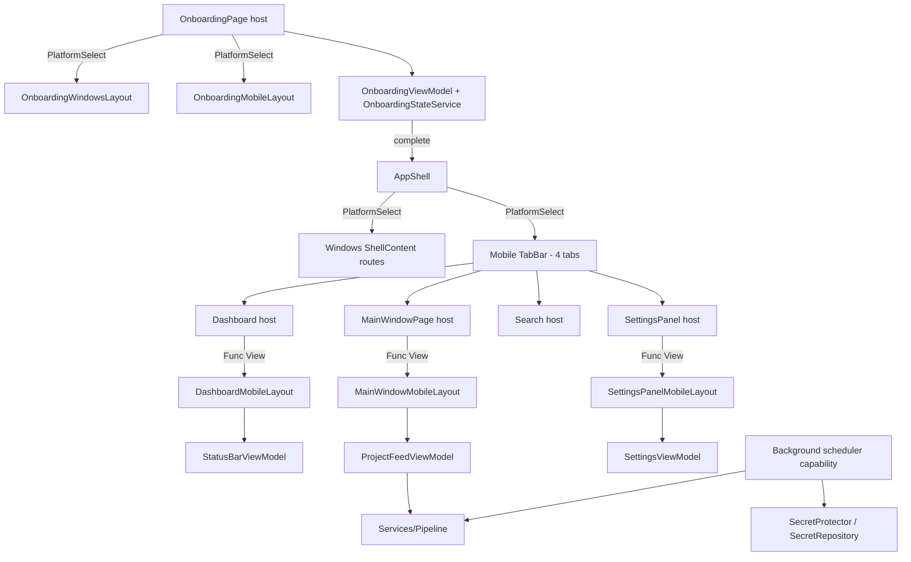

# Requirements

### Overview & Goals

Deliver the complete **MostaqlK Mobile Edition** (Android + iOS) on the existing .NET MAUI codebase, driven by a Master-Orchestrator model: the Master owns architecture, contracts, integration and acceptance; Slaves provide implementation capacity.

The outcome is **one coherent architecture** — mobile screens must look like they were designed together with the existing Windows desktop app, reusing the same ViewModels, services and unit catalog.

### Scope

**In Scope (Phases 1–9)**
- Mobile navigation shell: 4-tab RTL bottom navigation (`الرئيسية`, `المشاريع`, `البحث`, `المزيد`).
- **Mobile first-run onboarding** mirroring the six-step desktop onboarding flow (no mockup exists — derived from `.repertoire/design/mvp/onboarding.html` reflowed for phone form factors).
- Dashboard screen (`ScraperPowerButton`, `DashboardDailyStats`, `DashboardProjectCard`, `RecentScanRow`).
- Projects feed (filter/sort chips, `ProjectCardMobileLayout`, swipe actions).
- Search & filter screen (instant search, budget/skill/status filters, count-based Apply).
- More/Settings screen (polling, notifications, data purge, diagnostics, session login).
- WebView authentication + cookie extraction + secure session persistence.
- Background execution: Android `WorkManager`, iOS `BackgroundTasks`; mobile notifications.
- **Secondary surfaces that already have inert mobile barrels**: `ProjectDetailsMobileLayout.xaml`, `AboutPageMobileLayout.xaml`, plus a mobile presentation for `RecentNotificationsFlyout.xaml` and for `ModalPresenter`→`ConfirmationBox`→`ExitConfirmationBox`.
- Adaptive/tablet behaviour (≥600px master-detail).
- **Accessibility pass** (Android TalkBack / iOS VoiceOver semantics, 48dp touch targets, contrast, dynamic type) and **performance pass** (virtualized feeds, image sizing, startup cost) per current platform guidance.
- **Platform configuration**: Android manifest (permissions, notification channels, WorkManager), iOS `Info.plist` capabilities/background modes, mobile app icon and splash resources.
- Integration pass, `UNITS.md` catalog updates, final architectural review.

**Out of Scope**
- Any change to the SQLite schema or diff-engine semantics to make UI easier.
- Any regression or visual change to the Windows desktop experience.
- `v2/` features and `design/mvp/` desktop mockup changes.

### User Stories
- As a mobile freelancer, I want a 4-tab Arabic RTL app so I can reach dashboard, feed, search and settings with one thumb.
- As a user, I want a large power button on the dashboard so I can start/stop scraping and see live daily counts.
- As a user, I want to swipe a project card to open it on Mostaql, bookmark or hide it.
- As a user, I want instant search with budget/skill/status filters and a count-based Apply button.
- As a user, I want to log in through an in-app WebView once and have my session stored in hardware-backed secure storage.
- As a user, I want new matching projects to be discovered and notified even when the app is backgrounded.
- As a first-time mobile user, I want the same six-step Arabic onboarding as on desktop, reflowed for a phone, so I can set my personalization query before reaching the tabs.

### Functional Requirements
- All four destinations reachable and state-preserving; back behaviour correct on Android hardware back and iOS gestures.
- Every screen is a faithful implementation of its mockup in `.repertoire/design/postmvp/mobile/` (inspected, not recalled).
- All mobile UI is `FlowDirection="RightToLeft"` with the `Tajawal` family and design tokens from `UI/DesignSystem/DesignTokens.cs`.
- No hover-dependent interaction; press feedback via `PressableEffect` and haptics.
- Mobile screens bind to the existing `ProjectFeedViewModel`, `ProjectCardViewModel`, `ProjectDetailsViewModel`, `StatusBarViewModel`, `SettingsViewModel`, `NotificationCenterViewModel`.
- **Onboarding parity**: all six steps, Arabic RTL copy, `Resources/Images/Onboarding/` illustrations, progress dots, skip, query presets, validation, save/skip completion and final CTA behave identically to desktop; completion is stored once through the existing `OnboardingStateService` and the query through the existing `settings_query_params` contract. No mobile-only onboarding state, second preference key or duplicate view model.
- **No orphan surfaces**: every desktop screen has a reachable mobile counterpart — project details (from a feed card tap), about/diagnostics and the notifications list (from the More tab), and exit/confirmation modals rendered as mobile-appropriate sheets rather than desktop dialogs.
- Accessibility: every interactive element has a semantic description and a ≥48dp touch target; no information is conveyed by colour alone.
- On mobile, onboarding is a full-screen page presented before the tab shell (mobile has no multi-window concept); on Windows the existing dedicated onboarding `Window` created in `App.xaml.cs` is untouched.

### Non-Functional Requirements
- **Zero desktop regression**: `dotnet build MostaqlK.csproj -f net10.0-windows10.0.19041.0 -c Debug` → 0 errors, 0 warnings after every stage.
- **Zero `#if PLATFORM`** in shared logic outside `Core/Platform/CurrentPlatform.cs` and `UI/PlatformComponents/PlatformSelect.cs`.
- Session cookie `mostaql_session` never in plaintext or `Preferences`.
- Every new reusable unit registered in `UNITS.md`.
- Every new file justified against the New File Governance checklist before acceptance.

# Technical Design

### Current Implementation

Investigation confirms the mobile scaffolding partially exists but is inert:

 Area | File | State |
---|---|---|
 Platform resolution | `UI/PlatformComponents/PlatformSelect.cs`, `Core/Platform/CurrentPlatform.cs`, `Core/Platform/PlatformCapability.cs` | Complete — canonical, the only permitted `#if` sites |
 Navigation concept | `UI/PlatformConcepts/NavigationControl.cs` | Already `PlatformSelect`s `CreateBottomTabs`/`BuildBottomNav` vs `CreateSidePanel`/`BuildSidePanel` — but returns **empty scaffold Grids** |
 App shell | `AppShell.xaml` / `.cs` | Flat desktop list of `ShellContent` (MainWindowPage, MainPage, SettingsPanel, AboutPage). **No mobile TabBar.** |
 Layout barrels | `Features/Projects/Views/Layouts/{MainWindow,ProjectCard,ProjectDetails,AboutPage}{Windows,Mobile}Layout.xaml`, `Features/Settings/Views/Layouts/SettingsPanel{Windows,Mobile}Layout.xaml` | Barrel pattern established; mobile variants are thin placeholders |
 Design system | `UI/DesignSystem/` — `DesignTokens`, `PressableEffect(.Windows/.Android/.iOS/_Mobile)`, `PressableBorder/Button/CheckBox/Picker/Switch`, `ShimmerBox`, `TruncatingLabel`, `NewRibbonBadge`, `ConfirmationBox`→`ExitConfirmationBox` | Reusable, mobile-ready |
 Platform components | `AppButton`, `AppCard`, `AppEntry`→`DebouncedEntry`→`SearchInputField`, `AppToggle`, `AppIcon`, `AppSidebar`, `PlatformImage`→`OnboardingStepImage`, `LastScanStatus`, `SplitterHandle` | Reuse targets |
 ViewModels | `Features/Projects/ViewModels/{ProjectFeed,ProjectCard,ProjectDetails,StatusBar}ViewModel.cs`, `Features/Settings/ViewModels/SettingsViewModel.cs`, `Features/Notifications/ViewModels/NotificationCenterViewModel.cs` | Production — to be **consumed, not duplicated** |
 Pipeline | `Services/Pipeline/{PollService,EnrichmentService,DiscoveryQueue,WorkerPool,TokenBucketRateLimiter}`, `Services/WorkerState.cs` | Shared engine that mobile background workers must drive |
 Security | `Infrastructure/Security/SecretProtector.{Windows,Android,MaciOS}.cs`, `Infrastructure/Database/SecretRepository.cs` | Existing secure-secret abstraction |
 Data | `Infrastructure/Database/SqliteConnectionFactory.cs`, `SearchIndex/FtsQueryService.cs`, `ProjectRepository.cs` | FTS5 Arabic search already implemented |

### Key Decisions

1. **Mobile navigation = Shell `TabBar`, barrel-swapped** *(confirmed with user)*. `AppShell` remains the single host; its content is resolved once via `PlatformSelect.For<Func<ShellItem>>()` → a mobile `TabBar` with 4 `ShellContent` tabs, or the existing Windows route list. `NavigationControl` remains the concept for in-page navigation chrome and is **not** duplicated by a new navigation service.
2. **No new navigation state manager.** Tab state is Shell routing state; `Routing.RegisterRoute` in `AppShell.xaml.cs` stays the single registration point.
3. **Screens are View Barrels.** Each mobile page is a lightweight `ContentPage` host delegating its visual tree via `PlatformSelect.For<Func<View>>()` to `Layouts/*MobileLayout.xaml`.
4. **ViewModel reuse over new presentation models.** New VMs only where the Master rules that an existing VM cannot be safely extended; a presentation-only adapter is preferred over a parallel state store.
5. **Background work is platform-divergent by design.** Android → `WorkManager` periodic + expedited unique work with constraints/backoff. iOS → `BGAppRefreshTask` (light poll) and `BGProcessingTask` (enrichment), scheduled opportunistically. Exposed to shared code through one abstraction resolved by `PlatformCapability`/`PlatformSelect` — never by branching in shared logic.
6. **Secure session via existing `SecretProtector` family.** WebView cookie extraction feeds `SecretRepository`; no new secret store.
7. **Design tokens only.** No hard-coded hex outside `DesignTokens.cs` / resource dictionaries.

### Proposed Changes

- **AppShell**: introduce mobile shell content (`AppShell.Mobile.cs` partial or a mobile `TabBar` XAML fragment) selected at construction; register the 4 tab routes plus existing detail routes.
- **NavigationControl**: fill in the real mobile bottom-nav composition and safe-area handling; keep the desktop path byte-for-byte behaviourally identical.
- **Dashboard feature**: new `Features/Dashboard/` slice with a host page + `Layouts/DashboardMobileLayout.xaml`, plus the four dashboard units.
- **Projects**: flesh out `ProjectCardMobileLayout.xaml` and `MainWindowMobileLayout.xaml` (header counter, sort selector, filter chips, swipe actions) bound to `ProjectFeedViewModel`.
- **Search**: new mobile search page/layout composed from `SearchInputField` + `Core/Debouncer` + `SkillsFormatter`.
- **More/Settings**: flesh out `SettingsPanelMobileLayout.xaml` against `SettingsViewModel`; no second settings store.
- **Onboarding**: convert `Features/Onboarding/Views/OnboardingPage.xaml(.cs)` into a View Barrel host — its current desktop-sized visual tree moves to `Layouts/OnboardingWindowsLayout.xaml`, and a new `Layouts/OnboardingMobileLayout.xaml` gives the phone reflow (single vertical column, illustration capped by `OnboardingStepImage`, sticky bottom action row, thumb-reachable progress dots). The animation choreography hooks (`BeginExitAnimation`/`BeginEnterAnimation`, dot transitions, save spinner→check) move with each layout so `OnboardingViewModel` is unchanged. Startup presentation is resolved through `PlatformSelect` (desktop window vs mobile full-screen page).
- **Auth**: WebView login flow + cookie extraction into `Infrastructure/Http/CookieJar.cs` + `SecretRepository`.
- **Background**: platform partials driving `PollService`/`EnrichmentService`; mobile notification sender alongside the Windows toast variations in `Infrastructure/Notifications/`.

### Components

 Unit | Category | Base / reuse |
---|---|---|
 `ScraperPowerButton` | Design System | `PressableBorder` + `PressableEffect` + haptics |
 `DashboardDailyStats` | Block Component | `AppCard`, `LabelWithSubText` |
 `DashboardProjectCard` (Type 1) | Block Component | `AppCard`, `SkillsFormatter`, `ArabicRelativeTime`, `BudgetFormatter`, `NewRibbonBadge` |
 `RecentScanRow` (Type 2) | Block Component | `AppCard`, `TruncatingLabel` |
 `ProjectCardMobileLayout` (Type 3) | Layout Barrel | existing barrel host `ProjectCard` |
 `FilterChip` / chip group | Design System | `PressableBorder` |
 Mobile bottom navigation | Platform Concept | `NavigationControl` + Shell `TabBar` |
 Mobile background scheduler | Platform Capability | `PlatformCapability<T>` |
 `OnboardingMobileLayout` | Layout Barrel | existing host `OnboardingPage`, `OnboardingStepImage`, `AppButton`, `AppEntry` |
 Onboarding presentation selector | Platform Concept | `PlatformSelect`, existing `OnboardingStateService` |
 `ProjectDetailsMobileLayout` | Layout Barrel | existing host `ProjectDetailsPage`, `ProjectDetailsViewModel` |
 `AboutPageMobileLayout` | Layout Barrel | existing host `AboutPage` |
 Notifications list mobile presentation | Platform Concept | `RecentNotificationsFlyout`, `NotificationCenterViewModel` |
 Mobile confirmation sheet | Design System | `ModalPresenter`→`ConfirmationBox`→`ExitConfirmationBox` |

### File Structure

```
AppShell.xaml(.cs)                      # modified: PlatformSelect-resolved shell content
AppShell.Mobile.cs                      # new: mobile TabBar composition + tab routes
UI/PlatformConcepts/NavigationControl.cs# modified: real mobile bottom nav
UI/DesignSystem/ScraperPowerButton.cs   # new
Features/Dashboard/Views/…/Layouts/DashboardMobileLayout.xaml(.cs)   # new
Features/Projects/Views/Layouts/ProjectCardMobileLayout.xaml(.cs)    # modified
Features/Projects/Views/Layouts/MainWindowMobileLayout.xaml(.cs)     # modified
Features/Search/Views/Layouts/SearchMobileLayout.xaml(.cs)           # new
Features/Settings/Views/Layouts/SettingsPanelMobileLayout.xaml(.cs)  # modified
Features/Projects/Views/Layouts/ProjectDetailsMobileLayout.xaml(.cs) # modified: real details tree
Features/Projects/Views/Layouts/AboutPageMobileLayout.xaml(.cs)      # modified: real about tree
Features/Notifications/Views/RecentNotificationsFlyout.xaml(.cs)     # modified: mobile presentation
Platforms/Android/AndroidManifest.xml, Platforms/iOS/Info.plist      # modified: permissions/capabilities
Features/Onboarding/Views/OnboardingPage.xaml(.cs)                   # modified: becomes barrel host
Features/Onboarding/Views/Layouts/OnboardingWindowsLayout.xaml(.cs)  # new: extracted desktop tree
Features/Onboarding/Views/Layouts/OnboardingMobileLayout.xaml(.cs)   # new: phone reflow
App.xaml.cs                              # modified: PlatformSelect-resolved onboarding presentation
Infrastructure/Security/…                # extended for WebView session
Infrastructure/Notifications/…Mobile.cs  # new mobile notification variation
Services/Background/…Android/…iOS        # new platform background schedulers
UNITS.md                                 # updated with every new unit
```

### Architecture Diagram



### Inter-Agent Contracts

Every delegated task is issued with: Task ID, owner, objective, allowed files, expected files, dependencies, units to reuse, units it must **not** create, ViewModels to consume, bindings, navigation contract, platform boundary, design source file, acceptance criteria, build requirement, integration requirements.

**Shared / locked files** (Master-coordinated, never concurrently edited): `AppShell.*`, `MauiProgram.cs`, `NavigationControl.cs`, `PlatformSelect.cs`, `UNITS.md`, shared `ResourceDictionary`, `MostaqlK.csproj`, shared ViewModels.

### Risks
- **Duplicate abstractions** from parallel Slaves → mitigated by the Integration Slave's duplicate-detection pass and New File Governance reports.
- **Windows regression** from touching barrels/NavigationControl → mitigated by the build gate after every stage.
- **iOS background scheduling is opportunistic**, not guaranteed → design must degrade gracefully to foreground polling.
- **WebView cookie APIs differ per platform** → isolated in platform partials, researched against current Android/Apple docs before implementation.
- **Extracting the desktop onboarding tree into a layout barrel is a high-risk refactor** of a working, animation-heavy page → move the markup verbatim, keep all `x:Name` references and animation hooks intact, and verify the desktop flow end to end before adding the mobile layout.

# Governance

### Master Operating Model
The Master is the sole owner of architectural integrity, cross-platform separation, abstraction strategy, delegation, inter-agent contracts, integration, regression prevention, build verification, design fidelity, new-file governance, `UNITS.md` integrity, and final acceptance. Slaves provide implementation capacity only: **no Slave may redefine architecture, introduce an architectural pattern without Master approval, or mark its own work complete.**

Every implementation task runs the full cycle — no stage is skipped because the task looks simple:

```text
UNDERSTAND → INSPECT EXISTING ARCHITECTURE → WEB RESEARCH → FORM ARCHITECTURAL DECISION
→ DESIGN INTER-AGENT CONTRACTS → DECOMPOSE INTO PARALLEL TASKS → DELEGATE TO SLAVES
→ SLAVES IMPLEMENT → INTEGRATION SLAVE MERGES/GLUES → MASTER REVIEWS
→ BUILD/TEST/VERIFY → FIX REGRESSIONS → UPDATE UNITS/ARCHITECTURE DOCS → MARK COMPLETE
```

**Ownership map** (exactly one primary owner per item): Navigation Slave · Dashboard Slave · Projects Slave · Search Slave · Settings Slave · Onboarding Slave · Security Slave · Android Background Slave · iOS Background Slave · Integration Slave. Other Slaves may consume an owner's public contract but must never silently modify its architecture. The Integration Slave is a glue-and-consistency agent — if integration requires an architectural decision it stops and reports to the Master.

### Research Gate (mandatory before every non-trivial task)
Fresh web research is performed per stage, scoped to that stage's subject:

 Subject | Research target |
---|---|
 Navigation | Current .NET MAUI navigation patterns and platform back-navigation behaviour |
 Android background work | Current Android `WorkManager` guidance (periodic/expedited/long-running, constraints, backoff, unique work, chaining, battery restrictions) |
 iOS background work | Current Apple `BackgroundTasks` guidance (`BGAppRefreshTask`, `BGProcessingTask`, scheduling constraints, expiration, capabilities) |
 Secure storage | Current Android Keystore and Apple Keychain guidance, key lifecycle, credential deletion |
 Haptics | Current Android/iOS haptic APIs and .NET MAUI support |
 WebView authentication | Current WebView/WKWebView cookie and session behaviour |
 Gesture handling | Current .NET MAUI gesture APIs and mobile interaction best practices |
 Adaptive layouts | Current MAUI responsive/adaptive layout recommendations |
 Accessibility | Current Android and iOS accessibility requirements |
 Notifications | Current Android notification requirements (channels, runtime permission) and Apple notification behaviour |
 Performance | Current .NET MAUI performance guidance |
 SQLite / FTS5 | Current SQLite and FTS5 recommendations where relevant |

**Source priority:** 1) Official Microsoft docs → 2) Official Android docs → 3) Official Apple docs → 4) Official .NET docs → 5) Official library docs → 6) High-quality technical references only when official docs are insufficient. Never copy code blindly from blogs, Stack Overflow or old tutorials; the Master must judge whether the information is still current (deprecations, API behaviour, platform limits, security and performance implications).

Research never overrides MostaqlK architecture — the repository and steering docs remain authoritative. The Master reconciles external best practice with the existing architecture.

### Conflict Resolution
When Slaves propose different solutions the Master never simply picks the first one that compiles. Evaluation criteria: existing architecture fit · reusability · cross-platform consistency · platform separation · duplication · lifecycle behaviour · maintainability · current platform best practice · performance · security · testability · future extensibility. **The solution that best fits the existing architectural system wins.**

### Architectural Consistency Test
Before accepting any new abstraction: *"If another feature needs this capability tomorrow, would we want them to use this same abstraction?"* If yes — make it reusable, place it in the correct layer, catalog it. If no — keep it local to the existing component and do not create a global abstraction.

### Architectural Source of Truth
Before any implementation every agent must have read: `docs/mobile-architecture-specification.md` · `.repertoire/design/postmvp/mobile/` · `UNITS.md` · `.repertoire/.steering/base/structure.md` · `.repertoire/.steering/v1/tech/cross-platform-ui-conventions.md` · `data-model-schema.md` · the ViewModels/services relevant to its task · the platform abstraction infrastructure · the existing layout barrels · the existing reusable components. **The repository itself is also a source of truth** — inspect existing implementations before creating any new abstraction.

### New File Governance — never create a file just because it is convenient
Every new file is reported with: Path, Architectural category, Reason, Existing abstraction considered, Why insufficient, Reusable, Platform, Unit registration required, Consumers. The Master approves before acceptance.

Before any file is created these questions must be answered: does an existing class already own this responsibility? should an existing abstraction be extended instead? is it platform-specific / mobile-family / desktop+mobile shared? is it a UI component, a design-system unit, a platform capability, a navigation concern, or a View Barrel? does it fit an existing architectural category? will it be reusable? does it create duplication? does it violate the partial-class conventions? does it need a `UNITS.md` entry?

**Worked example — bottom tabs.** A file named `BottomTabs.cs` is not automatically acceptable. The correct home is the existing navigation abstraction: `NavigationControl` → `PlatformSelect.For(...)` → Windows implementation / Mobile implementation — **not** a parallel set of `BottomTabs.cs`, `MainBottomTabs.cs`, `MobileBottomTabs.cs`, `NavigationTabs.cs` with duplicated responsibilities. New behaviour extends the architecture; it never creates a second architecture.

### Cross-Platform & Abstraction Rules
- **Forbidden in shared files:** `#if WINDOWS` / `#if ANDROID` / `#if IOS` / `#if MACCATALYST`, except in the canonical compile-time resolution infrastructure (`Core/Platform/CurrentPlatform.cs`, `UI/PlatformComponents/PlatformSelect.cs`).
- **Required file split:** `X.cs`, `X.Windows.cs`, `_X.Mobile.cs`, `X.Android.cs`, `X.iOS.cs`, `X.MaciOS.cs` by responsibility; `PlatformSelect<T>` / `PlatformCapability<T>` for compile-time resolution and optional capabilities.
- **Responsibility hierarchy:** shared abstraction → `PlatformSelect`/`PlatformCapability` → platform-family implementation → platform-specific implementation. Platform behaviour must never leak into shared ViewModels or business logic; expose it through a service/abstraction instead.
- **Abstraction hierarchy:** Base Component → Specialization → screen-specific composition (`AppEntry`→`DebouncedEntry`→`SearchInputField`, `ModalPresenter`→`ConfirmationBox`→`ExitConfirmationBox`, `PlatformImage`→`OnboardingStepImage`, plus `Core/Debouncer` and `Core/Formatting/SkillsFormatter`). No sibling components with duplicated behaviour.
- **View Barrel rule:** hosts stay lightweight and delegate via `PlatformSelect.For<Func<View>>()` to `Layouts/*WindowsLayout` / `Layouts/*MobileLayout`. The host never becomes a dumping ground for platform UI logic.
- **Design source of truth:** inspect the corresponding mockup (DOM hierarchy, dimensions, spacing, typography, colors, borders, radius, shadows, states, interaction, responsive and RTL behaviour) — never approximate from memory.
- **Touch-first:** no `PointerEntered`/`PointerExited`/hover/cursor dependencies on mobile; use `PressableEffect`, scale/opacity feedback and haptics, with gesture behaviour validated against current platform docs.
- **ViewModel rule:** consume existing production ViewModels (`ProjectFeedViewModel`, `ProjectCardViewModel`, `SettingsViewModel`, …). Never duplicate backend state in mobile-only ViewModels, never change the database schema to simplify UI, never break Windows to simplify mobile. If an existing VM cannot serve the requirement, the Master decides between safe extension, a missing shared abstraction, a presentation-only adapter, or a platform capability.
- **Dependency injection:** use the existing DI architecture and constructor injection; no manual service instantiation in Views/ViewModels. New services need a clear interface where useful, a defined lifetime, explicit registration with an architectural reason, a platform implementation strategy and testability considerations.
- **Security rule:** `mostaql_session` never in preferences or plaintext — only through the established `SecretProtector`/`_SecretProtector.Mobile.cs` architecture, with researched Keystore/Keychain behaviour, key lifecycle, logout deletion and safe WebView cookie extraction.
- **Background work rule:** never assume an API is right because the spec names it. Android: evaluate WorkManager one-time/periodic/expedited/long-running, constraints, retry/backoff, unique work, chaining, battery restrictions. iOS: evaluate `BGAppRefreshTask`, `BGProcessingTask`, `BGContinuedProcessingTask`, scheduling constraints, expiration/cancellation, capabilities. Android and iOS are not equivalent.
- **`UNITS.md` governance:** before creating a reusable component — search `UNITS.md`, search the repo, check for an equivalent, extend if appropriate, create only when necessary, register under the correct category (Platform Components / Platform Concepts / Design System / Block Components & Layout Barrels). The implementation is incomplete if `UNITS.md` does not reflect new units.

### Parallel Execution, Shared-File Locking & Contracts
Independent work is parallelised (e.g. Dashboard / Navigation / Search Slaves running concurrently, then the Integration Slave, then Master review) **only** where boundaries are clearly defined; tasks touching the same architectural core are never parallelised without explicit Master coordination.

High-risk shared files under controlled ownership: `NavigationControl`, `AppShell.*`, `MauiProgram.cs`, `UNITS.md`, `PlatformSelect.cs`, shared `ResourceDictionary`, shared ViewModels, `MostaqlK.csproj`.

Example contract:

```text
TASK: MOBILE-NAV-001   Owner: Navigation Slave
Responsibilities: mobile bottom navigation; NavigationControl integration
Must reuse: NavigationControl, PlatformSelect
Must NOT create: independent navigation service; second navigation state manager
Depends on: AppShell, existing navigation state
Integration contract: expose the navigation surface expected by AppShell;
                      no direct modification of project feed state
```

### Slave Implementation Protocol
Read task contract → inspect relevant architecture → inspect existing reusable units → inspect the HTML/CSS mockup → search the repo for existing implementations → research current external best practice → avoid unnecessary abstractions → implement only within the assigned responsibility → build → report changes, new files, architectural decisions and unresolved issues → return control to the Master. **The Slave cannot mark the task complete.**

### Regression Gate
Before accepting any task the Master asks: did it modify shared code? affect Windows? affect existing ViewModels? introduce a new service? introduce a new UI component? introduce a duplicate abstraction? modify navigation? modify resources? alter platform resolution? alter database behaviour? **Any "yes" triggers targeted review.** A successful build never by itself means the implementation is architecturally correct — the Master independently verifies the reported build result.

### Slave Report Format
Task, Status, Files modified, New files (with category/reason/alternatives), Reused components, ViewModel bindings, Services used, Platform-specific code, Architectural decisions, Design implementation, Web research performed, Build result, Warnings, Errors, Integration requirements, Unresolved questions. **No Slave marks its own work complete.**

### Master Acceptance Checklist
Design inspected · Architecture inspected · Best practices researched · `UNITS.md` checked · Existing abstractions reused · No unnecessary abstraction · New files justified · Platform separation preserved · ViewModel integration verified · Integration completed · Windows build 0 errors / 0 warnings · `UNITS.md` updated · No unresolved architectural conflict.

### Anti-Patterns (rejected on sight)
"Just create a helper / new service / another ViewModel / another card component", inline `#if ANDROID`, duplicating the Windows component, making it screen-specific, hard-coded navigation, manual service instantiation, a second state manager or formatter.

### Definition of Done
Android and iOS implementations complete · Windows still functional · all four mobile destinations working · Dashboard, Projects, Search, More/Settings and Onboarding implemented · authentication and secure session storage implemented · background execution and notifications implemented · adaptive/tablet behaviour implemented · RTL verified · touch interactions verified · mockups faithfully implemented · existing ViewModels integrated · existing abstractions reused · no forbidden platform directives · no duplicated architecture · all new files justified · all reusable units cataloged · integration complete · Windows build 0 errors / 0 warnings · final architectural review passed.

### Final Master Stance
SYSTEM not SCREEN · ARCHITECTURE not CONVENIENCE · INTEGRATION not ISOLATED IMPLEMENTATION · REUSE not DUPLICATION · PLATFORM ABSTRACTION not PLATFORM LEAKAGE · CURRENT BEST PRACTICE not ASSUMPTION. The goal is one coherent MostaqlK architecture in which independently implemented pieces behave as if they were designed together from the beginning.

# Testing

### Validation Approach
The primary automated gate is the **Windows build gate**, run after every stage:

```
dotnet build MostaqlK.csproj -f net10.0-windows10.0.19041.0 -c Debug
```
Required: **0 errors, 0 warnings**. Mobile targets are additionally built (`net10.0-android`) to prove the mobile compilation path.

Static architectural verification is performed by repository search rather than assumption:
- grep for `#if WINDOWS|#if ANDROID|#if IOS|#if MACCATALYST` — expected hits **only** in `Core/Platform/CurrentPlatform.cs` and `UI/PlatformComponents/PlatformSelect.cs`.
- grep for `PointerEntered|PointerExited` in mobile layouts — expected zero.
- grep for hard-coded hex literals in new mobile XAML — expected zero outside token definitions.
- Confirm every new reusable type has a corresponding row in `UNITS.md`.

### Key Scenarios
- All four tabs resolve their routes and render their mobile layout barrel.
- Windows shell still opens `MainWindowPage` with the unchanged desktop route list.
- Dashboard power toggle drives the existing pipeline state, not a private copy.
- Projects feed binds `ProjectFeedViewModel`; search binds the existing FTS query path.
- Session cookie round-trips through `SecretProtector`/`SecretRepository`, and logout deletes it.
- First launch on mobile shows onboarding; completing or skipping stores completion once and lands on the Dashboard tab; second launch goes straight to the tab shell.
- Windows first launch still opens the dedicated onboarding window with unchanged visuals and animations.

### Edge Cases
- Android hardware back from a non-first tab; iOS edge-swipe.
- Layout at ≥600px (tablet/landscape) switching to master-detail.
- RTL mirroring of chips, swipe directions and card affordances.
- Background work denied/deferred by the OS — app must fall back cleanly to foreground polling.

### Test Changes
Extend `MostaqlK.UITests` where the existing harness supports the new surfaces; otherwise verification is by build gate plus the static architectural greps above.

# Delivery Steps

###   Step 1: Phase 0-1: Architectural discovery and mobile navigation shell
The app launches on Android/iOS into a 4-tab RTL bottom navigation while Windows keeps its existing shell unchanged.

- Complete Phase 0 discovery: re-read `docs/mobile-architecture-specification.md`, `.repertoire/.steering/v1/tech/cross-platform-ui-conventions.md`, `UNITS.md`, and inspect all four mockups in `.repertoire/design/postmvp/mobile/`.
- Research current .NET MAUI Shell/TabBar navigation and platform back-navigation behaviour before implementing.
- Add mobile shell composition (`AppShell.Mobile.cs` + mobile `TabBar` content) with tabs `الرئيسية`, `المشاريع`, `البحث`, `المزيد`; resolve shell content via `PlatformSelect` so `AppShell.xaml`'s Windows route list is untouched.
- Register the four tab routes alongside existing detail routes in `AppShell.xaml.cs`; do **not** introduce a second navigation service or state manager.
- Implement the real mobile composition in `UI/PlatformConcepts/NavigationControl.cs` (`CreateBottomTabs`/`BuildBottomNav`) including safe areas, Android navigation bar and iOS status bar insets; leave the desktop side-rail path behaviourally identical.
- Add adaptive switch to master-detail at ≥600px width.
- Define and freeze the inter-agent contracts, file-ownership map and shared-file lock list for all later stages.
- Register the mobile navigation unit in `UNITS.md`; run the Windows build gate.

###   Step 2: Phase 2: Dashboard screen and its four units
The Dashboard tab renders a faithful implementation of `dashboard.html` driven by existing pipeline state.

- Inspect `.repertoire/design/postmvp/mobile/dashboard.html` for exact DOM, dimensions, spacing, typography, colors, radii, shadows and states.
- Add the `Features/Dashboard` slice as a View Barrel host delegating to `Layouts/DashboardMobileLayout.xaml` via `PlatformSelect.For<Func<View>>()`.
- Implement `ScraperPowerButton` (148px circular toggle, pulsing status indicator, emerald-running vs crimson-stopped gradients) on top of `PressableBorder`/`PressableEffect` with haptic feedback — no hover dependencies.
- Implement `DashboardDailyStats` as the 4-column metric grid (`فحص`, `مشاريع`, `مطابقة`, `تنبيهات`) using `AppCard` and `LabelWithSubText`.
- Implement `DashboardProjectCard` (Card Type 1) and `RecentScanRow` (Card Type 2) reusing `SkillsFormatter`, `ArabicRelativeTime`, `BudgetFormatter`, `NewRibbonBadge`, `TruncatingLabel`.
- Bind power state and counters to the existing `StatusBarViewModel` / pipeline services — no duplicated state.
- Source all colors from `UI/DesignSystem/DesignTokens.cs`; register every new unit in `UNITS.md`; run the Windows build gate.

###   Step 3: Phase 3: Projects feed with filters and swipe actions
The Projects tab shows the mobile feed from `projects.html` bound to the existing `ProjectFeedViewModel`.

- Inspect `.repertoire/design/postmvp/mobile/projects.html` before writing XAML.
- Flesh out `Features/Projects/Views/Layouts/MainWindowMobileLayout.xaml` with the header bar (project counter, sort selector) and horizontal filter chips (`الكل`, `جديدة`, `مفتوحة`, `ميزانية عالية`).
- Implement the reusable filter-chip unit on `PressableBorder` rather than a screen-local control.
- Flesh out `ProjectCardMobileLayout.xaml` (Card Type 3): keyword highlight, dynamic status pill, flex-wrap skill tags, proposals/budget footer.
- Add swipe actions (Open on Mostaql, Bookmark, Hide) after researching current MAUI gesture/SwipeView behaviour; route them through existing `ProjectCardViewModel` commands.
- Consume `ProjectFeedViewModel` filtering/sorting — do not duplicate project-state logic or alter the Windows layout.
- Flesh out the currently inert `ProjectDetailsMobileLayout.xaml` so tapping a feed card opens a full-screen, scrollable details view bound to the existing `ProjectDetailsViewModel` (title, status, budget, skills, description, owner, open-on-Mostaql action) with correct Android back / iOS edge-swipe return.
- Update `UNITS.md`; run the Windows build gate.

###   Step 4: Phase 4-5: Search screen and More/Settings screen
The Search and More tabs render `search.html` and `more.html` against existing services and settings state.

- Inspect both mockups before implementation.
- Add `Features/Search` host + `Layouts/SearchMobileLayout.xaml`: instant keyword search built on `SearchInputField` → `DebouncedEntry` → `AppEntry` with `Core/Debouncer`.
- Implement status toggle chips, budget-range selector pills and multi-select skill chips reusing the filter-chip unit from Phase 3 and `SkillsFormatter`.
- Wire results to the existing `Infrastructure/Database/SearchIndex/FtsQueryService.cs` Arabic FTS5 path; implement the count-based Apply button.
- Flesh out `Features/Settings/Views/Layouts/SettingsPanelMobileLayout.xaml`: grouped settings cards, polling interval picker, notification toggles, data export/purge, diagnostics — all bound to the existing `SettingsViewModel`, with no second settings store.
- Flesh out the inert `AboutPageMobileLayout.xaml` (version, credits, diagnostics links) and make it reachable from the More tab.
- Give `RecentNotificationsFlyout` a mobile presentation (full-screen / bottom-sheet list) bound to the existing `NotificationCenterViewModel`, reusing `NotificationUrlLauncher` for tap routing — no second notification store.
- Route exit/confirmation dialogs through the existing `ModalPresenter`→`ConfirmationBox`→`ExitConfirmationBox` hierarchy with a mobile sheet presentation instead of a desktop dialog.
- Update `UNITS.md`; run the Windows build gate.

###   Step 5: Phase 6: Mobile onboarding, WebView authentication and secure session storage
First launch on a phone runs the six-step onboarding, and a user can log in through an in-app WebView with their `mostaql_session` cookie persisted in hardware-backed secure storage.

**Onboarding (mirrors desktop; no mockup exists):**
- Extract the current desktop visual tree of `Features/Onboarding/Views/OnboardingPage.xaml` verbatim into `Layouts/OnboardingWindowsLayout.xaml(.cs)`, leaving `OnboardingPage` as a lightweight barrel host that resolves its tree via `PlatformSelect.For<Func<View>>()`; verify the desktop flow and animations are unchanged before continuing.
- Add `Layouts/OnboardingMobileLayout.xaml(.cs)`: single vertical column, illustration scaled through `OnboardingStepImage`, heading/badge/description stack, personalization panel using `AppEntry`, sticky bottom action row (`AppButton` next/save + skip), and thumb-reachable progress dots — all RTL `Tajawal` with `DesignTokens` colors and `PressableEffect` instead of hover.
- Re-host the step exit/enter animations, dot transitions and save spinner→check choreography per layout so `OnboardingViewModel` needs no change; respect `MotionPreferences.IsReducedMotionRequested`.
- Resolve startup presentation via `PlatformSelect` in `App.xaml.cs`: Windows keeps its dedicated onboarding `Window`; mobile presents onboarding full-screen before the tab shell and navigates to the Dashboard tab on completion.
- Reuse the existing `OnboardingStateService` completion flag and `settings_query_params` contract — no mobile-only onboarding state or second preference key.

**Authentication:**

- Research current Android WebView / iOS WKWebView cookie and session behaviour, plus Android Keystore and iOS Keychain guidance, before implementing.
- Add the in-app WebView login surface reachable from the More tab.
- Implement platform-partial cookie extraction and feed it into `Infrastructure/Http/CookieJar.cs` so scraping requests are authenticated.
- Persist the session through the existing `Infrastructure/Security/SecretProtector.{Android,MaciOS}.cs` and `SecretRepository` — never `Preferences` or plaintext files.
- Implement logout: secure deletion of the stored secret, cookie store clearing, and pipeline state reset.
- Keep all platform divergence in dedicated partial files; no `#if` in shared logic. Run the Windows build gate.

###   Step 6: Phase 7: Platform background execution and mobile notifications
Scraping continues under OS rules when the app is backgrounded, and new matches raise native notifications.

- Research current Android WorkManager guidance (periodic vs expedited vs long-running work, constraints, backoff, unique work, chaining, battery restrictions) and current Apple BackgroundTasks guidance (`BGAppRefreshTask` vs `BGProcessingTask`, scheduling constraints, expiration) — justify the chosen APIs.
- Define one shared background-scheduling abstraction exposed through `PlatformCapability`/`PlatformSelect`, with Android and iOS implementations in separate platform files.
- Android: WorkManager worker driving `Services/Pipeline/PollService` and `EnrichmentService`, plus manifest configuration and `NotificationCompat` notifications with runtime permission handling.
- iOS: BackgroundTasks registration, scheduling and expiration handling, plus required capabilities/Info.plist entries and notification authorization.
- Add a mobile notification variation alongside the existing Windows toast variations in `Infrastructure/Notifications/`, reusing `NotificationUrlLauncher` for tap routing.
- Ensure graceful degradation to foreground polling when the OS defers or denies background work. Update `UNITS.md`; run the Windows build gate.

###   Step 7: Phase 8-9: Integration pass and final architectural review
All independently built pieces are glued into one coherent, reachable, regression-free application.

- Integration pass: connect all pages, navigation routes, ViewModels, commands, services, resource dictionaries and DI registrations in `MauiProgram.cs`; verify every layout barrel and platform-selection wiring actually resolves.
- Detect and remove duplicate components, conflicting names, duplicate abstractions, inconsistent binding conventions, conflicting resource keys and XAML namespace issues; confirm every new component is reachable from the app.
- Run the static architectural verification: no `#if PLATFORM` outside `CurrentPlatform.cs`/`PlatformSelect.cs`, no `PointerEntered`/`PointerExited` in mobile layouts, no hard-coded hex outside design tokens.
- Complete platform configuration: Android manifest permissions and notification channels, iOS `Info.plist` capabilities/background modes, plus mobile app icon and splash resources.
- Accessibility pass against current Android/iOS guidance: semantic descriptions on all interactive elements, ≥48dp touch targets, contrast checks, dynamic type, and TalkBack/VoiceOver traversal order in RTL.
- Performance pass against current .NET MAUI guidance: virtualized collections in the feed and search results, image sizing, and startup cost of the onboarding/shell resolution.
- Master review of the full diff across architecture, naming, abstraction, platform separation, view barrels, bindings, RTL, design fidelity, platform APIs, security, async/lifecycle, accessibility and performance.
- Reconcile `UNITS.md` so every introduced reusable unit is cataloged under the correct category.
- Final build gates: Windows `net10.0-windows10.0.19041.0` at 0 errors / 0 warnings, plus mobile target compilation; only then declare the mobile edition complete.