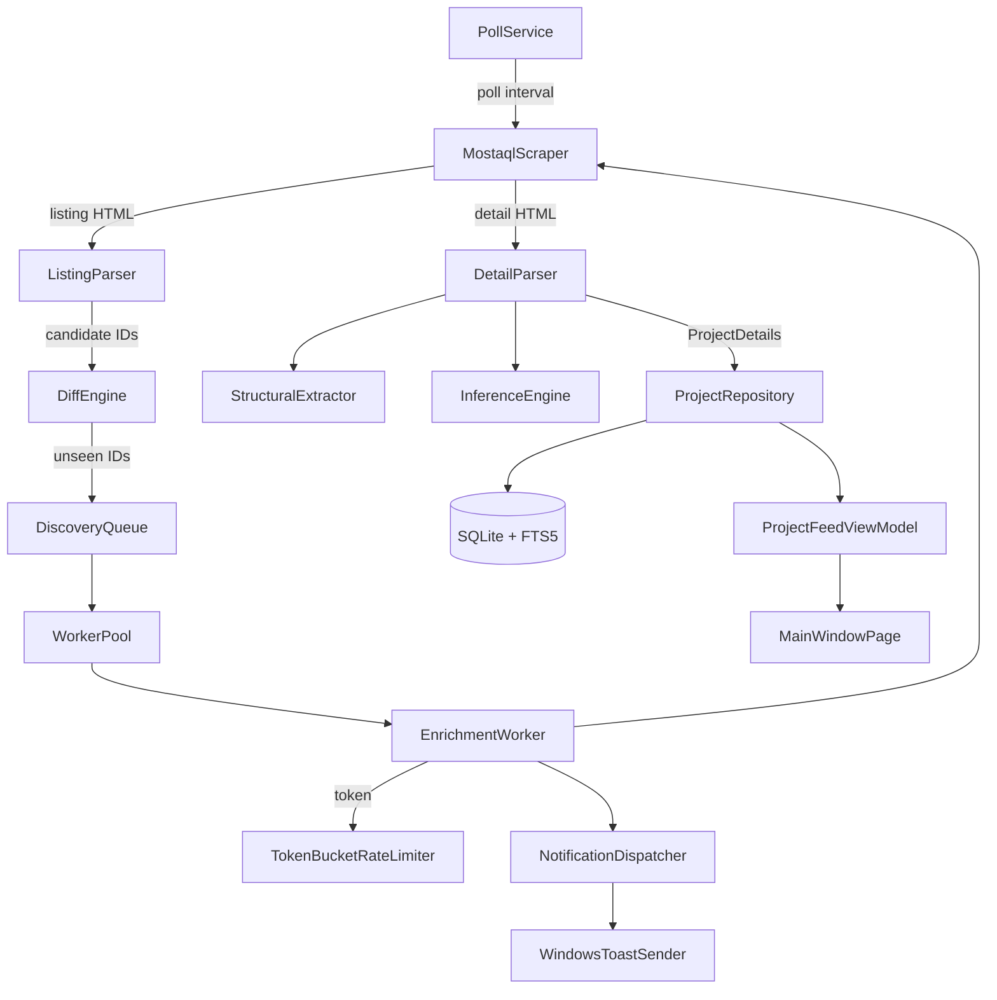

# Requirements & Scope

### Overview & Goals
Deliver a fully functional V1 MostaqlK Windows desktop app — not a static scaffold. Every stubbed file (`Core/`, `Models/`, `Services/`, `Infrastructure/`, `Features/`) created in the previous scaffolding session must become real, working logic, wired end-to-end: poll mostaql.com → diff → enrich (parse) → store (SQLite) → notify (toast) → display (RTL MAUI UI), matching the `.repertoire/design/mvp/*.html` mockups.

### In Scope (V1, Windows only)
- Real HTTP scraping (`MostaqlScraper`) + real HTML parsing (`ListingParser`, `DetailParser`) — **ported from the existing Python prototype** in `.repertoire/progress/python/parser/scratch/` (`analyzer.py`, `inference.py`, `pipeline.py`, `attachment_downloader.py`), not reinvented.
- Real Poll Service / Diff Engine / In-Flight Tracker / Discovery Queue / Worker Pool / Rate Limiter pipeline (per `system-components.md`).
- Real SQLite storage: schema + migrations, `ProjectRepository`/`OwnerRepository`/`AssetRepository`, FTS5 search.
- Real Windows toast notifications + grouping logic.
- Real, functional UI: Projects feed, Project details, Settings, About, Notifications flyout, Tray icon — all states (loading/empty/error/success), light+dark theme, RTL, responsive to window resize.
- Reuse of existing `UNITS.md` units (`AppButton`, `AppCard`, `AppEntry`, `AppToggle`, `NavigationControl`, `ShimmerBox`, etc.) — extend them with real behavior rather than duplicating.
- `UNITS.md` kept accurate as units evolve from Scaffold → Implemented and as any genuinely new unit is introduced.

### Out of Scope
- Android/iOS/macOS implementations (V3) — only leave the existing one-line TODO markers.
- Any `v2/` documented feature.
- Automated download of authenticated attachments without a configured session cookie (mirrors the Python prototype's `manual_download_required` behavior — no login flow is implemented).

### Key User Stories
- As a freelancer, I want new Mostaql projects to appear in my feed within ~1 minute of posting, with a toast notification, so I don't miss opportunities.
- As a user, I want to search/filter my locally stored project history (FTS5) so I can find past postings offline.
- As a user, I want to configure poll interval, request rate, and notification grouping in Settings, with my choices persisted and applied live.
- As a user, I want the app to look correct and be usable in both light and dark theme, in Arabic RTL, at any reasonable window size.

### Non-Functional Requirements
- Respect the configured request budget (default ~2 req/min) via the shared `TokenBucketRateLimiter` — never exceed it even under backlog.
- No placeholder/fake functionality in the final build: every button, list, and form must be wired to real behavior or explicitly documented as a stated blocker.
- Build must succeed with 0 errors on `net10.0-windows10.0.19041.0` at every stage.

# Technical Design

### Current Implementation (from investigation)
- All architecture folders (`Core/`, `Models/`, `Services/Pipeline/*`, `Infrastructure/Http|Database|Notifications`, `Features/Projects|Notifications|Settings`, `UI/*`) exist as **compiling stubs** (`NotImplementedException`/TODO bodies) — confirmed via prior scaffolding session; `dotnet build` currently succeeds with 0 errors.
- `MostaqlK.csproj` currently references `CommunityToolkit.Mvvm`, `Microsoft.Data.Sqlite` — **no HTML parsing package yet** (need to add `HtmlAgilityPack`).
- `UI/PlatformComponents/{AppButton,AppCard,AppEntry,AppToggle}` and `UI/PlatformConcepts/{NavigationControl,ModalPresenter,Drawer,ActionMenu}` exist as Windows-only stubs per `cross-platform-ui-conventions.md`; `UI/DesignSystem/{DesignTokens,ShimmerBox,TruncatingLabel,LabelWithSubText}` exist as stubs wired into `App.xaml`.
- **Existing Python prototype** (`.repertoire/progress/python/parser/scratch/`) is the reference algorithm to port:
  - `analyzer.py`: dual-strategy extraction — structural (class/id selectors) + label-driven (Arabic label text + DOM-adjacency walk: next sibling / next `<td>` / parent's next sibling / parent-text-minus-label), plus `extract_attachments()` (identifier-blind: `data-file-type` attr OR sibling ext badge OR filename suffix, `requires_auth` detection for `/register`/`/login` redirects).
  - `inference.py`: structure-independent scoring engine — flattens DOM into an ordered token stream, extracts numeric/date/percent/range candidates, scores each (candidate, field) pair via hand-weighted signals (Arabic-stem match with crude affix stripping, unit-hint match, type match, DOM/token distance decay, boilerplate damping, reading-order prior), softmax-normalizes, resolves one winner per field with runner-ups.
  - `pipeline.py`: **combinator** — per field, tries structural first, sanity-checks it (digit-shape for numeric fields), falls back to inference if missing/failing sanity, cross-validates and prefers inference on disagreement, then enforces nullable-by-design rules (`hire_rate` placeholder→null; `started_since`/`deal_date`/`delivery_date`→null unless `project_status == "مكتمل"`).
  - `attachment_downloader.py`: resolves attachments to `ready_url` / `downloaded` / `manual_download_required` / `auth_failed`, reading `MOSTAQL_COOKIE`/`MOSTAQL_COOKIE_FILE` from env — never a hardcoded secret, never attempts login.
- `UNITS.md` currently marks all UI units as `Scaffold`; must move to `Implemented` as real logic lands, and gain new rows for any new unit (e.g. a `SearchInputField` hierarchy if introduced).

### Key Decisions
1. **HTML parsing library**: use `HtmlAgilityPack` (idiomatic .NET, XPath/CSS-like node navigation) as the C# equivalent of BeautifulSoup — add via `dotnet add package HtmlAgilityPack`.
2. **Parser architecture mirrors the Python 3-layer design 1:1, not a rewrite**: `StructuralExtractor` (≈ `analyzer.structural_meta_extract`/`extract_attachments`), `InferenceEngine` (≈ `inference.py`'s token/candidate/scoring pipeline), and `DetailParser` as the combinator (≈ `pipeline.parse_project`) that owns the same fallback/sanity/cross-validation/nullable-enforcement rules. This preserves the "identifier-blind, dual-strategy" resilience property the docs call for, rather than a naive class/id-only parser.
3. **Reuse-first for UI**: every Feature view binds to existing `UI/PlatformComponents` units (`AppButton`, `AppCard`, `AppEntry`, `AppToggle`) and `UI/PlatformConcepts` (`NavigationControl` for the sidebar, `ModalPresenter`/`ActionMenu` where mockups show dialogs/context menus) instead of raw MAUI controls — matching the mandatory Units-first rule in `AGENTS.md`.
4. **Search field hierarchy** (base-component-first, per issue's example): introduce `AppEntry` (existing) → `DebouncedEntry` (new: adds debounce timer) → `SearchInputField` (new: adds icon/clear button + wires to `ProjectFeedViewModel.SearchQuery`), each a genuinely reusable layer, added to `UNITS.md` under Platform Components.
5. **Attachment download**: implement `AssetDownloadService` mirroring `attachment_downloader.py`'s status states (`ReadyUrl`/`Downloaded`/`ManualDownloadRequired`/`AuthFailed`) and env-var cookie config (`MOSTAQL_COOKIE`/`MOSTAQL_COOKIE_FILE`) — no login flow, exactly matching the Python prototype's documented boundary.

### Architecture Diagram


### Data Models / Contracts (delta from existing stubs)
```csharp
// Infrastructure/Http/Parsers/DetailParser.cs (combinator, mirrors pipeline.py)
public Result<ProjectDetails> Parse(HtmlDocument doc);

// Infrastructure/Http/Parsers/StructuralExtractor.cs
internal Dictionary<string,string> ExtractMetaFields(HtmlNode root);
internal List<AttachmentCandidate> ExtractAttachments(HtmlNode root);

// Infrastructure/Http/Parsers/InferenceEngine.cs
internal Dictionary<string, FieldInferenceResult> InferFields(HtmlNode root);
public record FieldInferenceResult(string? Value, double Confidence, string Strategy);

// Infrastructure/Http/AssetDownloadService.cs
public enum AttachmentStatus { ReadyUrl, Downloaded, ManualDownloadRequired, AuthFailed }
public Task<AttachmentResolution> ResolveAsync(Asset asset, CancellationToken ct);
```

### Components — key units affected
 Unit | Current | Target |
---|---|---|
 `MostaqlScraper` | stub throws | real `HttpClient` GET + timeout + `HttpErrors` mapping |
 `ListingParser`/`DetailParser` | stub | full port of Python pipeline (structural+inference+combinator) |
 `ProjectRepository`/`OwnerRepository`/`AssetRepository` | stub | real `Microsoft.Data.Sqlite` CRUD, migrations, FTS5 |
 `PollService`/`WorkerPool`/`DiffEngine`/`TokenBucketRateLimiter` | stub | real async pipeline wired via `MauiProgram.cs` DI, hosted via a background service |
 `NotificationDispatcher`/`WindowsToastSender` | stub | real grouping logic + native Windows toast API |
 `AppEntry` → `DebouncedEntry` → `SearchInputField` | `AppEntry` scaffold only | new debounced search hierarchy, added to `UNITS.md` |
 `ProjectFeedViewModel`/`ProjectCardViewModel`/`SettingsViewModel`/etc. | stub bindings | real state, commands, loading/empty/error states, live settings persistence |

### Risks
- **Live scraping against mostaql.com during automated verification** could violate rate-limits/ToS in an unattended agent run — mitigate by validating the parser against the **already-captured HTML fixtures** used by the Python prototype (if present under `.repertoire/progress/python/parser/scratch/temp/` or similar) rather than issuing live requests during build verification; only a single manual smoke-test request (respecting the rate limiter) is acceptable if fixtures are unavailable.
- **Arabic stemming/scoring port fidelity**: `inference.py`'s affix-stripping and softmax scoring must be ported faithfully (same weights/constants) to avoid silently different field-resolution behavior — validate against the same sample HTML files the Python version was tested with, comparing resolved field values.
- **SQLite schema-version mismatches** on iterative development — mitigate with an explicit `Migrations/` versioning table checked at startup (per `system-components.md`), failing fast with `DatabaseSchemaException` rather than silently corrupting data.

# Delegation & Review Strategy

### Master Agent Orchestration
This plan will be executed by decomposing into implementation stages (below), several of which will be delegated to subagents per `AGENTS.md`'s Subagent Delegation rules: each subagent receives full self-contained context (exact files, exact docs including the relevant Python source files and `cross-platform-ui-conventions.md`, exact acceptance criteria), must read `UNITS.md` first and update it if it introduces a new unit, must write `.repertoire/agents/<name>.md` on completion, and its output is reviewed by the master agent against architecture/UI/code-quality/integration criteria before being accepted (per issue §15).

### Verification approach per stage
- Each stage ends with `dotnet build MostaqlK.csproj -f net10.0-windows10.0.19041.0` — 0 errors required before moving on.
- Parser fidelity is checked by feeding the same sample HTML the Python scripts used (if present in the repo) through the new C# `DetailParser`/`ListingParser` and comparing resolved field values field-by-field against `pipeline.parse_project()`'s output shape.
- UI stages are checked against the specific `.repertoire/design/mvp/*.html` mockup for light+dark theme, RTL layout, and all documented states (loading/empty/error/success).
- Final stage performs the master-agent independent review described in issue §19: full build, `UNITS.md` accuracy check, no-placeholder audit, and integration smoke-check across pipeline → storage → UI.

# Delivery Steps

### ✓ Step 1: Add HTML parsing dependency and port the Python structural extractor to C#
HtmlAgilityPack is added and `Infrastructure/Http/Parsers/StructuralExtractor.cs` performs real class/id + Arabic-label-adjacency extraction matching `analyzer.py`.
- Run `dotnet add package HtmlAgilityPack`.
- Implement `StructuralExtractor.ExtractMetaFields()` mirroring `analyzer.structural_meta_extract` (meta-panel rows + owner-profile table rows).
- Implement label-driven fallback (`FindLabelElements`/`WalkToValue`) mirroring `analyzer.find_label_elements`/`walk_to_value` (next sibling, next `<td>`, parent's next sibling, parent-text-minus-label), using the same `KNOWN_LABELS` Arabic strings.
- Implement `ExtractAttachments()` mirroring `analyzer._attachment_from_link`/`extract_attachments` (data-file-type / ext-badge / filename-suffix signals, `RequiresAuth` detection for `/register`/`/login`).
- Implement `ListingParser` (project row/title/meta extraction) mirroring `analyzer.py`'s `projects_list` branch.
- Verify against the current stub call sites so the project still builds.

### ✓ Step 2: Port the inference scoring engine and the structural/inference combinator (DetailParser)
`InferenceEngine` and `DetailParser` reproduce `inference.py`'s scoring pipeline and `pipeline.py`'s fallback/sanity/cross-validation/nullable rules, producing real `ProjectDetails` from raw HTML.
- Implement DOM-to-token flattening, candidate extraction (numeric/date/percent/range merging), and the field-profile score table (`FIELD_PROFILES`, `WEIGHTS`) exactly as in `inference.py`, including Arabic affix stripping (`_strip_affixes`), boilerplate damping, reading-order prior, and softmax resolution with runner-ups.
- Implement `DetailParser.Parse()` as the combinator: structural-first per field with a sanity check, inference fallback on failure, cross-validation/mismatch tracking, and the nullable-by-design rules for `hire_rate` and the completed-only fields (`started_since`/`deal_date`/`delivery_date`), matching `pipeline.parse_project`.
- Map results into `Models.ProjectDetails`/`Owner`/`ProjectSkill`/`Asset`.
- Validate field-by-field against sample HTML (existing fixtures if present, else a single respectful live fetch) and note any intentional deviations.

### ✓ Step 3: Implement the real scraping + pipeline subsystem (Poll, Diff, Worker Pool, Rate Limiter)
The end-to-end discovery pipeline runs for real: polling mostaql.com on a timer, diffing against known state, enriching via the worker pool under the shared rate limiter, and persisting results.
- Implement `MostaqlScraper` with a real `HttpClient` GET, timeout, and `HttpErrors`-based `Result<T>` mapping.
- Implement `TokenBucketRateLimiter` (SemaphoreSlim-based refill matching `max_requests_per_minute`) and wire it into `EnrichmentWorker`/`PollService`.
- Implement `InFlightTracker` (atomic mark/complete), `DiscoveryQueue` (`Channel<long>`), `DiffEngine` + `SqliteCommittedProvider`/`InFlightSetProvider`.
- Implement `PollService` (timer-driven fetch→parse→diff→enqueue) and `WorkerPool`/`EnrichmentWorker` (token→enrich→commit→notify→`MarkComplete` with retry/backoff per `system-components.md`).
- Register the pipeline as a hosted background service in `MauiProgram.cs` DI.
- Build and smoke-verify the pipeline starts without exceptions using a mocked/short-circuited scraper if live network calls are undesirable during verification.

### ✓ Step 4: Implement real SQLite storage layer with migrations and FTS5 search
Projects, owners, skills, and assets are durably persisted and searchable via FTS5, matching the write-once/selective-update rules in `system-components.md`.
- Implement the connection factory (embedded single `.db` file via `Microsoft.Data.Sqlite`) and a `Migrations/` versioning mechanism that throws `DatabaseSchemaException` on mismatch at startup.
- Implement `ProjectRepository` (`INSERT OR IGNORE`, write-once, `project_id` uniqueness), `OwnerRepository` (selective update: `last_seen_at`+stats only), `AssetRepository` (metadata rows).
- Implement the FTS5 virtual table (`SearchIndex/FtsSchema.sql`) shadowing title/description/skills, and `FtsQueryService` exposing a query API for the UI.
- Wire real repository implementations into `MauiProgram.cs` DI (replacing the stub registrations).
- Verify by exercising insert→query→FTS-search round trips against a throwaway local `.db` file.

### ✓ Step 5: Implement real notification dispatch and grouping
New enriched projects trigger real Windows toast notifications, batched per the configured grouping mode.
- Implement `NotificationGrouper` (end_of_minute / after_minutes / after_count strategies, single-item bypass rule) per `system-components.md`.
- Implement `NotificationDispatcher` to consume enrichment-completion events and hand batches to the sender.
- Implement `WindowsToastSender` using the real Windows toast notification API (native wrapper), replacing the stub.
- Wire dispatcher into `EnrichmentWorker`'s per-commit notify step from Stage 3.
- Verify by triggering a manual test notification end-to-end (pipeline → dispatcher → toast) without requiring a live network fetch (inject a fake enriched project).

### ✓ Step 6: Implement the real Projects feed, Project Details, and search UI (with new debounced-search unit)
The Projects feed and detail view are fully functional against the design mockups and real data from Stage 4, including a new reusable debounced-search component hierarchy.
- Add `UI/PlatformComponents/DebouncedEntry` (extends `AppEntry`) and `UI/PlatformComponents/SearchInputField` (extends `DebouncedEntry`) per the base-component-first hierarchy in the plan; register both in `UNITS.md`.
- Implement `ProjectFeedViewModel` (real `FtsQueryService`-backed search with debounce, live reverse-chronological list from `ProjectRepository`, loading/empty/error states using `ShimmerBox`/`LabelWithSubText`) and `ProjectCardViewModel`/`StatusBarViewModel`.
- Build out `MainWindowPage.xaml`/`ProjectCard.xaml` against `projects.html` (RTL, unread/read `AppCard` state, sidebar via `NavigationControl`), and a new `ProjectDetailsPage` against `project-details.html` (skills, budget, owner stats, attachments list wired to `AssetDownloadService`).
- Ensure light/dark theme correctness and window-resize responsiveness for both pages.
- Update `UNITS.md` statuses from Scaffold to Implemented for all touched units.

### ✓ Step 7: Implement real Settings, Notifications flyout, About, and Tray Icon behavior
Settings changes persist and take live effect on the running pipeline; the tray icon and notification center are fully functional.
- Implement `SettingsViewModel` with real persistence (poll interval, rate, grouping mode/threshold, dark-mode) and validation, applying changes live to `PollService`/`TokenBucketRateLimiter`/`NotificationGrouper` without requiring app restart.
- Replace the plain `Switch` in `SettingsPanel.xaml` with the real `AppToggle` unit once stable (per prior scaffold note).
- Implement `NotificationCenterViewModel`/`RecentNotificationsFlyout` (last 5–10 notifications, real data).
- Implement `TrayIconService`'s 4 real states (idle/polling/backlog-draining/error) driven by live pipeline status, and wire its menu actions (Open, Pause/Resume, Check now, Recent notifications, Settings, Quit) to real commands.
- Fill in `AboutPage` content per `about.html`.
- Update `UNITS.md` accordingly.

### ✓ Step 8: Final integration review, no-placeholder audit, and build verification
The application is confirmed as one integrated, buildable, placeholder-free V1 desktop app ready to use, per the issue's final acceptance criteria.
- Perform an independent master-agent review across all prior stages: architecture-layer correctness, UI-vs-mockup fidelity (all states, both themes, RTL, resizing), code quality (naming, async/cancellation, debouncing, error handling), and cross-stage integration (pipeline→storage→notifications→UI).
- Audit for leftover `NotImplementedException`/TODO/placeholder code paths introduced in prior scaffolding that Stages 1–7 were supposed to replace; fix or explicitly document any remaining blocker with its exact cause.
- Run a final full `dotnet build MostaqlK.csproj -f net10.0-windows10.0.19041.0`, confirm 0 errors, and do a startup smoke-check (app launches, navigates between Projects/Settings/About, tray icon appears).
- Confirm `UNITS.md` fully and accurately reflects the final implemented system (mechanism, status, purpose) for every unit touched across all stages.