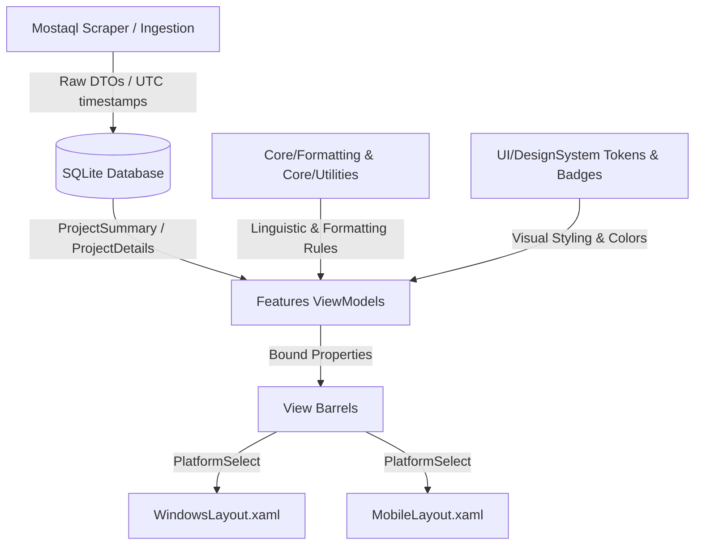

# Requirements

### Overview & Goals
The objective is to execute an end-to-end refactoring of **MostaqlK** based on the **Single Ground Principle** (`bugfree.txt`) and [`docs/single-ground-architecture-blueprint.md`](docs/single-ground-architecture-blueprint.md), as well as diagnosing and eliminating runtime crashes during page navigation (e.g., navigating to Settings):
1. **Navigation & XAML Runtime Crash Remediation**: Fix missing StaticResources (`InvertedBoolConverter`) and mismatched bindings in `SettingsPanelWindowsLayout.xaml` and `SettingsPanelMobileLayout.xaml` that cause instant fatal `XamlParseException` on navigation.
2. **Data Layer Contamination**: Persisting UI strings in SQLite (`publish_time_text`) and periodic database rewriting.
3. **Presentation Layer Contamination**: ViewModels/Views independently inventing Arabic "ال" stripping, broken pluralization, and string truncation.
4. **Duplicated Micro-Decisions**: Hardcoded hex colors and status badges scattered across ViewModels.
5. **Cross-Platform Divergence**: Layout and formatting differences between Windows desktop and Mobile.
6. **Inverted Layer Dependencies**: `Core/` referencing `Infrastructure/`.

### Scope
- **In Scope**:
  - Fixing `SettingsPanelWindowsLayout.xaml` and `SettingsPanelMobileLayout.xaml` resource declarations (`InvertedBoolConverter`) and property bindings (`MaxConcurrentDetailFetches`, `NotificationGroupingEnabled`, `GroupingThreshold`, cookie commands).
  - Implementation of all core formatters and utilities under `Core/Formatting/` and `Core/Utilities/`.
  - Database schema cleanup in SQLite (`ProjectRepository.cs`), removal of `PublishedTimeUpdateService.cs`, and fixing N+1 queries while retaining required raw primitives.
  - Refactoring `ProjectCardViewModel`, `ProjectDetailsViewModel`, `NotificationCenterViewModel`, and notification platform variations.
  - Creating `UI/DesignSystem/Badges/EnrichmentBadgeStyle.cs` and `NotificationItemViewModel`.
  - Bringing `ProjectCardMobileLayout.xaml` and `ProjectDetailsMobileLayout.xaml` to feature parity.
  - Updating `UNITS.md`.
- **Out of Scope**:
  - Modifying external scraping API endpoints or changing network protocols.
  - Breaking Windows desktop build (`net10.0-windows10.0.19041.0`).

# Technical Design

### Authority Matrix & Layer Boundaries

```
┌─────────────────────────────────────────────────────────────────────────────┐
│                             AUTHORITY MATRIX                                │
├──────────────────────────┬───────────────────────┬──────────────────────────┤
│ Decision Type            │ Authoritative Ground  │ C# Mechanism             │
├──────────────────────────┼───────────────────────┼──────────────────────────┤
│ Domain Rules & Grammar   │ Core/Domain/ &        │ Pure static formatters,  │
│ (Arabic plural, initials)│ Core/Formatting/      │ Value Objects (records)  │
├──────────────────────────┼───────────────────────┼──────────────────────────┤
│ Ingestion & Storage      │ Infrastructure/       │ Raw DTOs, UTC timestamps │
│ (Raw facts, zero UI text)│                       │ SQLite / FTS5 tables     │
├──────────────────────────┼───────────────────────┼──────────────────────────┤
│ State & Presentation     │ Features/*/ViewModels │ Reactive properties,     │
│ Transformation           │                       │ calls to Core/Formatting │
├──────────────────────────┼───────────────────────┼──────────────────────────┤
│ Visuals & Layout Styling │ UI/DesignSystem/ &    │ AppThemeBinding, XAML    │
│ (Tokens, View Barrels)   │ View Barrels          │ Styles, UNITS.md units   │
├──────────────────────────┼───────────────────────┼──────────────────────────┤
│ Platform Divergence      │ Core/Platform/ &      │ PlatformSelect.For<T>(), │
│                          │ Platforms/            │ PlatformCapability<T>    │
└──────────────────────────┴───────────────────────┴──────────────────────────┘
```

### End-to-End Architectural Data Flow



### File Structure & New Modules
```
MostaqlK/
├── Core/
│   ├── Formatting/
│   │   ├── ArabicRelativeTime.cs          (Extended with ParseRelativeNumber)
│   │   ├── ArabicProposalParser.cs        (Canonical pluralization)
│   │   ├── ArabicNameFormatter.cs         (Initial extraction & "ال" stripping)
│   │   ├── BudgetFormatter.cs
│   │   ├── TextTruncator.cs               (Safe truncation & ellipsis)
│   │   └── PipelineTelemetryFormatter.cs  (Worker states & durations)
│   └── Utilities/
│       ├── StringNormalization.cs         (ASCII digits, diacritics, HTML cleanup)
│       └── Debouncer.cs
├── UI/
│   └── DesignSystem/
│       └── Badges/
│           └── EnrichmentBadgeStyle.cs    (Single ground for status badge visuals)
└── Features/
    └── Notifications/
        └── ViewModels/
            └── NotificationItemViewModel.cs (Dynamic PostedRelative binding)
```

# Testing

### Validation Approach
Verification will follow a multi-stage automated and manual process:

1. **Compilation & Regression Check**:
   - Verify `dotnet build MostaqlK.csproj -f net10.0-windows10.0.19041.0 -c Debug` builds with 0 errors and 0 warnings.
2. **Automated Python AST & Regex Scanner (`script-violation-scanner`)**:
   - Run Python scan scripts in `scratch/` across all 211 codebase files checking for:
     - Ad-hoc `.Substring()`, `.Trim()`, or manual string slicing in ViewModels/Views.
     - Hardcoded hex color codes in ViewModels.
     - Direct binding to raw unformatted DTO properties.
     - Temporal string persistence in SQLite.
3. **Manual Deep Architectural Swipe (`codebase-deep-swipe-auditor`)**:
   - Audit cross-platform layout parity (`WindowsLayout` vs `MobileLayout`).
   - Validate clean dependency boundaries (`Core/` having 0 dependencies on `Infrastructure/`).
   - Inspect XAML bindings and ensure zero silent runtime failures.
4. **Iterative Audit Loop**:
   - Any secondary violations identified by the two verification agents will be assigned to targeted refactorer agents until 100% bug-free compliance is achieved.

# Delivery Steps

### ✓ Step 1: Phase 1: Core Foundation & Inverted Dependency Cleanup
Establish foundational single-ground utilities and linguistic engines in `Core/`.

- Create `Core/Utilities/StringNormalization.cs` (extracting `NormalizeLabel`, `ToAsciiDigits`, diacritics stripping from `Infrastructure/Http/Parsers/StructuralExtractor.cs`).
- Break inverted reference so `Core/` has zero dependencies on `Infrastructure/`.
- Implement `Core/Formatting/ArabicNameFormatter.cs` (pure "ال" prefix stripping & client avatar initial extraction).
- Implement `Core/Formatting/ArabicProposalParser.cs` (canonical Arabic proposal pluralization rules: `عرض واحد`, `عرضان`, `3-10 عروض`, `11+ عرضاً`).
- Implement `Core/Formatting/TextTruncator.cs` (single ground for string truncation and ellipsis).
- Implement `Core/Formatting/PipelineTelemetryFormatter.cs` (centralized worker states and duration formatting).
- Extend `Core/Formatting/ArabicRelativeTime.cs` with `ParseRelativeNumber(string text)` to unify scraper relative time parsing.
- Update `UNITS.md` with newly introduced core building blocks.

### ✓ Step 2: Phase 2: SQLite Schema & Storage Layer Purification
Clean up database schema, remove background temporal string rewriting, and eliminate N+1 queries.

- Update `Infrastructure/Database/ProjectRepository.cs` schema definition: drop `publish_time_text`, `publish_time_number`, and `proposal_count_text` columns. Store raw ISO-8601 UTC `discovered_at` and integer `proposal_count`.
- Refactor `Infrastructure/Database/ProjectRepository.cs` to batch query related entities (skills, attachments) in `GetAllDetailsAsync`, eliminating N+1 database roundtrips.
- Deprecate and delete `Services/PublishedTimeUpdateService.cs`.
- Unregister `PublishedTimeUpdateService` from `MauiProgram.cs` / background worker pool.
- Update `Infrastructure/Http/Parsers/ListingParser.cs` and `DetailParser.cs` to delegate relative time parsing to `ArabicRelativeTime.ParseRelativeNumber`.

### ✓ Step 3: Phase 3: ViewModel & Presentation Layer Modernization
Refactor ViewModels and notification layers to consume pure domain formatters and design system tokens.

- Refactor `Features/Projects/ViewModels/ProjectCardViewModel.cs` to remove hand-rolled initial extraction, manual pluralization, and hardcoded status colors.
- Refactor `Features/Projects/ViewModels/ProjectDetailsViewModel.cs` to expose formatted `Budget` via `BudgetFormatter.Format()` and duration via `ArabicRelativeTime.Days()`.
- Implement `UI/DesignSystem/Badges/EnrichmentBadgeStyle.cs` to provide a single ground for badge styling (text, background color, text color) using `DesignTokens`.
- Create `Features/Notifications/ViewModels/NotificationItemViewModel.cs` wrapping `ProjectSummary` and exposing dynamic `PostedRelative` property.
- Wire `Features/Notifications/Views/RecentNotificationsFlyout.xaml` and `NotificationCenterViewModel.cs` to `NotificationItemViewModel`, resolving silent binding failures.
- Update `Infrastructure/Notifications/WinAppSdkVariation.Windows.cs` and `WinRtVariation.Windows.cs` to use `TextTruncator.Truncate()`.

### ✓ Step 4: Phase 4: Layout & Cross-Platform Parity
Align XAML layouts across desktop and mobile to eliminate feature and styling divergence.

- Add flex-wrap skills chip row to `Features/Projects/Views/Layouts/ProjectCardMobileLayout.xaml` (conforming to Card Type 3 of the Mobile Architecture Specification).
- Add mobile-adapted owner statistics card to `Features/Projects/Views/Layouts/ProjectDetailsMobileLayout.xaml`.
- Remove broken `StringFormat='{0} أيام'` from `ProjectDetailsWindowsLayout.xaml` and `ProjectDetailsMobileLayout.xaml`, binding directly to ViewModel's formatted duration.
- Update `UNITS.md` with new layout entries and design system components.

### ✓ Step 5: Fix Settings Navigation Crash & Binding Alignment
Resolve runtime crash on navigation to Settings page and align XAML layouts with ViewModel contracts.

- Add `xmlns:converters="clr-namespace:MostaqlK.UI.DesignSystem.Converters"` and `<converters:InvertedBoolConverter x:Key="InvertedBoolConverter" />` to `SettingsPanelWindowsLayout.xaml` resource dictionary to fix fatal `XamlParseException`.
- Correct mismatched bindings in `SettingsPanelWindowsLayout.xaml`: `MaxParallelEnrichment` → `MaxConcurrentDetailFetches`, `NotificationsGroupingEnabled` → `NotificationGroupingEnabled`, `NotificationsGroupingThreshold` → `GroupingThreshold`.
- Align session cookie and close behavior controls in `SettingsPanelWindowsLayout.xaml` and `SettingsPanelMobileLayout.xaml` to match `SettingsViewModel` commands and properties.
- Verify end-to-end navigation across all shell routes (`//MainWindowPage`, `//SettingsPanel`, `//AboutPage`, `ProjectDetailsPage`) to ensure zero runtime crashes.