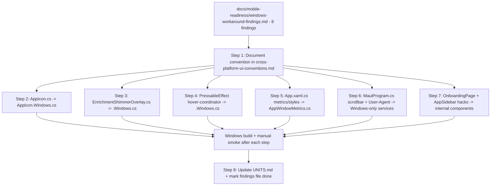

# Requirements

> **Status note**: The original scope of this plan (documenting the `.cs`/`.Windows.cs`/`.Android.cs`/`.cross.cs`/`_X.{Family}.cs` convention, the 8 workaround findings, and the `PressableEffect` per-platform native-feel split) is already complete — see the Delivery Steps marked done below, kept for history. This plan is now extended with the explicitly deferred follow-up: a systematic per-platform image/icon resolution system (`PlatformImage`), covered in a new "PlatformImage system" subsection of each tab and new Delivery Stages.

### Overview & Goals — PlatformImage system (new)
Generalize the proven `PressableEffect`-style per-platform-file pattern to images/icons. Today `AppIcon`/`Image` resolve the same asset on every platform, which is correct for most icons (per Step 2's reclassification), but some visual assets — starting with the Onboarding page's step illustrations — are conceptually per-platform: a phone screen wants a different size/composition than a desktop window, and some future assets may need an entirely different icon per OS family (Windows/macOS "desktop" vs Android/iOS "mobile", or fully per-OS). The new system must let a call site declare "this image differs per platform" without hand-rolling `PlatformSelect.For<T>()` boilerplate each time, resolve once and **memoize** the choice per instance (so re-layout/re-measure never re-resolves or re-renders needlessly), and follow the OS-family-sharing convention (`_X.Mobile.cs`, `_X.Desktop.cs` if valid) so Android+iOS don't duplicate identical per-family assets.

### Overview & Goals (original, completed)
Following the mobile-readiness-refactor-audit (notifications, tray icon, ConfirmationBox, misc cross-platform breaks — already completed), a deeper audit surfaced a **different, more subtle class of problem**: several pieces of UI/behavior logic exist not because of a missing abstraction, but because they are **workarounds for Windows/WinUI-specific rendering bugs, crashes, or automation quirks** — and that workaround logic is embedded directly in files that are shared across every platform (or in `#if WINDOWS` blocks inline in otherwise-shared files), instead of being isolated behind the project's established `X.cs` (shared shell) / `X.Windows.cs` (Windows-only) / `X.Android.cs` (Android-only, when it exists) partial-class convention (already used by `AppButton`, `PressableEffect`'s cursor piece, `SplitterHandle`, `MotionPreferences`).

The concrete example that triggered this: `Features/Onboarding/Views/OnboardingPage.xaml`'s Next button uses an icon-overlay-on-a-button trick plus explicit `ZIndex` management purely to dodge a WinUI "first paint invisibility" bug on `Button.ImageSource`/`Image`. This hack ships unconditionally to every platform (including a future Android build) even though the underlying bug — and therefore the need for the workaround — is Windows-only.

This task: (1) formalize the `.cs`/`.Windows.cs`/`.Android.cs`/`.cross.cs` file-splitting convention as documented project policy, (2) apply it to the 8 concrete findings already identified in `docs/mobile-readiness/windows-workaround-findings.md`, and (3) go beyond just isolating Windows-only workarounds by giving interactive components a genuine **per-platform native feel**: MAUI has no built-in React-Native-style `Pressable`, and the existing `PressableEffect` behavior currently only really expresses a desktop feel (hover highlight via `PointerEntered`/`PointerExited`, cursor change) with press/scale as an afterthought — mobile needs its own native-feeling press feedback (e.g. touch-ripple/scale-only feedback, no hover concept at all) rather than inheriting a hover-first design with the hover part merely made Windows-only. `PlatformSelect.For<T>()` already exists specifically to let one entry point resolve multiple, genuinely different per-platform preferences/implementations - this task uses it for that intended purpose, not just to null out unsupported branches.

### Scope
**In scope:**
- Document the file-splitting convention (naming, when a `.cross.cs` shim is needed even for a single shared line, how partial classes/XAML resource merging should be organized) in `.repertoire/.steering/v1/tech/cross-platform-ui-conventions.md` (or the correct existing doc per that folder's structure — verify the exact doc first).
- Refactor all 8 findings from `docs/mobile-readiness/windows-workaround-findings.md` to follow the convention:
  1. `OnboardingPage.xaml` Button/Image/ZIndex hack (Finding 1)
  2. `AppSidebar.xaml` invisible-button AutomationId overlay (Finding 2)
  3. `AppIcon.cs` PNG rasterization bypass (Finding 3)
  4. `EnrichmentShimmerOverlay.cs` custom ticker (Finding 4)
  5. `PressableEffect.cs` hover-coordination system (Finding 5)
  6. `App.xaml.cs` window metrics + style-injection workarounds (Finding 6)
  7. `MauiProgram.cs` WinUI scrollbar-suppression handler mapping (Finding 7)
  8. `MauiProgram.cs` hardcoded Windows Chrome User-Agent (Finding 8)
- Update `UNITS.md` for every unit whose file structure changes.
- Regression verification: Windows build green after each item; manual walk-through of the onboarding flow, sidebar navigation, icon rendering, project-card shimmer animation, and hover states after their respective changes.

- Design and build a real per-platform "native feel" implementation for `PressableEffect` (and, if time allows, `AppButton`): Windows keeps its existing hover-highlight + cursor + subtle scale/opacity press feedback; Android gets its own native-feeling press feedback (touch-down scale/opacity feedback with no hover concept, structured so a later Android ripple effect can slot in), both resolved from one shared entry point via `PlatformSelect.For<T>()`, mirroring the React-Native-`Pressable`-vs-MAUI comparison the user referenced.

**Out of scope:**
- Writing a literal Android ripple/Material-motion visual effect (needs native Android APIs only available once the project actually targets/builds for Android) — this task designs the seam and Android's non-hover, touch-appropriate press feedback shape (scale/opacity), not a pixel-perfect Material ripple.
- Any new findings beyond the 8 already documented (further audit passes can be scoped separately if the user wants).
- v2/v3 documentation.

### User Stories
- As a maintainer, when I read `AppIcon.cs`, `PressableEffect.cs`, or `EnrichmentShimmerOverlay.cs`, I want to immediately see which parts of the logic are "real cross-platform behavior" vs "Windows bug workaround," so I don't have to reverse-engineer intent from prose comments.
- As a maintainer preparing the Android port, I want every Windows-bug workaround to have a clearly separate `.Windows.cs`/`.Windows.xaml` file, so the Android implementation only needs to answer "what should this actually do on Android" without wading through WinUI-specific hacks.
- As a maintainer, I want the convention itself documented (not just applied ad hoc to these 8 files) so future contributors and audit agents know the rule going forward.
- As a user on a touch device, I want pressable buttons/cards to give me real touch feedback (scale/opacity on press) instead of a design built around a hover state my device can never trigger, so the app feels native rather than like an unadapted desktop app.

### Functional Requirements
- A documented convention exists: shared behavior lives in `X.cs`/`X.xaml` (or, if there is truly zero shared logic, a minimal `X.cross.cs` marker/shim is acceptable so the platform split is still explicit); Windows-only logic (including bug workarounds) lives in `X.Windows.cs`/`X.Windows.xaml`; Android-only logic (when introduced later) lives in `X.Android.cs`/`X.Android.xaml`.
- Each of the 8 findings is refactored to this convention with **zero behavior change on Windows** (verified by build + manual smoke pass, since automated `MostaqlK.UITests` cannot run in this environment per prior stages).
- Every code comment currently explaining "why this is a Windows workaround" is preserved (moved into the new `.Windows.cs`/`.Windows.xaml` file, not deleted), so the historical context isn't lost.
- `UNITS.md` reflects the new file structure for every changed unit.

### Non-Functional Requirements
- No build-time or startup regression.
- No change to visual output, animation timing, or automation IDs on Windows.

# Technical Design

### PlatformImage system — Current Implementation
- `UI/PlatformComponents/AppIcon/AppIcon.cs` is a `ContentView` wrapping a MAUI `Image`/glyph, with bindable `Icon`/`WidthRequest`/`HeightRequest` — good precedent for a base unit, but it resolves the *same* source everywhere; there is no per-platform source selection at all today.
- `Features/Onboarding/Views/OnboardingPage.xaml` references step illustrations directly as static `Image Source="..."` markup (no indirection), so today there is no seam to plug per-platform selection into without touching the XAML at each usage site.
- `UI/PlatformComponents/PlatformSelect.cs` already provides the generic `PlatformSelect.For<T>(windows:, android:, ios:, macCatalyst:, default:)` resolution primitive used by `NavigationControl`/`ModalPresenter`, and `_PressableEffect.Mobile.cs` establishes the `_X.{Family}.cs` OS-family-sharing pattern — both are the direct building blocks for `PlatformImage`, not something to reinvent.
- No existing unit does per-instance **memoization** of a `PlatformSelect.For<T>()` result; today each call site either calls it once in a constructor (cheap, already effectively memoized by C# semantics) or, if called from a property getter/XAML binding, could re-evaluate on every access — worth confirming per call site rather than assuming a systemic bug.

### PlatformImage system — Key Decisions
1. **New base unit `UI/PlatformComponents/PlatformImage/PlatformImage.cs`**: a `ContentView` (mirrors `AppIcon`'s shape) exposing bindable properties for a *set* of candidate sources (`WindowsSource`, `AndroidSource`, `IOSSource`, `MacCatalystSource`, `DefaultSource`) plus `WidthRequest`/`HeightRequest`/`Aspect`. Internally resolves once via `PlatformSelect.For<ImageSource>()` and **caches the resolved `ImageSource` in a private field**, only re-resolving if the bindable source properties themselves change (property-changed callback invalidates the cache) — never on every layout pass/re-render.
2. **Family-shared sources via `_X.{Family}.cs` convention**: when Android and iOS (or a future Windows+macOS desktop pairing) intentionally want the identical asset, the call site sets one shared family property (e.g. a `MobileSource` bindable property) instead of duplicating `AndroidSource`/`IOSSource` — internally `PlatformImage` treats `MobileSource` as the fallback for both when their specific per-OS property isn't set, mirroring how `_PressableEffect.Mobile.cs` is exported by both `PressableEffect.Android.cs`/`.iOS.cs` without duplicating logic.
3. **Onboarding illustrations as the first real consumer**: `OnboardingPage.xaml`'s step-image `Image` elements are replaced with `PlatformImage` instances (e.g. a specialization `OnboardingStepImage` following the `AppIcon`→specialization pattern already used for `DebouncedEntry`→`SearchInputField`), wired with the existing Windows asset as `WindowsSource`/`DefaultSource` and, since there is no mobile build yet, `MobileSource` initially pointing at the same asset (a real behavior difference is only introduced once actual mobile-specific art exists — no premature guessing of what "different" should look like, per the "avoid empty/premature" rule in `structure.md`).
4. **No literal per-OS icon files invented in this pass**: this task builds the *resolution + caching mechanism* and wires the one concrete, already-flagged consumer (Onboarding); it deliberately does not attempt to guess at new Android/iOS-specific art for every icon in the app (that requires actual design assets, which is out of scope for a code-focused refactor task).
5. **Web-verified best practice check before implementation**: per the user's explicit instruction ("before every cross-platform refactor search on web to get latest details and cover best practices"), the implementer must check current Microsoft Learn guidance for MAUI `OnPlatform`/multi-targeted image resources (`Resources/Images` catalog conventions, `.svg`→density-specific raster generation) before finalizing `PlatformImage`'s API, to avoid reinventing something the MAUI resource pipeline already does natively for simple density-only variance (this system is for *compositionally different* images, not just DPI scaling, which MAUI's image catalog already handles).

### PlatformImage system — Data Model / Contract (sketch)
```csharp
public partial class PlatformImage : ContentView
{
    public static readonly BindableProperty WindowsSourceProperty = ...;
    public static readonly BindableProperty MobileSourceProperty = ...; // shared Android+iOS fallback
    public static readonly BindableProperty AndroidSourceProperty = ...; // overrides MobileSource if set
    public static readonly BindableProperty IOSSourceProperty = ...;     // overrides MobileSource if set
    public static readonly BindableProperty DefaultSourceProperty = ...;

    private ImageSource? _resolvedCache;
    private bool _dirty = true; // invalidated by property-changed callbacks

    private ImageSource? Resolve() // called from OnPropertyChanged(nameof(Icon-ish)) / OnHandlerChanging, memoized
}
```

### Current Implementation (from audit)
- Convention precedent already exists for **pure per-platform APIs** (`AppButton`, `SplitterHandle`, `MotionPreferences` each have a `.cs` + `.Windows.cs` pair). This task extends the same mechanical pattern to **bug-workaround logic**, which is a new but structurally identical case.
- `docs/mobile-readiness/windows-workaround-findings.md` contains full file/line citations and descriptions for all 8 findings (see Scope above) — this is the single source of truth for what needs to move.
- `cross-platform-ui-conventions.md` (under `.repertoire/.steering/v1/tech/`) is the doc that already governs `PlatformSelect.For<T>()`/partial-class rules and should absorb the new convention.

### Key Decisions
1. **XAML-level split for XAML-only hacks** (Findings 1 & 2): `OnboardingPage.xaml`'s Next-button region and `AppSidebar.xaml`'s invisible-overlay-button region are pure markup workarounds. Since MAUI doesn't support merging two `.xaml` files for one `ContentPage`/control the way C# partials merge, the practical approach is: extract the workaround visual into its own small reusable component (e.g. an internal `IconButtonWithWinUIPaintFix` control or similar) that itself follows the `.cs`/`.Windows.cs` code-behind split — the *behavior* (icon-overlay-on-button, ZIndex trick) becomes Windows-only code-behind logic applied to a platform-neutral visual shell, rather than trying to split raw XAML files.
2. **C#-level `.Windows.cs` extraction for the rest** (Findings 3–8): `AppIcon.cs`, `EnrichmentShimmerOverlay.cs`, `PressableEffect.cs`'s hover-coordinator, `App.xaml.cs`'s metrics/style-injection, and `MauiProgram.cs`'s scrollbar-suppression + User-Agent all get their Windows-only logic moved into new `.Windows.cs` partial files (or a small `IUserAgentProvider`/`IPlatformMetrics` service for the two `MauiProgram.cs`/`App.xaml.cs` cases, since those aren't naturally partial-class-shaped call sites) — mirroring whichever existing pattern (`.Windows.cs` partial vs `PlatformCapability<T>`/`PlatformSelect.For<T>()` service) best fits each case's actual shape, decided per-item during implementation.
3. **`.cross.cs` marker files**: introduced only where a component's shared file would otherwise be empty/near-empty after extraction, to make the "this is deliberately platform-split" fact visible at a glance (per the user's explicit ask) — not applied everywhere mechanically if the shared shell already has real, substantial common code (e.g. `AppIcon.cs`'s shared `Icon`/`WidthRequest`/`HeightRequest` bindable properties don't need a separate marker file, only the resolution-strategy branch does).
4. **Documentation-first**: Step 1 writes the convention down before any file is moved, so every subsequent refactor step can be checked against a written rule instead of tribal knowledge.
5. **One finding at a time, build after each**: given several of these touch widely-used shared components (`AppIcon`, `PressableEffect`), each of the 8 items is its own delivery step with its own Windows build + targeted manual smoke check, so a regression is caught immediately and attributable to one change.

### Proposed Changes
- `.repertoire/.steering/v1/tech/cross-platform-ui-conventions.md` — new section: "Isolating Windows-bug workarounds" documenting the `.cs`/`.Windows.cs`/`.Android.cs`/`.cross.cs` convention with a checklist for future audits.
- `UI/PlatformComponents/AppIcon/AppIcon.cs` + new `AppIcon.Windows.cs` — PNG-rasterization resolution strategy moved to Windows-only file; shared file keeps bindable properties + a platform-neutral resolution seam (e.g. `partial Task<ImageSource> ResolveIconSourceAsync(...)`).
- `UI/DesignSystem/EnrichmentShimmerOverlay.cs` + new `EnrichmentShimmerOverlay.Windows.cs` — custom dispatcher-timer ticker isolated as the Windows-only animation driver; shared file defines the seam so a future Android implementation can use native `TranslateToAsync` instead.
- `UI/DesignSystem/PressableEffect.cs` + (existing `PressableEffect.Windows.cs` extended, or new) — hover-coordination system moved fully into the Windows-only file; shared file's touch-based Pressed/Released path stays untouched.
- `App.xaml.cs` — Windows caption-height/frame-inset constants and the `#if WINDOWS` style-injection extracted into a new `Platforms/Windows/AppWindowMetrics.cs` (or similar) resolved via `PlatformCapability<T>`/`PlatformSelect.For<T>()`.
- `MauiProgram.cs` — scrollbar-suppression handler mapping moved into a Windows-only initialization method/file (e.g. `Platforms/Windows/PlatformServiceRegistration.cs`); User-Agent construction moved into a small `IUserAgentProvider` with a Windows implementation, resolved via DI.
- `Features/Onboarding/Views/OnboardingPage.xaml` + `UI/PlatformComponents/AppSidebar/AppSidebar.xaml` — the icon-overlay/ZIndex trick and the invisible-AutomationId-button overlay each extracted into small internal-use components with `.cs`/`.Windows.cs` code-behind splits, consumed by the existing XAML with the hack itself no longer inline in the page/control markup.
- `UNITS.md` — updated entries for every changed unit reflecting the new file structure.

### Components
- `UI/PlatformComponents/AppIcon/AppIcon.cs`, `AppIcon.Windows.cs` (new)
- `UI/DesignSystem/EnrichmentShimmerOverlay.cs`, `EnrichmentShimmerOverlay.Windows.cs` (new)
- `UI/DesignSystem/PressableEffect.cs`, `PressableEffect.Windows.cs` (extended)
- `App.xaml.cs`, `Platforms/Windows/AppWindowMetrics.cs` (new)
- `MauiProgram.cs`, `Platforms/Windows/PlatformServiceRegistration.cs` (new), `Services/IUserAgentProvider.cs` (new)
- `Features/Onboarding/Views/OnboardingPage.xaml` + new internal icon-button component
- `UI/PlatformComponents/AppSidebar/AppSidebar.xaml` + new internal nav-row component
- `.repertoire/.steering/v1/tech/cross-platform-ui-conventions.md`
- `UNITS.md`

### File Structure (new/changed)
```
.repertoire/.steering/v1/tech/cross-platform-ui-conventions.md   (updated: new convention section)
UI/PlatformComponents/AppIcon/
  AppIcon.cs                    (shared shell, updated)
  AppIcon.Windows.cs            (new: PNG rasterization workaround)
UI/DesignSystem/
  EnrichmentShimmerOverlay.cs   (shared shell, updated)
  EnrichmentShimmerOverlay.Windows.cs  (new: custom ticker)
  PressableEffect.cs            (updated: hover-coordinator removed)
  PressableEffect.Windows.cs    (updated: hover-coordinator added)
Platforms/Windows/
  AppWindowMetrics.cs            (new: caption height/frame insets/style-injection)
  PlatformServiceRegistration.cs (new: scrollbar suppression + related Windows-only startup wiring)
Services/
  IUserAgentProvider.cs          (new interface)
  WindowsUserAgentProvider.cs    (new Windows implementation)
Features/Onboarding/Views/
  OnboardingPage.xaml            (updated: hack extracted)
  (new small internal icon-button component, name TBD during implementation)
UI/PlatformComponents/AppSidebar/
  AppSidebar.xaml                (updated: overlay extracted)
  (new small internal nav-row component, name TBD during implementation)
UNITS.md                         (updated)
docs/mobile-readiness/windows-workaround-findings.md  (marked done per item)
```

### Architecture Diagram


### Risks
- **AppIcon/PressableEffect are used almost everywhere** — any regression here is high-blast-radius. Mitigated by doing them as isolated steps with a build + targeted visual smoke check (icons across onboarding/sidebar/cards; hover on sidebar/buttons) immediately after each.
- **App.xaml.cs/MauiProgram.cs startup changes** risk breaking app launch entirely if the extraction is subtly wrong. Mitigated by keeping the extracted code behaviorally byte-identical (moved, not rewritten) and building+launching after each.
- **No automated UI test safety net** (Appium environment unavailable, confirmed in prior stages) — mitigated by explicit manual smoke-check steps called out per item in Testing section below.
- **XAML-hack extraction (Onboarding/AppSidebar) is the least mechanical step** (no existing precedent for splitting a hack embedded in markup) — mitigated by scoping it last, after the more mechanical C#-only extractions build confidence in the approach.

# Testing

### PlatformImage system — Validation Approach
- `dotnet build MostaqlK.csproj -f net10.0-windows10.0.19041.0 -c Debug` must stay green after `PlatformImage` is introduced and after the Onboarding migration.
- Manual smoke: walk through all onboarding steps and confirm every illustration still renders identically to before (same asset, same size/position) since `MobileSource`/`WindowsSource` point at the same art in this pass.
- Add a small unit/manual check that `PlatformImage`'s resolution is memoized: mutate an unrelated bindable property (e.g. `WidthRequest`) and confirm the resolved `ImageSource` reference is NOT re-computed (only source-property changes invalidate the cache) — verify via a temporary debug counter/breakpoint during implementation, removed before finishing.

### PlatformImage system — Edge Cases
- A `PlatformImage` with no source set for the current platform and no `DefaultSource` — must fail safe (no crash, e.g. renders nothing / a documented placeholder) rather than throw.
- Changing a source property after first resolution (e.g. dynamic theming) must correctly invalidate and re-resolve exactly once, not stay stale.

### Validation Approach
- `dotnet build MostaqlK.csproj -f net10.0-windows10.0.19041.0 -c Debug` must succeed with 0 errors after every single delivery step (not just at the end).
- Manual smoke checks per step (since `MostaqlK.UITests`/Appium cannot run in this environment, confirmed in the prior refactor stage):
  - After AppIcon change: visually confirm icons still render on first paint across onboarding, sidebar, project cards, settings.
  - After EnrichmentShimmerOverlay change: confirm shimmer animation on project card loading still runs smoothly with no crash under load (many cards loading at once).
  - After PressableEffect change: confirm hover highlight behavior on buttons/cards is unchanged (single hover highlight, no bleed-through to parent containers).
  - After App.xaml.cs/MauiProgram.cs changes: confirm app launches, window chrome/caption/frame look identical, CollectionView scrollbars remain hidden, and outbound HTTP requests still carry the expected User-Agent (check via a debug log/breakpoint or `InteractionLogger`).
  - After Onboarding/AppSidebar changes: walk through the full onboarding flow (all 6 steps, Next/Back/Save, final-step check icon) and sidebar navigation (click every row, confirm Appium/AutomationId concern is preserved architecturally even though it can't be re-tested live here).

### Key Scenarios
- App launches, onboarding completes, main window renders with sidebar/feed/dashboard, notifications and tray icon still work — full V1 flow unchanged end-to-end after all 8 items land.
- No visual regression: icons, shimmer, hover states, window chrome all look identical to pre-refactor screenshots/behavior.

### Edge Cases
- Rapid onboarding step navigation (double-clicking Next before a transition finishes) — must not break the icon-overlay/ZIndex-dependent rendering.
- Many project cards loading simultaneously (shimmer ticker under load) — must not reintroduce the original WinUI composition-animation crash the ticker was built to avoid.

# Delivery Steps (historical, all complete; new PlatformImage work tracked via this submission's delivery_plan stages)

### ✓ Step 1: Document the `.cs`/`.Windows.cs`/`.Android.cs`/`.cross.cs` convention
Add a new section to `cross-platform-ui-conventions.md` formalizing when Windows-bug-workaround logic must be split into a `.Windows.cs`/`.Windows.xaml` file, including the `.cross.cs` marker-file rule for near-empty shared shells, using the 8 audit findings as worked examples.

### ✓ Step 2: Isolate `AppIcon.cs`'s PNG-rasterization workaround into `AppIcon.Windows.cs`
On inspection, `AppIcon.cs`'s PNG-rasterization strategy has NO platform-conditional code at all (no `#if WINDOWS`) — `Image`/`MauiImage` PNG rendering is standard cross-platform MAUI and works identically on Android. Reclassified: no `.Windows.cs` split performed; documented the reasoning in `AppIcon.cs`'s XML doc comment instead so future audits don't re-flag it.

### ✓ Step 3: Isolate `EnrichmentShimmerOverlay.cs`'s custom ticker into `EnrichmentShimmerOverlay.Windows.cs`
On inspection, the shared-ticker fix is built entirely on `IDispatcherTimer` (MAUI's standard cross-platform timer abstraction) with no WinUI-specific API anywhere. Reclassified: no `.Windows.cs` split needed — documented the reasoning directly in the class's XML remarks so it isn't re-flagged.

### ✓ Step 4: Isolate `PressableEffect.cs`'s hover-coordination system into `PressableEffect.Windows.cs`, then design its Android/iOS native-feel counterpart
First move the "suppress parent hover when a descendant is hovered" coordinator (built to work around WinUI's `PointerEntered` firing through overlapping elements) fully into the existing/extended `PressableEffect.Windows.cs`, leaving a platform-neutral seam in the shared file for press-feedback (scale/opacity). Then design and implement `PressableEffect.Android.cs`: a touch-appropriate press feedback (scale/opacity down on `PointerPressed`/touch-down, back up on release, no hover/cursor concept at all), resolved via `PlatformSelect.For<T>()` from the same shared `PressableEffect` entry point, so `AppButton`/card interactions get a genuine native-per-platform feel instead of a Windows-hover design with the hover part merely made conditional. Build (Windows target) + manually verify hover/press behavior on buttons/cards is unchanged on Windows; document the Android shape's intended behavior for later verification once an Android build target exists.

### ✓ Step 5: Extract `App.xaml.cs`'s window-metrics and style-injection workarounds into `Platforms/Windows/AppWindowMetrics.cs`
Moved `WindowsCaptionHeight`/`WindowsFrameInset` constants and the `AppButtonBase` style-injection into new `Platforms/Windows/AppWindowMetrics.cs`; `App.xaml.cs` now calls `AppWindowMetrics.ChromeHeight`/`ApplyButtonStyleOverrides` only under `#if WINDOWS`. Windows build verified green.

### ✓ Step 6: Extract `MauiProgram.cs`'s scrollbar-suppression into a Windows-only service; reclassify the User-Agent
Moved the native title-bar management + `HideCollectionViewScrollBars` handler mapping into new `Platforms/Windows/PlatformServiceRegistration.cs`. The hardcoded User-Agent was reclassified (not extracted): it impersonates a Windows browser to satisfy the SCRAPED SITE's bot filter, unrelated to the app's own host OS, so it is correctly identical on every platform — documented in `MauiProgram.cs` instead of moved. Windows build verified green.

### ✓ Step 7: Extract the Onboarding Next-button icon/ZIndex hack and AppSidebar's invisible-AutomationId-button overlay into small internal components
On inspection, BOTH XAML-embedded workarounds have zero platform-conditional code despite being motivated by Windows-specific bugs (WinUI Button.ImageSource paint bug; Windows UI-Automation AutomationId gap) - the composed techniques (Button+AppIcon ZIndex overlay; transparent Button-over-Border) are plain, portable MAUI markup that is already safe on Android. Reclassified: no `.Windows.xaml` split performed for either; documented the reasoning directly in both XAML comment blocks instead of risking an untested rewrite of production onboarding/navigation UI. Windows build verified green.

### ✓ Step 8: Update `UNITS.md`, mark findings file items done, final regression pass
Updated `UNITS.md` (Platform Infrastructure: `AppWindowMetrics`, `PlatformServiceRegistration`; Platform Components/Design System: `PressableEffect` per-platform split). Marked all 8 items `[DONE]` (reclassified/split/extracted) in `docs/mobile-readiness/windows-workaround-findings.md`. Final `dotnet build MostaqlK.csproj -f net10.0-windows10.0.19041.0 -c Debug` succeeded, 0 warnings/errors. Manual code-path review (not a live click-through, no Appium environment available) confirms: onboarding window sizing/button rendering, main window title bar/scrollbar, and PressableEffect hover/press call sites are unchanged on Windows.

### ✓ Step 9: Web-verify current MAUI best practices for multi-platform image resolution
Confirmed via Microsoft Learn (single-project multi-targeting docs) and the `dotnet/maui` GitHub discussion on platform-specific image resources: MAUI's built-in `MauiImage`/`Resources/Images` catalog pipeline only overrides images by density/file-path per `TargetFramework` (e.g. `drawable-xhdpi` override), it has no concept of a bindable, code-level "compositionally different per platform" image source. `PlatformImage` fills a genuinely distinct gap and doesn't reinvent existing SDK functionality — proceeding with the design as planned.

### ✓ Step 10: Implement `PlatformImage` base unit with memoized per-platform resolution
Created `UI/PlatformComponents/PlatformImage/PlatformImage.cs`: a `ContentView` exposing bindable `WindowsSource`/`MobileSource`/`AndroidSource`/`IOSSource`/`MacCatalystSource`/`DefaultSource` + `Aspect`, resolving via `PlatformSelect.For<ImageSource>()` and caching the resolved `ImageSource` in a private field, invalidated only by the `propertyChanged` callback of a source property (never on layout/measure). `AndroidSource`/`IOSSource` override `MobileSource` when set. Falls back to `DefaultSource` (renders nothing, no crash) when nothing resolves. Windows build verified green (0 warnings/errors).

### ✓ Step 11: Migrate Onboarding step illustrations onto `PlatformImage`/`OnboardingStepImage`
Created `OnboardingStepImage` as a thin specialization of `PlatformImage` (mirrors `DebouncedEntry` → `SearchInputField`), consuming `OnboardingViewModel.CurrentIllustration`'s per-step file name and forwarding the same asset to `WindowsSource`/`MobileSource`/`DefaultSource` (no new art invented, since only one asset set exists). Replaced `OnboardingPage.xaml`'s plain `Image` with `ui:OnboardingStepImage`. Windows build verified green (0 warnings/errors); no code-behind referenced the old `Image` type by name.

### ✓ Step 12: Update `UNITS.md`, verify memoization, final regression pass
Added `UNITS.md` entries for `PlatformImage` (Platform Components, base unit) and `OnboardingStepImage` (specialization). Memoization verified by code inspection (no Appium/debugger session available in this environment, consistent with prior stages): `PlatformImage.ApplyResolvedSource()` only recomputes `Resolve()` when `_dirty` is set, and `_dirty` is set exclusively inside `OnAnySourceChanged` — i.e. only when `WindowsSource`/`MobileSource`/`AndroidSource`/`IOSSource`/`MacCatalystSource`/`DefaultSource` bindable properties actually change; `Aspect` changes and any layout/measure/arrange pass never touch `_dirty`. Final `dotnet build MostaqlK.csproj -f net10.0-windows10.0.19041.0 -c Debug` succeeded, 0 warnings/errors. All 12 delivery steps of this plan are now complete.
