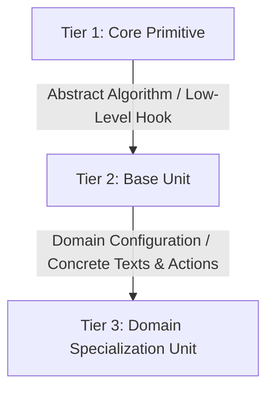
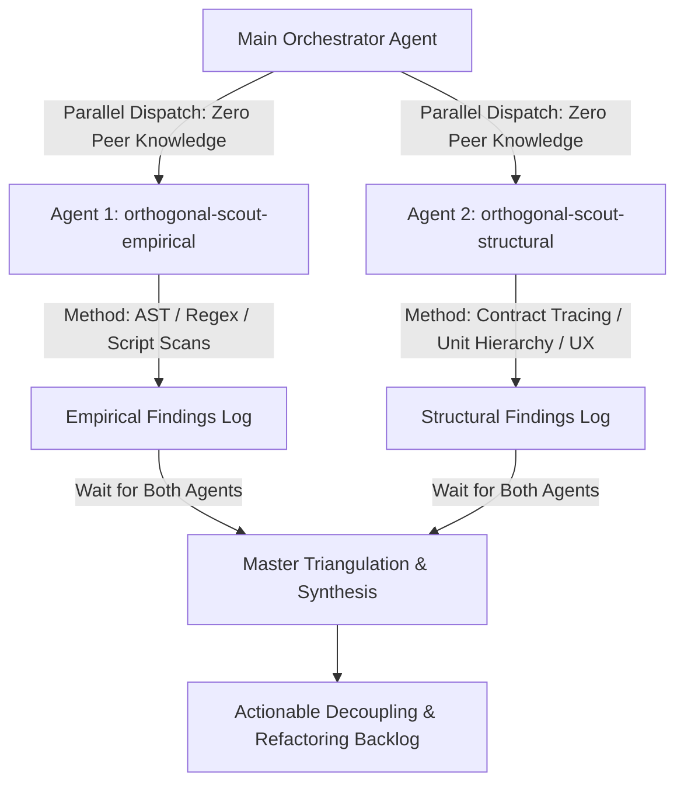

# Universal Anti-Coupling Architecture & Cross-Platform Refactoring

This guide provides language-agnostic architectural methodologies for decoupling client and system applications, eliminating platform preprocessor coupling, building modular unit hierarchies, and swapping UI visual hierarchies without regression.

---

## 1. The Core Anti-Patterns of Platform Coupling

| Anti-Pattern | Description | Universal Remedy |
|---|---|---|
| **Direct Platform Conditionals** | Sprinkling `#if WINDOWS`, `#if ANDROID`, `Platform.OS === 'ios'`, or `runtime.GOOS` directly inside shared business logic, view models, or services. | The Partial-Class / Build-Tag / Platform-Suffix compilation split (`X.Windows.cs`, `X.native.tsx`). |
| **Indirect / Leaked Platform Checks** | Branching on platform-correlated side-effects (e.g. `DeviceInfo.Idiom == Desktop`, checking for webview objects, pointer type sniffers). | Feature-first capability contracts or View Barrel Layout Swapping. |
| **Runtime OS Switch Sprawl** | Sprawling `if (os == 'ios')` branching inside render loops or domain operations. | Dynamic Platform Strategy resolution with memoization (`PlatformSelect.For<T>`). |
| **Asymmetric Feature Guessing** | Scattering null-checks for features that exist on one OS (System Tray, Dock, Global Hotkeys) but not on another. | `PlatformCapability<T>` container isolating supported vs unsupported features. |
| **DOM / View Tree Bloat** | Hiding desktop layouts on mobile via CSS `display:none` or XAML `IsVisible="false"`. | View Barrel Layout Swapping (instantiating only the target layout tree). |
| **Ad-Hoc Duplication** | Re-implementing debouncers, confirmation prompts, formatters, or asset pickers across screens. | 3-Tier Unit Specialization Hierarchy (`Core Primitive` ➔ `Base Unit` ➔ `Specialization`). |

---

## 2. Universal Isolation Mechanisms

### A. The Platform Suffix & Compilation Split
All platform-divergent logic must be isolated into dedicated files recognized by the platform's build system or packager:

- **.NET MAUI / C#:** `X.cs`, `X.Windows.cs`, `_X.Mobile.cs`, `X.Android.cs`, `X.iOS.cs` (via multi-targeting `Compile Remove`).
- **React Native / Expo / TypeScript:** `X.types.ts`, `X.windows.tsx`, `X.native.tsx`, `X.ios.tsx`, `X.android.tsx` (via Metro bundler extensions).
  > *Tooling Note:* Metro / Expo specifically parses `.native.tsx` for shared iOS/Android code and does not recognize `.mobile.tsx`. Naming conventions must align with the target environment's resolution rules.
- **Go:** `x.go`, `x_windows.go`, `x_darwin.go`, `x_linux.go` (via `//go:build`).
- **Rust:** `x/mod.rs`, `x/windows.rs`, `x/unix.rs` (via `#[cfg(target_os = ...)]`).

### B. The Optional Capability Pattern (`PlatformCapability<T>`)
Never allow platform-exclusive features to leak nullable noise across consumers. Wrap platform services in an explicit capability:

```text
Consumer Layer
     │
     ▼
[PlatformCapability<T>]
     ├── IsSupported: bool
     ├── Instance: T?
     └── Execute(action: (instance: T) => void)
```

### C. Dynamic Layout Barrels (Grouper Shell & Platform Resolvers)
A composite block or page shell contains zero direct UI controls and must never perform ad-hoc platform/dimension sniffing internally:
1. `Host / Grouper Shell`: Manages state and imports all platform layouts, delegating layout selection to a canonical `getPlatform()` / `PlatformSelect` resolver.
2. `Desktop Layout`: Multi-column, dense tabular grids, hover highlights, pointer cursor states (`*DesktopLayout` / `*WindowsLayout`).
3. `Mobile Layout`: Single-column, touch-first padding, swipe gestures, haptic feedback triggers (`*MobileLayout`).

---

## 3. The 3-Tier Base-to-Specialization Hierarchy

To achieve long-term reusability, decompose UI and behavioral concepts into three distinct tiers:



1. **Tier 1 (Core Primitive):** Independent of UI frameworks where possible (e.g. debouncer timer, math calculator, token store contract, dialog host protocol).
2. **Tier 2 (Base Unit):** Configurable UI component exposing properties, callbacks, and responsive behaviors (e.g. `DebouncedInput`, `ConfirmationDialog`, `PlatformImage`).
3. **Tier 3 (Domain Specialization):** Concrete application unit with fixed localized copy, default icons, and specific domain actions (e.g. `SearchInputField`, `ExitConfirmationBox`, `OnboardingStepImage`).

---

## 4. Multi-Agent Orthogonal Discovery Sweep Pattern

Before performing structural refactoring, the orchestrator executes a full codebase sweep by dispatching two independent, orthogonal subagents on the same codebase simultaneously, as established in the universal refactoring case study (`references/case-study-universal-refactor.md`, Section 2):



### Discovery Methodologies & Invocation:
- **Scout 1 (`orthogonal-scout-empirical`)**: Spawned via `spawn_subagent(agent="orthogonal-scout-empirical", mode="EXPLORE")` (or Claude agent runner). Runs automated AST search scripts, regex scans, and compiler inspections to detect syntactic platform leaks (`#if PLATFORM`, runtime OS switches, indirect hardware/idiom checks, and native platform SDK imports).
- **Scout 2 (`orthogonal-scout-structural`)**: Spawned via `spawn_subagent(agent="orthogonal-scout-structural", mode="EXPLORE")` (or Claude agent runner). Manually audits class relationships, interface boundaries, repeated micro-behaviors (debouncers, confirmation popups, formatters), and missing abstraction tiers.
- **The Orchestrator**: Blocks until both scouts finish, compares their orthogonal logs, identifies consensus discoveries and solitary findings, eliminates false positives, and builds the decisive refactoring backlog before executing changes.
