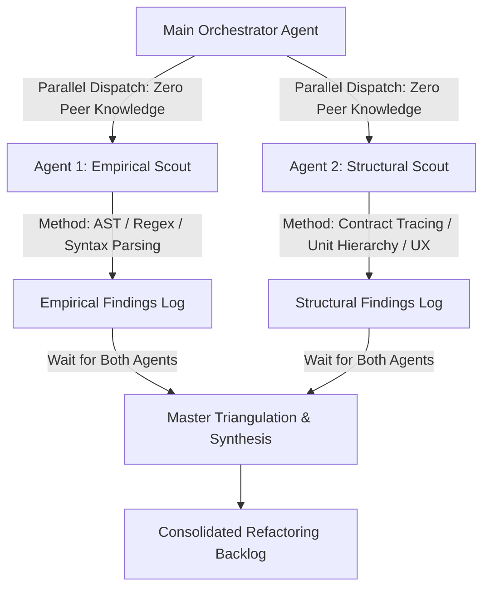

# Universal Cross-Platform Refactoring & Decoupling Case Study

This document is a universal, language-agnostic reference case study demonstrating how a monolithic, platform-coupled client codebase is systematically audited, decoupled, and refactored into modular unit hierarchies, platform-isolated contracts, and swappable layout barrels.

---

### 1. The Core Baseline Debt & Problem Archetypes

Across software client engineering (React Native, Flutter, Swift/Kotlin native, Go CLI, Rust GUI, or C#/.NET), client applications often start with platform coupling and architectural debt:

#### 1.1 Direct Platform Preprocessor & SDK Leaks
- **The Pitfall**: Native OS APIs (e.g. WinRT/COM, Android Intents, Apple Keychain, Windows DPAPI) or preprocessor switches (`#if WINDOWS`, `#[cfg(target_os)]`, `runtime.GOOS ==`) are embedded directly in shared business logic, view models, or domain services.
- **The Impact**: Violates Single Responsibility, breaks automated unit testing across host targets, and causes build breakage or runtime exceptions when compiling for a second platform.
- **Universal Fix**: Extract platform-neutral interfaces (`IPlatformService`, `SecureStoragePort`) placed in core shared packages. Implement concrete OS adapters strictly in target-specific files or directories (`adapters/windows/`, `adapters/mobile/`, `*.windows.ts`, `*.native.ts`).

#### 1.2 Indirect Platform & Hardware Sniffing
- **The Pitfall**: Shared views sniff screen dimensions (`width >= 768`), user-agent strings, pointer device types (`PointerDeviceType.Mouse`), or optional subsystem instances (`if (trayIcon != null)`) to infer platform environment.
- **The Impact**: Brittle conditionals that break on foldables, tablets, or accessibility modes, coupling view presentation to hardware assumptions.
- **Universal Fix**: Replace runtime sniffing with canonical environment selectors (`getPlatform()`, `PlatformSelect.For<T>()`) and encapsulate asymmetric capabilities behind `PlatformCapability<T>` wrappers that resolve to no-ops or `null` cleanly without scattered null checks.

#### 1.3 Ad-Hoc Duplication & Missing Abstraction Tiers
- **The Pitfall**: UI micro-behaviors (e.g. debouncing input changes, confirmation dialogs, skill/tag formatting, image asset resolution) are written ad hoc per screen rather than building upon reusable base units.
- **The Impact**: Inconsistent user experience, duplicated bugs, and maintenance overhead.
- **Universal Fix**: Adopt the 3-Tier Unit Specialization model:
  1. *Core Low-Level Primitive*: Pure algorithm or engine (e.g. `Debouncer`, `PlatformSelect`, `MarkdownParser`).
  2. *Base Shared Unit*: Configurable UI component exposing props, callbacks, and theme tokens (e.g. `DebouncedInput`, `ConfirmationBox`, `PlatformImage`).
  3. *Domain Specialization*: Ready-to-use business unit with localized domain copy, icons, and actions (e.g. `SearchInputField`, `ExitConfirmationBox`, `StepIllustrationImage`).

#### 1.4 Monolithic Presentation Layouts
- **The Pitfall**: Composite cards and pages hardcode desktop multi-column grids or sidebars into a single monolithic view file, attempting to hide elements with CSS media queries or visibility tags.
- **The Impact**: Inactive DOM/visual elements remain instantiated in memory and bind to view models, degrading performance and causing responsive layout bugs.
- **Universal Fix**: View Barrel Layout Swapping. The root component acts as a lightweight host shell delegating to dedicated, isolated layout trees (`<Component>DesktopLayout` vs `<Component>MobileLayout`) resolved via `getPlatform()` or compile-time resolution.

---

### 2. Multi-Agent Orthogonal Discovery Sweep

Before touching code, execute an orthogonal multi-agent discovery sweep using two independent scouts with zero knowledge of each other:



1. **Scout 1 (Empirical - High Recall)**: Runs automated AST traversal, regular expression scans, and build tool inspections to identify every direct/indirect preprocessor leak, SDK import, and idiom check.
2. **Scout 2 (Structural - High Precision)**: Audits interface boundaries, class contracts, repeated micro-behaviors, and missing unit specialization tiers.
3. **Master Synthesis**: The orchestrator awaits both runs, compares findings, eliminates false positives, reconciles overlapping issues, and produces the prioritized execution backlog.

---

### 3. Concrete Architectural Implementations Across Ecosystems

#### 3.1 Pattern 1: Platform Capability Encapsulation
Desktop features (such as system tray icons, multi-window management, or file explorer reveals) have no mobile counterpart.
```
Shared Contract: PlatformCapability<ITrayIconService>
Desktop Target: Returns concrete NativeTrayIconService instance
Mobile Target:  Returns PlatformCapability.Empty / null without throwing
```

#### 3.2 Pattern 2: Sensory, Touch & Animation Parity
- **Mouse Hover vs Touch Press**: Replace mouse hover (`PointerOver`, `onMouseEnter`/`onMouseLeave`) with touch-scale spring transitions (e.g. `scale(0.97)` on press) and native tactile haptic feedback.
- **Canvas Inspection**: Replace pointer-hover tooltips on data canvases/graphs with touch tap-to-inspect hit testing and radial gesture selectors.

#### 3.3 Pattern 3: View Barrel Layout Swapping
A parent shell resolves and mounts strictly one layout tree:
```
ComponentShell
 ├── DesktopLayout (4-column grid, sidebar, expanded metrics, hover tools)
 └── MobileLayout  (single-column feed, bottom sheet, touch cards, swipe actions)
```

---

### 4. Verification & Quality Gates

1. **Zero-Regression Target Builds**: The primary shipping target must compile cleanly (0 errors, 0 warnings) after each atomic stage.
2. **Platform Invariant Audits**: Automated regex/AST scanners verify that zero forbidden platform preprocessors or imports exist in shared code paths.
3. **Component Cataloging**: All newly introduced primitives, base units, and domain specializations must be registered in the project's central component catalog (e.g. `UNITS.md`).
