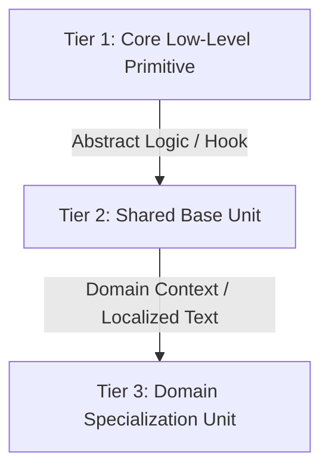

# The Universal 3-Tier Unit Hierarchy (`UNITS.md`)

## 1. Architectural Philosophy

Duplicating UI behaviors, debouncing timers, confirmation popups, and formatting logic across screens creates maintenance debt and inconsistencies. 
A disciplined engineering organization enforces a strict 3-tier unit hierarchy across all client platforms:

Every reusable unit must be cataloged in a repository root `UNITS.md` with:
- **Unit Name**
- **Mechanism / Category** (Platform Components, Platform Concepts, Design System Primitives, Block Layout Barrels)
- **Base Type / Superclass**
- **Purpose & Scope**
- **Status** (Implemented, Scaffold, Planned)

---

## 2. Canonical Real-World Specialization Hierarchies Across Ecosystems

### Pattern A: Debounced User Inputs

| Tier | Role | React / Web | Flutter | .NET MAUI / C# |
|---|---|---|---|---|
| **Tier 1 (Core Primitive)** | Pure debounce timer with cancel-and-restart token | `useDebounce` hook / RxJS `debounceTime` | `Timer` with cancellation | `Core/Debouncer` (Task + CTS) |
| **Tier 2 (Base Unit)** | General text input with configurable delay and clear action | `<DebouncedInput delay={300} />` | `DebouncedTextField` | `DebouncedEntry` |
| **Tier 3 (Domain Specialization)** | Instant search input with domain search icons & filters | `<SearchInputField placeholder="Search projects..." />` | `ProjectSearchField` | `SearchInputField` |

---

### Pattern B: Destructive Dialog Confirmations

| Tier | Role | React Native | Flutter | .NET MAUI / C# |
|---|---|---|---|---|
| **Tier 1 (Core Primitive)** | Host modal abstraction (native dialog vs bottom sheet) | `Modal` / Native Action Sheet bridge | `showModalBottomSheet` | `ModalPresenter` |
| **Tier 2 (Base Unit)** | Generic confirmation with Title, Message, Primary/Secondary buttons, and "Remember my choice" checkbox | `<ConfirmationModal onConfirm onCancel />` | `ConfirmationDialog` | `ConfirmationBox` |
| **Tier 3 (Domain Specialization)** | Exit confirmation with persistent tray vs exit settings | `<ExitConfirmationModal onExit />` | `ExitConfirmationDialog` | `ExitConfirmationBox` |

---

### Pattern C: Platform-Aware Image & Asset Resolvers

| Tier | Role | Web / Responsive | Flutter | .NET MAUI / C# |
|---|---|---|---|---|
| **Tier 1 (Core Primitive)** | Memoized platform/breakpoint resolver | MatchMedia / DeviceContext resolver | `Theme.of(context).platform` | `PlatformSelect.For<T>()` |
| **Tier 2 (Base Unit)** | Image element resolving source per platform without re-evaluating on layout passes | `<PlatformImage desktopSrc mobileSrc />` | `PlatformImage` | `PlatformImage` |
| **Tier 3 (Domain Specialization)** | Illustration binding specific onboarding / tutorial step graphics | `<OnboardingStepImage step={1} />` | `OnboardingStepImage` | `OnboardingStepImage` |

---

### Pattern D: Centralized Domain Formatting

| Tier | Role | Implementation Rule |
|---|---|---|
| **Tier 1 (Core Primitive)** | Standard regex string parsers, date arithmetic, and currency formatters. | Keep pure, testable, and completely independent of UI controls or state containers. |
| **Tier 2 (Base Unit)** | Specialized domain formatters (e.g. `SkillsFormatter`, `RelativeTimeFormatter`, `BudgetRangeFormatter`). | Eliminates duplicated string splits, badge truncations, and localized string formatting across view models. |
