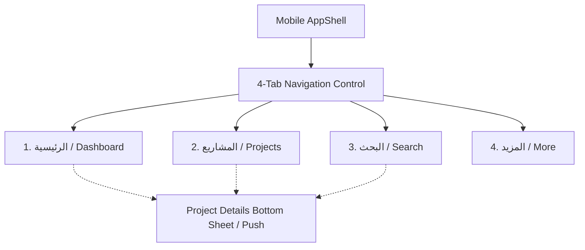

# MostaqlK Mobile Architecture & Technical Specification

## 1. Executive Summary & Product Vision

This specification defines the complete technical architecture, visual design system, navigation model, component hierarchy, storage mechanisms, security baseline, and background execution policies for **MostaqlK Mobile** (.NET MAUI for Android and iOS), adhering to the design specifications defined in `.repertoire/design/postmvp/mobile/`.

MostaqlK Mobile introduces a dedicated 4-tab mobile experience with a central **Scraper Dashboard**, **Live Project Feed**, **Advanced Search & Filter**, and **More / Settings** hub.

---

## 2. Information Architecture & Navigation

### 2.1 4-Tab Mobile Navigation Bar (`NavigationControl`)
The primary mobile navigation utilizes a persistent bottom tab bar (`nav.surface` with safe area inset handling):



| Tab | Route | Primary Responsibilities |
|---|---|---|
| **1. الرئيسية (Dashboard)** | `//dashboard` | Scraper Big Power Button (Start/Stop), Last Scan timestamp, 4 Daily Stats (`فحص`, `مشاريع`, `مطابقة`, `تنبيهات`), Top Matched Project Cards, and Recent Scan Log rows. |
| **2. المشاريع (Projects)** | `//projects` | Count & Sort bar (`28 مشروع متاح` + Sort selector), horizontal filter chips (`الكل`, `جديدة`, `مفتوحة`, `ميزانية عالية`), Feed Project Cards with swipe gestures, and Load More pagination. |
| **3. البحث (Search)** | `//search` | Instant keyword search, status toggle chips (`مفتوح`, `مغلق`), budget range selector pills, multi-select skill chips, additional flags (`بدون عروض`), and instant count-based Apply button. |
| **4. المزيد (More)** | `//more` | Polling intervals, immediate notifications, high-budget alert thresholds, data clearing/export, session management (In-App WebView login / cookie purge), and about/diagnostics. |

---

## 3. UI/UX Design System & Theme Specifications

### 3.1 Color Palette & Dynamic Theming
Implemented via `AppThemeBinding` matching the mobile mockups:

| Token | Light Theme | Dark Theme (`html.dark`) | Purpose |
|---|---|---|---|
| `--bg` | `#F1F5F9` (Slate 100) | `#020617` (Slate 950) | Main background canvas |
| `--surface` | `#FFFFFF` | `#0F172A` (Slate 900) | Card surfaces, headers, bottom nav |
| `--text` | `#1E293B` (Slate 800) | `#F1F5F9` (Slate 100) | Primary typography |
| `--text-muted` | `#64748B` (Slate 500) | `#94A3B8` (Slate 400) | Secondary / subtitle typography |
| `--border` | `#E2E8F0` (Slate 200) | `#1E293B` (Slate 800) | Structural card borders |
| `--accent` | `#2386C8` (Mostaql Blue) | `#5CA8DE` | Active states, brand logo, action tags |
| `--accent-soft` | `#EFF6FF` | `rgba(92, 168, 222, 0.1)` | Tag backgrounds, active chip surfaces |
| `--green` | `#2E9E6B` (Emerald) | `#4FBF8C` | Budget values, running status, match badges |
| `--green-soft` | `#F0FDF6` | `rgba(79, 191, 140, 0.1)` | New project badge background |
| `--danger` | `#DC2626` (Red 600) | `#F87171` (Red 400) | Scraper stopped state, session purge |

### 3.2 Typography & Font Family
- **Font Family**: Arabic-optimized `Tajawal` (`TajawalBold`, `TajawalMedium`, `TajawalRegular`) with fallback to `-apple-system, SF Pro Text, Segoe UI, Cairo`.
- **Direction**: Strict RTL (`dir="rtl"` / `FlowDirection="RightToLeft"`).

---

## 4. Mobile Component Hierarchy & The 3 Project Card Types

The mobile edition implements 3 distinct project card presentations tailored to viewport context:

### 4.1 Card Type 1: Dashboard Matched Project Card (`DashboardProjectCard`)
- **Location**: `dashboard.html` ("أحدث المشاريع المطابقة")
- **Structure**:
  - Top header: Project Title (`h3`), Green "جديد" status pill (`.new`).
  - Body: 2-line description excerpt (`.project p`).
  - Tags: Horizontal skill tags (`.tags .tag`).
  - Bottom row: Divider line + Time ago (`منذ 10 دقائق`) + Green Bold Budget (`$250 - $500`).
- **Interaction**: Tap opens project details sheet; swipe reveals "Open on Mostaql" action.

### 4.2 Card Type 2: Recent Scan History Row (`RecentScanRow`)
- **Location**: `dashboard.html` ("سجل الفحص الأخير")
- **Structure**:
  - Grid: `[Avatar 38px] [Title + Time Ago] [Budget Value]`
  - Avatar: Circular badge with client initial or project category glyph.
  - Title: Compact 1-line bold text + subtitle relative time.
  - Budget: Pinned to trailing edge in emerald green.

### 4.3 Card Type 3: Full Feed Project Card (`ProjectCardMobileLayout`)
- **Location**: `projects.html` & `search.html`
- **Structure**:
  - Header: Title + Dynamic status badge (`جديد` green vs `مفتوح` blue).
  - Body: Full description excerpt with keyword highlights.
  - Tags: Complete skill pill flex wrap.
  - Footer: Divider line + Proposals count + Relative time + Budget.
  - Gestures: Tap-to-open details, swipe-to-reveal quick actions (Open on web, Bookmark, Hide).

---

## 5. Scraper Control & Diagnostics on Mobile

### 5.1 Power Button Widget (`ScraperPowerButton`)
- **Visuals**: Large circular central button (`148px × 148px`) with dynamic radial elevation shadow and tactile press scaling (`scale(0.94)`).
- **States**:
  - **Running**: Emerald gradient (`#14b876` → `#0f9c63`), Power Icon + "إيقاف", pulsing green dot, "حالة الفحص: يعمل بشكل طبيعي".
  - **Stopped**: Crimson gradient (`#f24957` → `#e0303f`), Power Icon + "تشغيل", red dot, "حالة الفحص: متوقف".
- **Operation**: Toggles the background scraping worker pool in `WorkerPool.cs`.

### 5.2 Daily Stats Bar (`DashboardDailyStats`)
- **Layout**: 4-column horizontal grid (`فحص`, `مشاريع`, `مطابقة`, `تنبيهات`).
- **Metrics**: Real-time counts bound to `ScrapeSessionRepository` and `ProjectRepository`.

---

## 6. Authentication, Security & Storage

### 6.1 In-App WebView Session Capture
- **Flow**: Opens `https://mostaql.com/login` within an isolated, secure MAUI `WebView`.
- **Interception**: Monitors cookie headers for `mostaql_session`. Upon detection, extracts the cookie, dismisses the WebView, encrypts it via `_SecretProtector.Mobile.cs` (Android Keystore / iOS Keychain), and persists it securely.

### 6.2 Local Database & Search
- **Engine**: SQLite + FTS5 full-text search (`projects_fts`) with Arabic diacritic normalization.
- **Path**: `Microsoft.Maui.Storage.FileSystem.AppDataDirectory`.

---

## 7. Tablet, Foldable & Landscape Adaptation

- **Narrow Viewport (< 600px)**: Single-column 4-tab bottom navigation with bottom sheet details.
- **Wide Viewport (≥ 600px, Tablets / Foldables / Landscape)**: Automatic adaptation via `NavigationControl` to an **Adaptive Master-Detail Split**:
  - Left column: Feed list / Search filters.
  - Right column: Full project details, client analytics, and attachment viewer.

---

## 8. Summary of Mobile Layout Barrels & Units

```
Features/
  Dashboard/
    Views/
      DashboardPage.xaml (.cs)          -> Layout shell delegating to Mobile/Windows
      Layouts/
        DashboardMobileLayout.xaml      -> Power button, stats grid, recent scan log
  Projects/
    Views/
      Layouts/
        ProjectCardMobileLayout.xaml    -> Card Type 3 (Feed card)
        DashboardProjectCard.xaml       -> Card Type 1 (Dashboard match card)
        RecentScanRow.xaml              -> Card Type 2 (Compact scan row)
  Search/
    Views/
      Layouts/
        SearchMobileLayout.xaml         -> Keyword input, filter chip groups, count apply bar
  More/
    Views/
      Layouts/
        MoreMobileLayout.xaml           -> Grouped settings, data management, about links
```
